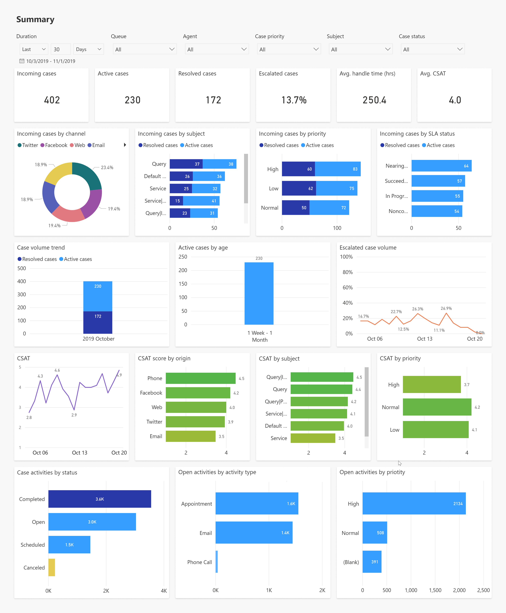
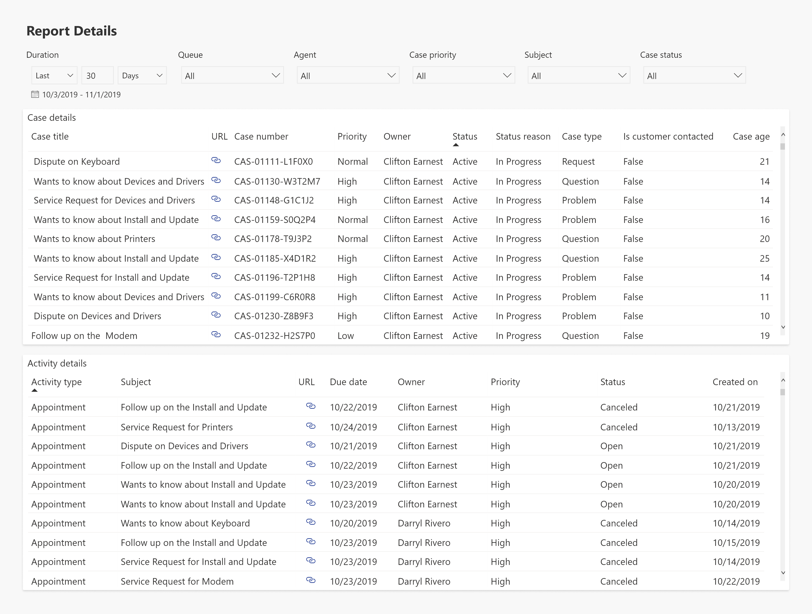

# View and Understand Customer Service Analytics for Dynamics 365

The Customer Service Analytics dashboard provides information about the historical operational metrics and key performance indicators (KPIs) to effectively manage contact centers. 

The following is an example of the Customer Service Analytics overview dashboard:  

   > [!div class=mx-imgBorder]
   >
  
This section consists of the following KPIs:  

| KPI                       | Description         |
|---------------------------|-------------------------|
|Total cases                |Number of cases created to support customers.      |
|Active Cases               |Number of cases which are currently open.          |
|Resolved cases             |Number of cases which have been closed by an agent.   |
|Escalated Cases %          |Percentages of cases which have been escalated.    |
|Average Handle Time (mins) |Average length of time taken by an agent to resolve the case. |
|Avg. CSAT                  |Average customer satisfaction score based on the survey submitted by the customer. |
|Case age                    |Average time the case was in an open state.                 |
|Total Activities            |Total activities which are created by agents                |

This section also consists of the following filters:

|Filters / Dimensions  |Description        |
|----------------------|-------------------|
|Duration              |Filters the reporting date range.|
|Queue                 |Provides an ability for the user to filter the queue which they would like to drill deeper and see all metrics related to those queue(s). |
|Agent                 |Provides an ability for the user to filter all their reporting agents to understand how each one of them are performing and plan to coach/train agents.  |
|Priority              |Filters the reporting to the selected priority of the case. (High, Normal, Low) |
|Subject               |Filters the reporting to the selected subject of the case.  |
|Channel               |Filters the reporting to the selected Omnichannel channels. (Example: Chat, SMS, Facebook, etc.)  |

## Customer Service Analytics Reports

The following is an example a of the **Customer Service Analytics** report detail view. 

The Customer Service Analytics report detail view has three views: 

   - [Summary](#1-summary)

   - [Agent/Queue](#2-agent-/-queue)

   - [Case/Activity List](#3-case-/-activity-list)

### 1.	Summary
    
   This view provides KPIs and metrics across customer service with an ability for supervisors to filter the view:

   > [!div class=mx-imgBorder]
   > 
    
   This section contains the following visuals/KPIs:

   |Visuals / KPI              |Description                   |
   |---------------------------|------------------------------|
   |Incoming cases by channel  |This visual shows the volume of cases created in each of the support channela. |
   |Incoming cases by priority |This visual shows the volume of active and resolved cases by priority.        |
   |Incoming cases by subject  |This visual shows active and resolved cases by subject. This considers the last node in the subject hierarchy. |
   |Incoming cases by SLA status |This visual shows the volume of active and resolved cases by SLA status.      |
   |Case volume trend           |This visual shows the trend of active and resolved cases based on the time the case was created. |
   |Case by age                 |This visual groups the cases which are currently open and grouped on the number of days/weeks/months they are currently open. |
   |Escalated case trend        |This visual shows the trend of cases escalated over the period selected. |
   |CSAT trend                  |This visual shows the CSAT trend over the period selected.  |

### 2. Agent / Queue 
    
   This view provides KPIs and metrics across customer service with an ability for supervisors to filter the view:

   > [!div class=mx-imgBorder]
   > 
    
   This section contains the following visuals/KPIs:
 
   |Visuals / KPI              |Description                            |
   |---------------------------|---------------------------------------|
   |Agents with most cases     |This visual shows the top agents who have handled the most cases along with the states of those cases.|
   |Agents with most open activities          |This visual shows the agents with the most open Activities. This helps users enable agents to clear the backlog.|
   |Agents with highest avg. handle time      |This visual shows the agents with the highest average handle time.|
   |Agents with highest CSAT                  |This visual shows the top agents with high CSAT. |
   |Agents with lowest CSAT                   |This visual shows the agents with low CSAT. Supervisors use this information to train agents and improve overall customer satisfaction.|
   |Key influencers for CSAT                   |This visual shows the factors that drive the CSAT metric. It analyzes data, ranks the factors that matter, and displays them as key influencers. |
   |Open activities by agent                  |This visual shows the number of open activities by agent and type of activity.|
 
 ### 3.	Case / Activity List
     
    This section provides a detailed view of case and activities which a supervisor can use to drill into each case or activity to help resolve customer issues. The link in this report directs the user to customer service or the customer service hub application in Dynamics 365.  

   >[!Note]:
   > Prerequisite for the link to work – you must have either a customer service hub application or customer service app installed from the Appsource. 
         
   > [!div class=mx-imgBorder]
   >  
    
## View and filter report  

Filter information by viewing the reports and selecting: Duration, Queue, Agent, Priority, Subject and case status. 
    
   > [!div class=mx-imgBorder]
   > 
    
Select: Queue, Agent, Priority, Subject or Date as required, and information is filtered according to selection. This helps to quickly analyze KPIs and take necessary steps to improve outcomes. 

## See Also 

[Introduction to Customer Service Analytics](introduction-customer-service-analytics.md) 

[Configure Customer Service Analytics Dashboards](configure-customer-service-analytics-dashboard.md)

     

    

