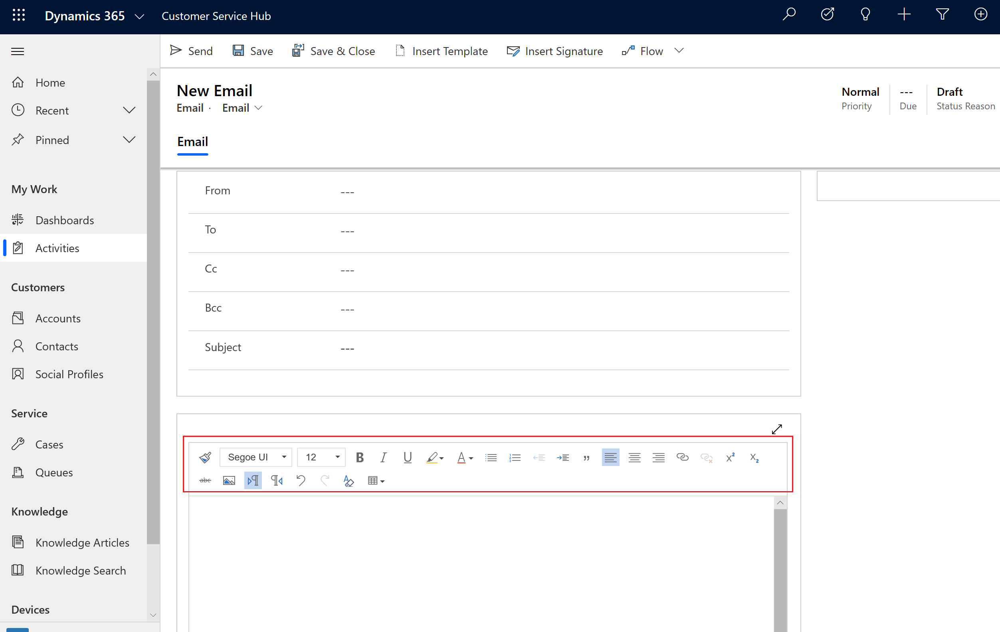
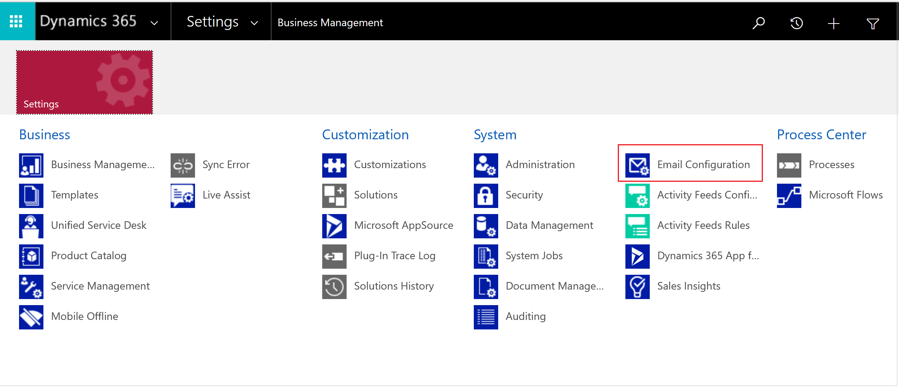
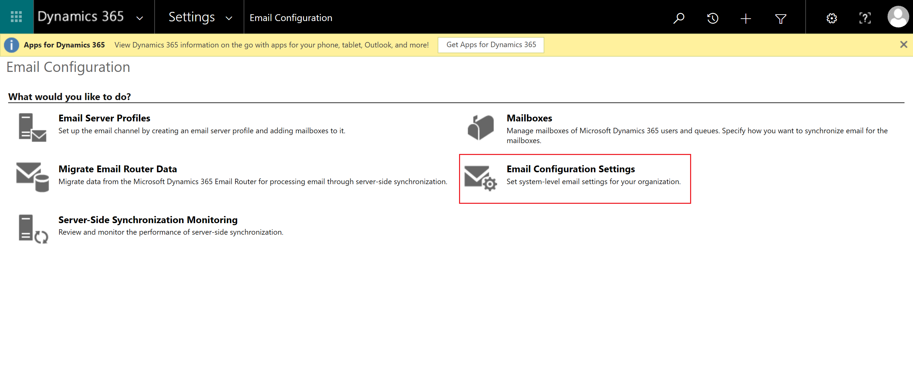
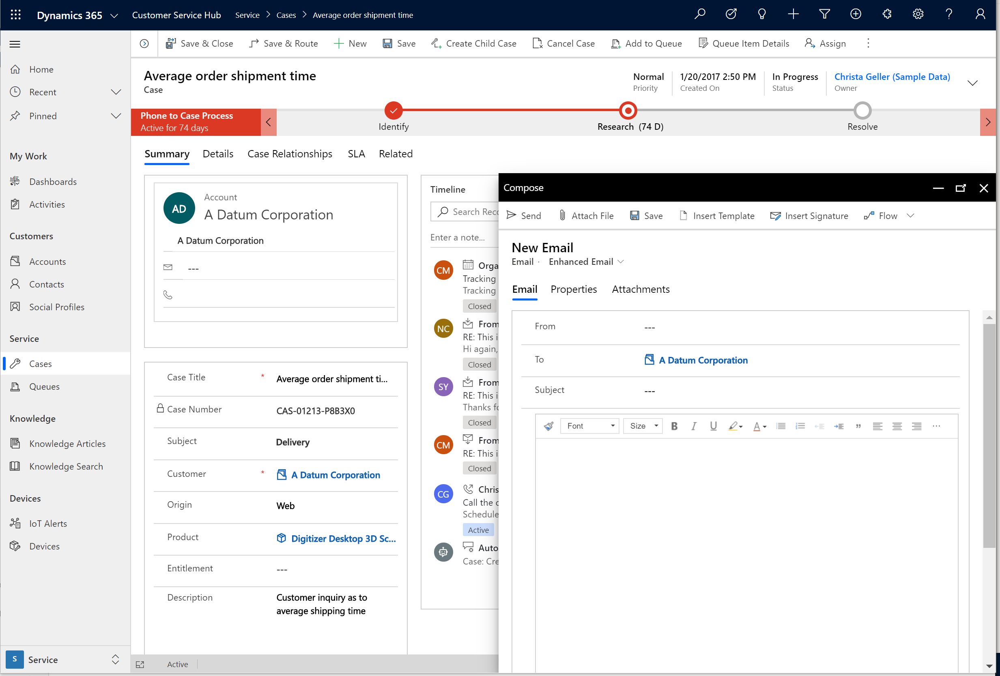
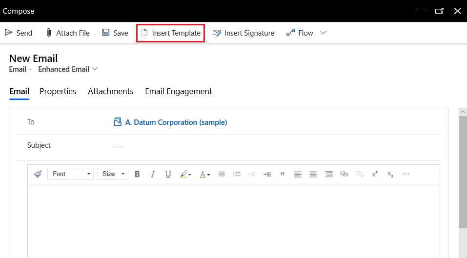
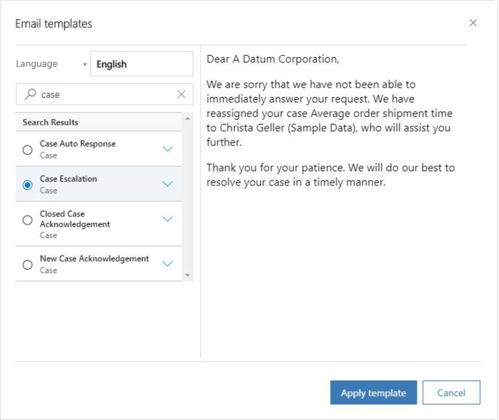
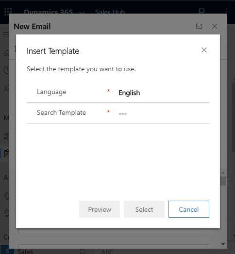

# Using Email

Add intro to email here 

## View and create email

Dynamics 365 Customer Service lets agents interact with customers through email. Email functionality allows agents to:
- View and respond to emails. 
- Utilize common email toolbar functionality and rich text editor controls. 
- View and insert images inline using drag-and-drop or copy-and-paste functionality. 
- Create email in a pop-up window.  
- Preview templates before applying them. 

### View your email

To view your email:

1. In the Customer Service Hub sitemap, go to **Service** > **Activities**. 

2. Select the **All Activities** drop-down list, and then select **My Received Emails**.

   > [!div class=mx-imgBorder]
   > 

3. Select the email you want to view to open it. When the email opens, you can reply to the sender and recipients or forward it.

### Create email

The following steps detail how to create an email.

1. In the Customer Service Hub sitemap, go to **Service** > **Activities**.

2. On the command bar, select **Email**. A new email window opens.

   > [!div class=mx-imgBorder]
   > 

   The **From** field is automatically populated based on the currently logged-in user.

3. Write your email directly in the composer or select **Insert Template** to search for and apply a template.

4. To compose your email in a full-screen window, select the expand icon.

   > [!div class=mx-imgBorder]
   > 

   The message box has a rich text editor that enables you to create rich and well-formatted content for the emails with emphasis. By default, the editor displays as a single line that you can expand to see all of the functionality. For details about the features in the editor, see [Editor functionality and accessibility shortcuts](#editor-functionality-and-accessibility-shortcuts).

  > [!div class=mx-imgBorder]
  > 

5. When you're done, select **Send**.

### Create and send email using the enhanced email experience

An alternate way of creating email is to use the enhanced email experience, which allows you to compose email without leaving the record you are working on. With the enhanced email experience, you can:

- Navigate to different pages without losing the email content.
- Minimize the email window to get back to the records you were working on.
- Expand the email editor pop-up window to see more email options.
- Simultaneously open three compose email pop-up windows.
- Search for and apply a predefined template to an email you're composing.
- Insert attachments to email.

> [!IMPORTANT]
> - Your system administrator must enable the enhanced email experience before you can use it. Follow the steps in [Enable the enhanced email experience](#enable-the-enhanced-email-experience).
> - The enhanced email experience is available only for email activities created from the **Timeline** section of any model-driven app. 

### Enable the enhanced email experience

1. Sign in to your [https://\<YourOrgURL\>.dynamics.com/apps](https://<YourOrgURL>.dynamics.com/apps) environment.

2. Open a model-driven app, and then on the command bar, select **Settings**.

3. Under **System Settings**, select **Email Configuration**.

    > [!div class="mx-imgBorder"]  
    > 

    The **Email Configuration** page opens.

4. Select **Email Configuration Settings**.

    > [!div class="mx-imgBorder"]  
    > 

5. On the **Email** tab of the **System Settings** dialog box, scroll down to find **Enhanced email for Timeline**, and then select the **Multitask, compose, and save drafts, using email pop-up windows, when creating email from timeline** check box to enable it.

    > [!div class="mx-imgBorder"]  
    > 

6. Select **OK**.

### Compose an email using the enhanced experience:

   > [!Note]
   > This section assumes the administrator has already enabled this feature. For steps on how to enable it, see [Enable the enhanced email experience](#enable-the-enhanced-email-experience).

1. In the **Timeline** section of records such as account or contact, select **+** and then under **Activities**, select **Email**.

   A new email pop-up window opens. 

   > [!IMPORTANT]
   > The enhanced email pop-up window opens only when the height and width of your screen size is at least 400 x 650 pixels or greater. If lower, you will be taken to the standard form instead of the enhanced email experience. 

   > [!div class="mx-imgBorder"]
   > 

   The **From** and **To** fields are automatically populated based on the user and the account and contact of the original record.

2. Write your email from scratch or select **Insert Template** to search for and apply a template. For more information on inserting an email template, see [Insert an email template](#insert-an-email-template).

3. Select **Attach file** if you want to add attachments.

4. Select **Insert signature** to search for and add your signature.

5. When you're done, select **Send**. 

## Insert an email template

You can use an email template—a preformatted email message—to quickly create and send email messages. You can insert the template while composing an email by selecting **Insert Template** on the command bar. The list of available templates is displayed in the **Email templates** window. In the **Recently used** section, the four most recently used templates by you are displayed. The **All templates** section displays a list of all out-of-the-box email templates (global and entity specific), in alphabetical order. Global templates are shown as the type User. If you've created a custom email template, it will also be available here. For information about creating a custom email template, see [Create templates for email](https://docs.microsoft.com/power-platform/admin/create-templates-email).

You can see templates of a particular language by selecting a language from the **Language** list. You can either search for a template or browse through the list and select it. When you select an email template, a preview is displayed on the right side of the window. The preview shows you the content so you can pick the template that best meets your needs. After inserting an email template, you can modify the content as needed, and then send the email.

> [!NOTE]
> The search does not support regular expressions and it works on the template name only.

**To insert an email template**

1. In the email editor, select **Insert Template** on the command bar.

     > [!div class="mx-imgBorder"]
     >  

    The **Email templates** window opens.

2. To see templates of a different locale, select a language from the **Language** list. The templates are loaded as per the selected language.    

3. Browse for the template you want. Select the template, and preview the content of the template.

4. Optionally, you can select the drop-down arrow on the name of the template to see a description of its content.

5. Select **Apply template** to insert the content in the email.

     > [!div class="mx-imgBorder"]
     > 

   If you try to insert an email template on a device with a smaller screen size, you'll only see an option to search and select a template.

> [!div class="mx-imgBorder"]
>  

## Formatting options

The following table outlines the different formatting options of the rich text editor.

   > [!Note]
   > You can access your browser's context menu by pressing **Ctrl** + right-click. This is useful if you need to use your browser's built-in spell checker. Otherwise, you can use the right-click to provide contextual formatting for any element you might be using.

|Icon | Name | Shortcut key | Description |
|----------------------|-------------------------|-----------------------------|-----------------------------|
|| Format Painter | Ctrl+Shift+C, Ctrl+Shift+V | Apply the look of a particular section to another section. |
| | Font | Ctrl+Shift+F | Select your desired font. The default font is Segoe UI.   **Note**: When you select any formatted content, the font name for that content displays. If your selection contains multiple fonts, the topmost font name of your selection is displayed. |
| | Font size | Ctrl+Shift+P | Change the size of your text. The default size is 12.   **Note**: When you select any formatted content, the font size for that content displays. If your selection contains multiple font sizes, the topmost font name of your selection is displayed.|
|| Bold | Ctrl+B | Make your text bold. |
|| Italic | Ctrl+I | Italicize your text. |
|| Underline | Ctrl+U | Underline your text. |
|| Text Highlight Color |  | Make your text stand out by highlighting it in a bright color. |
|| Font Color |  | Change the color of your text. |
|| Bullets |  | Create a bulleted list. |
|| Numbering |  | Create a numbered list. |
|| Decrease Indent |  | Move your paragraph closer to the margin. |
|| Increase Indent |  | Move your paragraph farther away from the margin. |
|| Block Quote |  | Apply a block-level quotation format in your content. |
|| Align Left | Ctrl+L | Align your content with the left margin. (Commonly used for body text to make it easier to read.) |
|| Align Center | Ctrl+E | Center your content on the page. (Commonly used for a formal appearance.) |
|| Align Right | Ctrl+R | Center your content on the page. (Commonly used for a formal appearance.) |
|| Link |  | Create a link in your document for quick access to web pages and files.  Pasted or typed URL text is converted into a link. For example, "http://myexample.com" will become "<a href="http://myexample.com">http://myexample.com</a>".   In the **Link** dialog box, choose the type of link you'd like to insert.  The **Link Info** tab allows you to choose the link type as well as set the link protocol and URL.  The **Target** tab is only available for the URL link type. It specifies the location where the link will open after you select it. |
|| Unlink |  | Delete a link in your email or document.  When you place the cursor on a link, the **Unlink** button on the toolbar becomes active. Select the button to remove the link and make it plain text. |
|| Superscript |  | Type very small letters just above the line of text. |
|| Subscript |  | Type very small letters just below the line of text. |
|| Strikethrough |  | Cross out text by drawing a line through it. |
| | Image | | Insert an image.   You can insert an image by directly copying and pasting it inline in the editor, dragging and dropping it from your desktop or local folder directly into the editor, or by typing a URL. The following formats are supported: .PNG, .JPG., or .GIF.  To insert an image inline in your article:<ol><li>Drag and drop the image or or copy and paste it directly into the article.</li><li>Drag any corner of the image to resize it.</li></ol>  To insert an image using a URL or navigating to the local image:<ol><li>Choose Insert Image.</li><li>In the **Image** property dialog, choose from the following options:</li></ol><ul><li>Specify the web address of the image, and also specify properties to define how the image will appear in the email or article. **Note:**      If the image is located on the external server, use the full absolute path. If the image is located on a local server, you can use a relative path. If you want the image to be a selectable link, add a URL for the image. You can also specify if you want the targeted page to open in a new window, topmost window, same window, or parent window.</li><li>Select **Browse** to navigate to the image on your computer.</li></ul>|
|| Left to Right |  | Change the text to left-to-right for content such as a paragraph, header, table, or list. Commonly used for bi-directional language content. This is the default setting.|
|| Right to Left |  | Change the text to right-to-left for content such as a paragraph, header, table, or list. Commonly used for bi-directional language content. The default setting is left-to-right. |
|| Undo Typing |  | Undo changes you made to the content. |
|| Redo Typing |  | Redo changes you made to the content. |
|| Clear All Formatting |  | Remove all formatting from a selection of text, leaving only the normal, unformatted text. |
|| Add a Table |  | Add a table to your content.   After adding a table, you can do any of the following:  <ul><li>Resize table columns by clicking and dragging your mouse to resize to the columns to the desired width.</li><li>Select one or several cells within a table and apply specific formatting, add links to the selection, or cut, copy, or paste entire rows or columns.</li><li>Right-click to access the properties. This supports features such as cell type, width and height, word wrapping, alignment, merging and splitting cells horizontally and vertically, inserting or deleting rows and columns, row and column span, and cell and border color.</li></ul>|
|| Expand Toolbar |  | Displays when the toolbar is collapsed and not all options appear. Click to expand the toolbar and make all options visible. |

## Accessiblity shortcuts

The following table outlines a list of accessibility shortcuts available when using email. You can access this list while composing email by pressing **Alt+0**.

|Type | Shortcut key | Description |
|----------------------|-------------------------|-----------------------------|
| General | Alt+F11 | Toggle full-screen view. |
| Tab navigation | Alt+Ctrl+0 | Go to menu bar. |
| Tab navigation | Alt+1 | Go to the rich-text editor. |
| Tab navigation | Alt+2 | Go to the HTML editor. |
| Tab navigation | Alt+3 | Go to the preview view. |
| General editor commands | Alt+F10 | Navigate to the editor toolbar. Move to the next and previous toolbar group with Tab and Shift+Tab. Move to the next and previous toolbar button with Right Arrow or Left Arrow. Press Space or Enter to activate the toolbar button. |
| General editor commands |  | Editor dialog: Inside a dialog, press Tab to navigate to the next dialog element, press Shift+Tab to move to the previous dialog element, press Enter to submit the dialog, press ESC to cancel the dialog. When a dialog has multiple tabs, the tab list can be reached either with Alt+F10 or with Tab, following the dialog tabbing order. With a tab list focused, move to the next and previous tab with Right and Left Arrow, respectively.. |
| General editor commands |  | Editor list box: Inside a list box, move to next list item with Tab or Down Arrow. Move to previous list item with Shift+Tab or Up Arrow. Press Space or Enter to select the list option. Press ESC to close the list box. |
| Base commands | Ctrl+Z | Undo command. |
| Base commands | Shift+Ctrl+Z | Redo command. |
| Base commands | Ctrl+B | Bold command. |
| Base commands | Ctrl+I | Italic command. |
| Base commands | Ctrl+U | Underline command. |
| Base commands | Alt+0 | Accessibility help. |
| Base commands | Esc | Cancel operation. |

### See Also

[Email FAQs](email-faqs.md)
