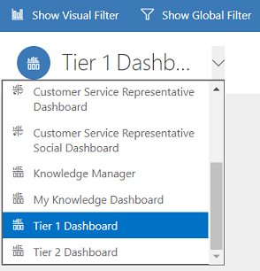
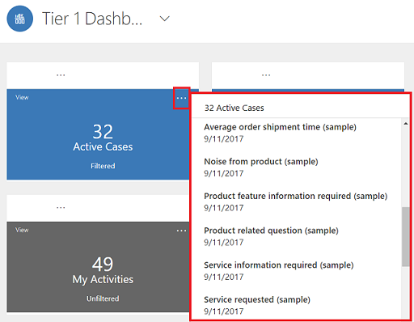
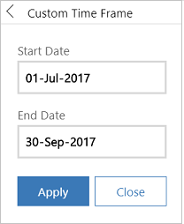

# Use interactive dashboards to effectively manage service cases in the Customer Service Hub

[!INCLUDE[cc-applies-to-update-9-0-0](../includes/cc_applies_to_update_9_0_0.md)]

[!INCLUDE[pn_microsoftcrm](../includes/pn-microsoftcrm.md)] interactive experience dashboards are a one-stop workplace where you review your workload and take actions. The information in the interactive dashboard is shown in real time, coming from views and queues. The interactive dashboards with their modern and intuitive interface are optimized for the customer service experience. For example, instead of paging through the application looking for a case, you’ll be able to open and update the case right from the dashboard. This will save you time, help to focus on tasks at hand, and get more work done. You’ll need sufficient permissions to use the interactive dashboards. The permissions will be assigned to you by an administrator.

  
Watch this video to learn more about dashboards in the Customer Service Hub:

<iframe src="https://www.microsoft.com/en-us/videoplayer/embed/2a9199d6-67b8-486d-a915-1ed2fb33c80c" frameborder="0" allowfullscreen=""></iframe>

## Interactive experience dashboards overview  
The interactive dashboards come in two flavors: 

- Multi-stream dashboards 
- Single-stream dashboards  
  
When you sign in to the Customer Service Hub, you’re looking at the Tier 1 multi-stream default dashboard. A multi-stream dashboard displays data in real time over multiple data streams. The data in a stream is based on an entity’s view or a queue, such as My Activities, My Cases, or Cases in the Banking Queue. While a stream always contains information only about one entity, each stream on the dashboard may contain information about a different entity. For example, you may be tracking cases in one stream and accounts in the other stream, but, you can’t track cases and accounts in the same stream. In a multi-stream dashboard all streams may be displaying data based on the same entity.  
  
You could also be using a multi-stream entity-specific dashboard, such as the Cases dashboard. To open a dashboard like this, navigate to **Service** and down to a specific entity, such as **Cases**. The default **Cases** grid is displayed. To directly open the **Cases** dashboard from the cases grid, select  from the command bar.

> [!NOTE]
> You can access entity dashboards from the command bar on home page grids via **Open Dashboards** command.
  
Multi-stream dashboards target Tier 1 support, where customer service representatives handle many support cases at the same time. An entity-specific dashboard can be useful for Tier 1 representatives or Tier 2 customer representatives that look at fewer, but, more complex cases. In the multi-stream dashboard, you can easily switch from a standard view to the tile view. The interactive tiles show an aggregated view of the data across the queues or views. You can also select the tile to drill down to the underlying records. The interactive dashboard application opens with the Tier 1 interactive dashboard. However, you can make another selection from the available dashboards, as shown here:  
  
   
  
Single-stream dashboards display real-time data over one stream based on a view or queue. The tiles are positioned on the right side of the dashboards and are always shown. Single-stream dashboards are helpful to Tier 2 leads or managers, who monitor fewer, but more complex or escalated cases in a single view or queue.  
  
Multi-stream and single-stream dashboards contain interactive charts that give you a count of relevant records, such as cases by priority or by status. These charts also act as visual filters.  
  
You can apply additional filtering with **Global filters** and **Timeframe filters**. The Global filter works on streams and charts in the dashboard. You can sort the data in a stream based on different criteria, such as the priority, status, or the date when the record was created.  
  
The illustrations given below show multi-stream and single-stream dashboards with the header pane. Below the header you see visual filters and streams. In the single-stream dashboard, you also see tiles. The dashboard header shown here contains the following controls and clickable buttons, from left to right: 
- Dashboard selector
- Show Visual filter
- Show Global filter 
- Switch to Tile view
- Set as Default
- Refresh All
- Timeframe filter 
  

  
### Multi-stream dashboard standard view  (with visual filter)
 In the multi-stream dashboard, when you select **Show Visual Filter**, you see a row of visual filters at the top with the data streams below.  
  
   
  
### Multi-stream dashboard tile view  (with visual filter)
 The same dashboard, in the tile view.  
  
   
  
#### Multi-stream entity specific dashboard standard view (with visual filter) 
 The following illustration shows the entity specific dashboard for the **Case** entity, with enabled visual filter.  
  
   
  
### Single-stream dashboard  
 The single-stream dashboard contains the data stream on the left and visual filters and tiles on the right.  
  

  

## Interactive tiles  
 Interactive tiles provide an aggregated view of the information in the streams, across queues or views that interest you most. They help you monitor the volume of cases and quickly drill down to a particular case. In the multi-stream dashboard, you can switch from the standard view to the tile view by selecting 
 given in the command bar.
  
  
 If you have five streams in the multi-stream dashboard in the standard view, after you switch to tiles, you’ll see five tiles. If a view that tracks your active cases contains 32 items, the corresponding **My Active Cases** tile will display a numerical number 32 in the center of the tile. To drill down to a particular case, do one of the following:
- Select the tile anywhere
- Select **View**
- Select  **(…)** in the top right corner

A flyout window will open. If there are too many cases to show, the window will have a scrollbar. You can navigate and select a particular case in the list, which will take you straight to the case form. The illustration shows the tiles and underlined cases in the list.  
  
   

  

## Visual Filter  
Visual filters provide a visual snapshot of key metrics, such as cases by priority or by origin. They also help removing clutter from the screen and display information that interests you most. For example, if you select the **High Priority** circle in the **Cases by Priority** chart, the dashboard will refresh and you’ll see only high priority cases in your data streams. You can find different types of charts on your dashboard, such as pie, bar, doughnut, or tag chart. Visual filters and tiles help you see the changes and patterns in data, and act quickly to address the most important issues. 

To display the charts on the dashboard, select the visual filter button in the dashboard header, as shown below. The clickable button acts as a toggle switch, to show or hide the visual filters on the dashboard. On the single-stream dashboard, the visual filters are always shown and can’t be hidden from the view.  
  
   
  
 The following illustration shows the multi-stream dashboard without visual filters enabled: 
  
   
  
 The following illustration shows the multi-stream dashboard with visual filters. You can use the arrows to move the view right or left to see all charts.
  
   
  

## Global Filter  
 To add granularity to filtering data, you can use the Global filter. For example, you can apply the Global filter to show only escalated cases and the cases that are marked as “Request.”  
  
Select the **Show Global Filter** button in the command bar to view and apply global filters.  
  
   
  
 When you select the Global filter button, the filter flyout window opens. The entity fields that are preconfigured by your administrator appear in alphabetical order in the flyout window. You can select multiple values in a field, as well as values from multiple fields. Select **Apply** for the action to take place.  
  
   
  
 After you apply Global filters, the dashboard refreshes to show you only the cases in charts, streams, and tiles that are based on the filter entity (the filter entity is the entity that is used in the charts). To clear the Global filter, select **Clear** in the flyout window.

By using a combination of Visual and Global filters, you can drill down from a long list of cases to a more focused list.

## Clear the filters  
 Filtering helps remove the clutter on the screen and show only the work items that you want to focus on. However, if you want to see the entire unfiltered workload, select the specific filter button once again to clear the respective filter.   

 For example, select **Hide Visual Filter** to clear all visual filters applied on the records.
  
   
  

## Timeframe filter  
 You can apply a specific timeframe to display cases in a specified period of time. The available timeframe filters are: 

   

For example, you can choose to view cases created in **This Quarter**, or  **Last Quarter**. You can also apply **Custom Time Frame** filter, where you can choose a particular start and end date to view the records created during a specific timeframe.   

  
  

## Collapse or expand work item description in the stream  
 To learn more about the work item, you can expand the work item description area. Select the arrow in the bottom right corner of the work item to expand or collapse the description, as shown here.  
  
   

## Show quick actions  
 Select the quick action menu **(...)** in the top right corner of the work item to open the quick actions menu. From this menu, you can directly resolve or cancel the work item, or assign the work item to another owner, as shown here:  
  
   

> [!NOTE]
> The Quick action commands on the streams feature the full set of grid commands. These are configurable and are shared between dashboards and grids.

## Apply Bulk Select

Benefit from the Bulk Select option, where you can select multiple records at one time and perform specific actions.

Select the Bulk Select icon and select multiple records by selecting the check box. Then select **(...)** to view the actions that can be performed on the selected records.

## Change the sort order in the data stream  
 You can easily toggle the sort order in the stream by selecting the field name on which you want the data to be sorted. You can also sort the records by oldest or newest. 
  
   
  

## Color-coded data in streams and charts  
 The information in the charts and streams is color coded for the fields that contain a set of options. For example, a case type can be **Question**, **Problem**, or **Request**. A case's status can be **Resolve** or **In-progress**. Each of these options can be assigned a specific color. For example, cases that are **In-progress** can be shown in blue and **Resolved** cases can be shown in green.

In the streams, the color is depicted using the thin vertical line to the left of the work item description. You can work with your administrator to choose the colors you like for your dashboard data.  

## Information for customizers  
 For information on how to configure the interactive dashboards, see [Configure interactive experience dashboards](https://technet.microsoft.com/library/d1446a95-14bf-4b15-a905-72fce07f4c76.aspx)  
  

## See also

[Learn the basics of the Customer Service Hub ](customer-service-hub-user-guide-basics.md)
  

  
