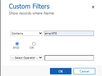
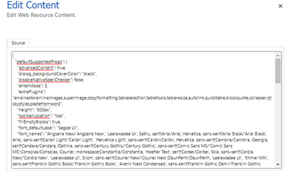
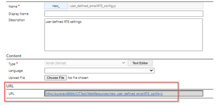

# Customize the email experience

The email configuration experience enables users to be more effective and efficient when using email to communicate with customers. This topic discusses how to configure the email editor, email template builder, and email signature builder, which accepts the full configuration capability of the Rich Text Editor control.

> [!NOTE]
> If you're using the Activity Editor control, we recommend that you use the rich text editor control instead, as the Activity Editor control has been deprecated. For details, see [Use the rich text editor control in Power Apps](https://docs.microsoft.com/powerapps/maker/model-driven-apps/rich-text-editor-control#defaultsupportedprops). 

Each instance of the email editor or builder can be configured independently, enabling you to:

- Choose the fonts you want
- Set a default font
- Add your own font
- Adjust the toolbar location and buttons
- Automatically increase the editor height to fit the content
- Access HTML
- Configure [the rich text editor control](https://docs.microsoft.com/powerapps/maker/model-driven-apps/rich-text-editor-control) in email experiences (including email editor, email template builder, and signature builder)

## Configure the Email form by using a web resource file

You can configure email by using a web resource file that can be modified as needed and then linked to the email form.

Enabling the user configured settings to an email form consists of the following steps:
1.	[Configure the web resource file](#configure-the-web-resource-file)
2.	[Enable the RTE control in the email form](#enable-the-rte-control-in-the-email-form)

### Configure the web resource file

1. Access the web resource file by navigating to **Advanced settings** > **Customize the system** > **Web Resources**.

2. Use the filter to search for the web resource files, as shown below:

   

There may be more than one file named msdyn_EmailRTEConfig.js. One is the default, out-of-box configuration file that isn't modifiable. The other one can be opened and used as a reference to create a new web resource file that will host your configuration changes. 

3. Select the modifiable file.

   
   
   A new window is displayed. 
   
4. In the **Content** section, select **Text Editor**.
   
   An **Edit Content** window is displayed.
   
5. Copy the text in the **Source** field, and then close the window.

   

6. Create a new web resource and paste the code you copied from the existing file into it.

> [!NOTE]
> A code editor such as Visual Studio Code can provide a better editing experience.  
There are a variety of properties that can be modified and will apply to the email form when you configure it. For more information, see [Rich Text Editor Properties](https://docs.microsoft.com/powerapps/maker/model-driven-apps/rich-text-editor-control#rich-text-editor-properties).

7. Make any changes you want, and then select **Save and publish**. Save the URL to the new web resource because you'll need it to map the new web resource file to the **Enhanced Email** form.

   

8. Navigate to **Customization** > **Customize the system** > **Entity** > **Email** > **Forms**.

9. Open the **Enhanced Email** form, double-click **Description**, and then navigate to the **Control** tab.
	
10. Add the RTE control, select **Custom Configuration URL** and then in the URL field, enter the URL from the new web resource file you created.

11. Select **Save** and then **Publish All Customizations**.

### Enable the RTE control in the email form

1. Navigate to the email form properties: Select **Advanced settings** > **Customize the system** > **Entities** > **Email** > **Forms**.

   In this example, we'll add the web resource file to the **Enhanced Email** form.
   
    
 
2. Select the form, and then double-click the **Description** field to enter the field properties.

3. If the RTE control isn't already added, select the **Controls** tab to add it.

4. Select the **Custom configuration control** and replace **singleLine.URL** with the web resource URL for the web resource file you created in the steps above.

   

5. Select **Save** > **Publish**.
   
   The settings will now apply to the form when you create an email.

### See also

[Configure email](/power-platform/admin/settings-email) 
[Create an email template](customer-service-hub-user-guide-email-create-template.md) 
[Insert an email template](customer-service-hub-user-guide-email-insert-template.md) 
[Convert an email to a template](customer-service-hub-user-guide-email-convert-template.md) 
[Use a signature in email](customer-service-hub-user-guide-email-create-signature.md) 
[Email FAQs](email-faqs.md)  

[!INCLUDE[footer-include](../includes/footer-banner.md)]
