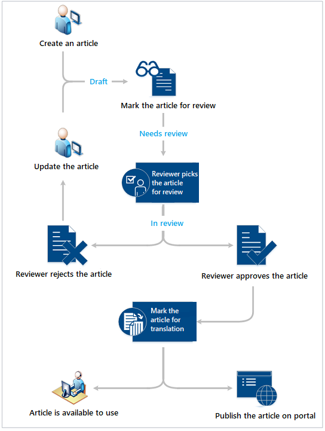
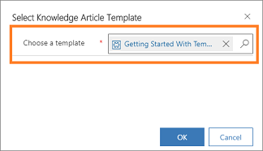
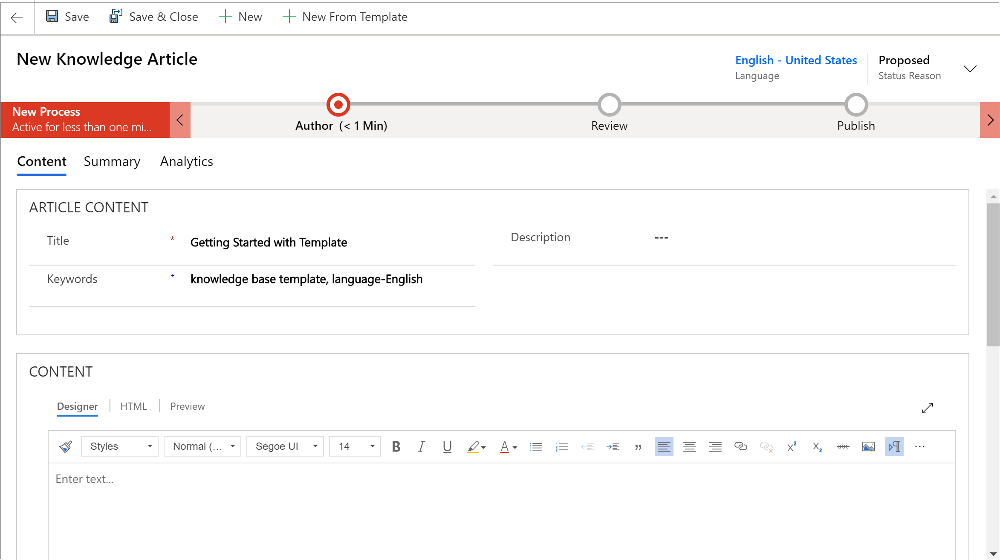
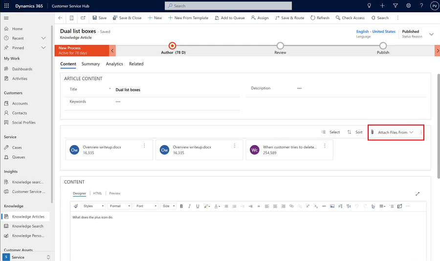
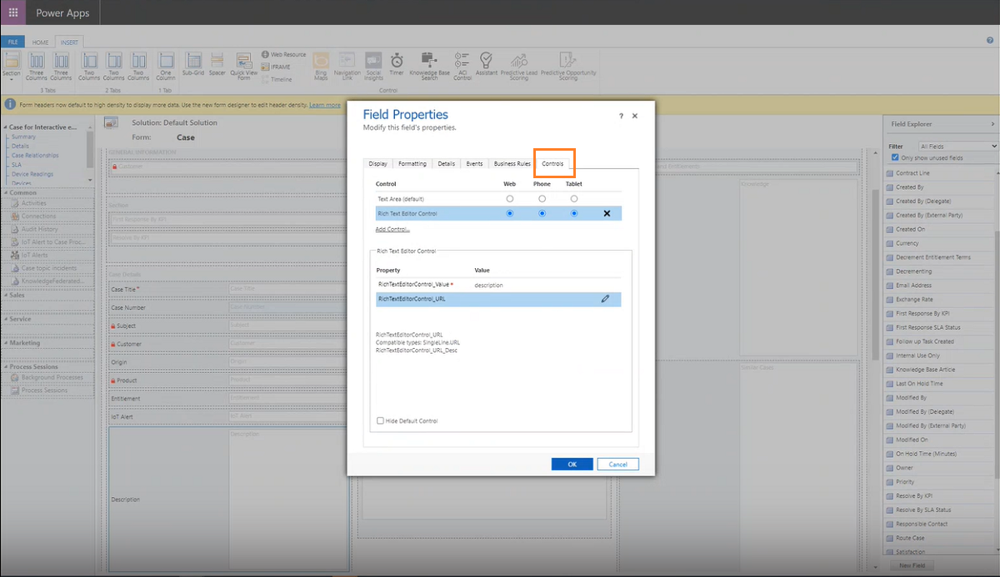
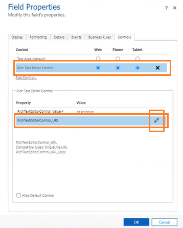
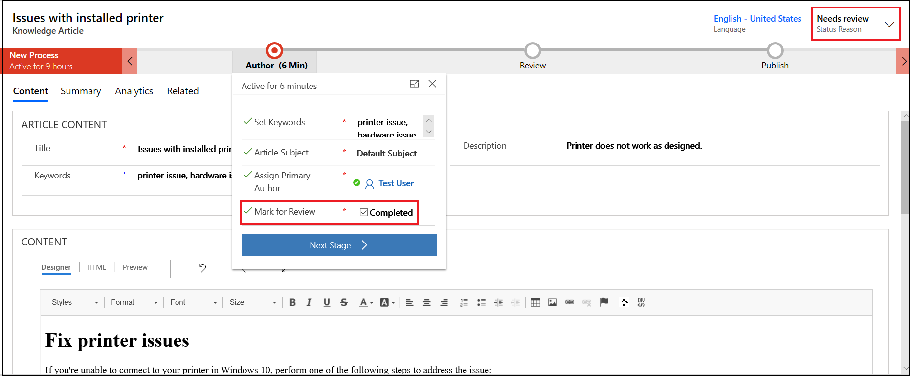
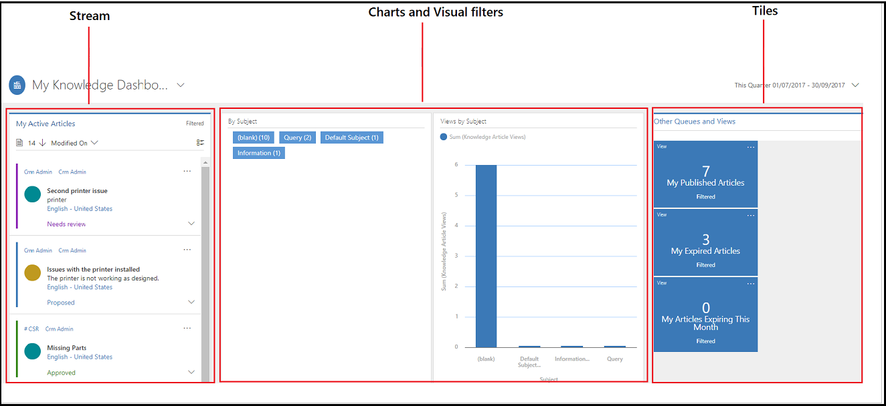
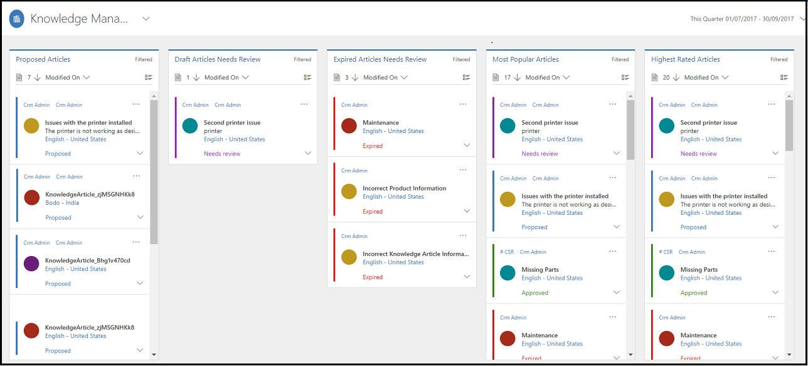

# Create and manage knowledge articles

[!INCLUDE[cc-trial-sign-up](../includes/cc-trial-sign-up.md)]

Reduce call handling times with knowledge articles in the Customer Service Hub application.
  
With the knowledge management module, you can create and manage knowledge articles that your users may be looking for.

Knowledge articles can address any number of issues your customers encounter while using your organization's product or services. Types of knowledge articles can include solutions to common issues, product or feature documentation, answers to frequently asked questions (FAQ), product briefs, and more. Use the rich text editor to create knowledge articles, format your content, or embed videos and images.  
  
> [!IMPORTANT]
> Knowledge management is available out of the box through the Customer Service Hub app module, and it works with other customer service apps as well. Articles that are created in the Customer Service Hub will be available in the Dynamics 365 Customer Service app as read-only records.  

> [!NOTE]
> The entities `KBArticle`, `KBArticleTemplate` and `KBArticleComment` are now deprecated. This means we don't expect you to use these entities anymore. You must use the newer `KnowledgeArticle` entity for knowledge management in Dynamics 365 Customer Service. More information: [Work with knowledge articles](work-knowledge-articles.md)

## Knowledge management process

The following diagram describes the default process for creating and using knowledge articles in the Customer Service Hub. Create an article and mark it for review. The reviewer can approve or reject the article. If the article is rejected, it is sent back for edits or updates. If the article is approved, it is published on the portal. It is also available in search and can be translated.
  
  
  

## Create a knowledge article

Turn your customer questions, issues, and feedback into knowledge articles, so other service reps can benefit from them. Add images and videos to your articles to explain things better and make the articles engaging. You can author, edit, search, publish, and translate the knowledge articles in the Customer Service Hub.
  
Ensure that you have Create and Read permissions on the Knowledge Article entity. By default, these permissions are added to the roles of knowledge manager, customer service manager, or customer service representative.  
  
1. In the Customer Service Hub sitemap, go to **Service** > **Knowledge Articles**.  
  
2. On the command bar, select **New**.  
  
   You’ll be on the **Content** tab of the knowledge article.
  
3. In the **Article Content** section, fill in the following details:  
  
   - **Title**: Type a descriptive title that communicates the subject and purpose of the article in a concise manner.  
  
   - **Keywords**: Type or select keywords for the article. These keywords are used to search the knowledge base for articles. Separate keywords with commas. 

   - **Description**: Type or select a short description of the article. This appears in the search results and is used for search engine optimization.
   
       :::image type="content" source="media/v9-add-cont_article.png" alt-text="Add article content":::
 
4. In the **Content** section, add the content for your knowledge article.  
  
   > [!NOTE]
   > As soon as you select inside the editor space, the rich text editor command bar appears. Use the rich text editor command bar options to format and style your content. If you can't use the features, your editing space is too small. If this is the case, you'll need to resize to a larger space. [!INCLUDE[proc_more_information](../includes/proc-more-information.md)] [Use the rich text editor to create knowledge articles and emails](#use-the-rich-text-editor-to-create-knowledge-articles-and-emails)
  
5. Select **Save**.
   
   As the article is saved, the Business Process flow bar appears for the article. The stages are **New Process**, **Author**, **Review**, and **Publish**. The Business Process flow bar guides you to drive the article toward completeness. You can customize the stages in the Business Process flow to suit your  requirements.

6. On the Business Process flow bar, select **Author**.  

7. In the **Set Keywords** text box, add keywords for your article.
  
8. In the **Article Subject** dropdown list, choose the subject of the article to help with article searches.  
  
9. In the **Assign Primary Author** dropdown list, choose a person who is responsible for maintaining the article content. By default, the user who creates the article is the primary author.  

    Once a new article is created, the author value will be replicated to Primary author if it is a system user but not a team. The knowledge article author must be a single user (not a team) in order for it to be searchable and to load properly.
    
    You can mark the article complete by selecting the checkbox at this stage.

> [!TIP]
> Select the icon  to pin the stage flyout vertically.
  
Posts about knowledge article-related activities will begin appearing in the **Timeline** section.  

## Use AI-suggested article keywords and descriptions

If your administrator has enabled keywords and description suggestions, you can select and enter your preferred keywords and descriptions when authoring or updating knowledge articles. More information: [Configure AI suggestions for article keywords and description](configure-ai-suggested-article-keywords-description.md#configure-ai-suggestions-for-article-keywords-and-description)

However, either the **Title** or **Content** fields&mdash;or any other corresponding mapped fields set by the administrator&mdash;must contain some value for suggestions to be generated. If any of the fields that the model uses to generate suggestions are empty, you'll see messages such as "There was a problem finding suggested keywords" or "There was a problem finding a suggested description".

1. In the article **Content** section, add the content for your knowledge article and then select **Save**. The **View suggested keywords and description** link appears.

1. Select the **View suggested keywords and description** link.

      :::image type="content" source="media/v9-view-suggested-keywords.png" alt-text="View suggested keywords and description link":::

1. In the **Suggested keywords and description** dialog, do the following:

   - Select the keywords that you want to add to your keywords list or select the **Insert all keywords** link to insert all the suggested keywords to the Keywords field. You can enter a keyword in the Keywords field to add to existing list.
   - Select **Insert suggested description** to add the description to the **Description** field.

     :::image type="content" source="media/v9-suggested-keywords-description-dialog.png" alt-text="Screenshot showing a Keyword field containing keywords that were selected from the list of suggested keywords below it.":::

1. Select **Apply Changes**.

The selected keywords and description appear in the **Keywords** and **Description** fields of the knowledge article form.

## Personalize your language preferences for authoring knowledge articles

If your administrator has enabled language personalization, you can select your preferred language when authoring knowledge articles.

> [!NOTE]
> Language settings apply only to knowledge articles that aren't created by converting a case. Converted knowledge articles are created in the default language setting of your organization.

1. In **Customer Service Hub**, go to **Service** > **Knowledge** > **Knowledge Personalization**.

2. Select the **Authoring** tab.

3. Do one of the following:
 
   - Set **Use organization’s language value** to **Yes**.
   - Select your preferred language from the dropdown list.
   
   > [!NOTE]
   > At any point, you can only either set the org language or select a language from the list.  

4. Select **Save**.

   When you create a new knowledge article, the default language you selected is used.

5. If you need to change the language for a specific article only, select the **Summary** tab, and then select your preferred language in the **Language** field.

6. Select **Save**.

## Create knowledge articles using templates

Authors can use the templates to create knowledge articles quickly because the fields for the knowledge article are prepopulated according to the selected template. To create knowledge articles using templates:
 
Ensure that you have Create and Read permissions on the Knowledge Article entity. By default, these permissions are added to the roles of knowledge manager, customer service manager, or customer service representative.
  
1. In the Customer Service Hub sitemap, go to **Service** > **Knowledge Articles**.  

    A list of available articles is displayed. 

2.	To create an article from a template, select **+ New From Template**.
  
3.	In the **Select Knowledge Article Template** dialog, select the template to use as a base on which you author the article and select **OK**. In this example, we are selecting the template as **Getting Started With Template**.

    > [!div class=mx-imgBorder]
    > 
  
    You observe that some fields are prepopulated as defined in the template.

4.	In the **New Knowledge Article** page, edit the fields as required. 

    > [!div class=mx-imgBorder]
    > 
  
5.	Select **Save**.

    The article is saved, and you can take it to the next stage to approve and publish the article to make it available for users.

> [!NOTE] 
> To learn how to create knowledge article templates, see [Create a knowledge article template](create-templates-knowledge-article.md).

## Use the rich text editor to create knowledge articles and emails
Create rich and well-formatted content for emails or knowledge articles using the new rich text editor in the Customer Service Hub. The editor brings common word processor features like advanced styling, linking, find and replace, and insert images and tables.  

The **Content** editor panel consists of three tabs:

- **Designer**: Author and edit the article here. Benefit from the enhanced and rich text editing capabilities.
- **HTML**: View the HTML preview of the content here. You can author or edit the article in the HTML tab also.
- **Preview**: See how your content would look on devices like desktop, tablet, or mobile.

Additionally, you can perform **Undo**, **Redo**, and **Full Screen** in the Content editor panel. 
  
### Designer

You can choose a specific format or style for the content you’re writing. The following table outlines the different formatting options of the rich text editor.

   > [!Note]
   > You can access your browser's context menu by pressing **Ctrl+right-click**. This is useful if you need to use your browser's built-in spell checker. Otherwise, you can use the right-click to provide contextual formatting for any element you might be using.

|Icon | Name | Shortcut key | Description |
|----------------------|-------------------------|-----------------------------|-----------------------------|
|| Format Painter | Ctrl+Shift+C, Ctrl+Shift+V | Apply the look of a particular section to another section.   **Note**: Copy formatting only works with inline styles, and won't copy or apply block-level styles. |
| | Formatting Styles | | Apply predefined sets of formatting features to make it easier to keep the presentation of the text consistent. To make the choice easier, the style names are displayed in a style that they represent, giving you a preview of what the text will look like.   **Note**: This option is available in the expanded mode only.
| | Paragraph Format | | Apply predefined block-level combinations of formatting options. A paragraph format can only be applied to a block-level element, like a `paragraph` or a `div` element.   **Note**: This option is available in the expanded mode only. |
| | Font | Ctrl+Shift+F | Select your desired font. The default font is Segoe UI.   **Note**: When you select any formatted content, the font name for that content displays. If your selection contains multiple fonts, the topmost font name of your selection is displayed. |
| | Font size | Ctrl+Shift+P | Change the size of your text. The default size is 12.   **Note**: When you select any formatted content, the font size for that content displays. If your selection contains multiple font sizes, the topmost font size of your selection is displayed.|
|| Bold | Ctrl+B | Make your text bold. |
|| Italic | Ctrl+I | Italicize your text. |
|| Underline | Ctrl+U | Underline your text. |
|| Text Highlight Color |  | Make your text stand out by highlighting it in a bright color. |
|| Font Color |  | Change the color of your text. |
|| Bullets |  | Create a bulleted list. |
|| Numbering |  | Create a numbered list. |
|| Decrease Indent |  | Move your paragraph closer to the margin. |
|| Increase Indent |  | Move your paragraph farther from the margin. |
|| Block Quote |  | Apply a block-level quotation format in your content. |
|| Align Left | Ctrl+L | Align your content with the left margin. (Commonly used for body text to make it easier to read.) |
|| Align Center | Ctrl+E | Center your content on the page. (Commonly used for a formal appearance.) |
|| Align Right | Ctrl+R | Center your content on the page. (Commonly used for a formal appearance.) |
|| Link |  | Create a link in your document for quick access to webpages and files.  URL text that you paste or enter is converted into a link. For example, **ht&#8203;tp://myexample.com** will become <a href="http://myexample.com">http://myexample.com</a>.   In the **Link** dialog, choose the type of link you'd like to insert.   Use the **Link Info** tab to choose the link type and set the link protocol and URL.   The type of links that you can add are defined by your administrator. If you add links whose origin link doesn't match any of the links specified in the origins list, an error will be displayed when users open an article. The error message "Update your origins allow list if any iframe in the article doesn't work or displays error" will appear. More information: [Configure origins allow list for knowledge articles](configure-knowledge-article-origin-allow-list.md)   The **Target** tab is only available for the URL link type. It specifies the location where the link will open after you select it. |
|| Unlink |  | Delete a link in your email or document.  When you place the cursor on a link, the **Unlink** button on the toolbar becomes active. Select the button to remove the link and make it plain text. |
|| Superscript |  | Type very small letters just above the line of text. |
|| Subscript |  | Type very small letters just below the line of text. |
|| Strikethrough |  | Cross out text by drawing a line through it. |
| | Image | | Insert an image.   You can insert an image by directly copying and pasting it inline in the editor, dragging and dropping it from your desktop or local folder directly into the editor, or by typing a URL. The following formats are supported: PNG, JPG, or GIF. For details on using inline images, see [Use inline images](#use-inline-images).|
|| Left to Right |  | Change the text to left-to-right for content such as a paragraph, header, table, or list. Commonly used for bi-directional language content. This is the default setting.|
|| Right to Left |  | Change the text to right-to-left for content such as a paragraph, header, table, or list. Commonly used for bi-directional language content. The default setting is left-to-right. |
|| Undo Typing |  | Undo changes you made to the content. |
|| Redo Typing |  | Redo changes you made to the content. |
|| Clear All Formatting |  | Remove all formatting from a selection of text, leaving only the normal, unformatted text. |
|| Add a Table |  | Add a table to your content.   After adding a table, you can do any of the following:  <ul><li>Resize table columns by clicking and dragging your mouse to resize the columns to the desired width.</li><li>Select one or several cells within a table and apply specific formatting, add links to the selection, or cut, copy, or paste entire rows or columns.</li><li>Right-click to access the properties. This supports features such as cell type, width and height, word wrapping, alignment, merging and splitting cells horizontally and vertically, inserting or deleting rows and columns, row and column span, and cell and border color.</li></ul>|
| | Create Collapsible Section | | Create a section that can be collapsed or expanded. This is useful in articles with a lot of information. Collapsed sections help agents find relative information more quickly by scanning the titles within an article. Collapsible sections include title and body fields to type text into, and you can nest collapsible sections to make it easier to scan longer articles to find the most relevant sections quickly. You can also select text you have already typed and then click the collapse icon to turn it into a collapsible section.     If you create a collapsible section and then later want to delete it, place your cursor within the section, and then click **Delete** on your keyboard, or right-click within the collapsible section and select **Cut**. |
|| Embed Media | | To embed videos into your content:   1.  Place the cursor where you want to insert the video, and then on the toolbar, select the **Embed Media** button. The **Embed Video** dialog opens.  2.  Enter the embed link of the video provided by the video hosting provider, and then select **OK**. |
| | Create Div Container | | Create a `div` container to apply formatting to a larger document fragment that extends beyond one block.   The **General** tab lets you manually add a stylesheet class that is applied to the div element.   The **Advanced** tab lets you configure additional div element options such as assigning it an ID, a language code, a text direction, an advisory title, or CSS style properties.  **Note**: This option is available in the expanded mode only. |
| | Create Anchor | | You can add anchors in document text and then link to them for easier navigation.  **Note**: The anchor feature only works when an article is open. It doesn't work if you are viewing an article from the **Preview** tab.   To add an anchor:   1.  Place the cursor where you want to insert an anchor, and then on the toolbar, select the **Anchor** button. The **Anchor Properties** dialog opens.  2.  Enter a name for the anchor, and then select **OK**.      The **Anchor** button  appears in the area where you created the anchor.   You can now use the **Link** button to link to your anchor. |   
  
> [!IMPORTANT]
>  You can’t use client-side code (script tags or [!INCLUDE[pn_JavaScript](../includes/pn-javascript.md)]) in articles or emails. If you want to associate CSS or [!INCLUDE[pn_JavaScript](../includes/pn-javascript.md)], use web resources. 
> 
> [!NOTE]
> In mobile devices, where you have comparatively smaller screen sizes, a limited set of formatting options will be displayed.

#### Use inline images

You can insert an image by directly copying and pasting it inline in the editor, dragging and dropping it from your desktop or local folder directly into the editor, or by typing a URL. 

Before using inline images, keep in mind the following: 

- These are the supported formats: PNG, JPG, or GIF
- These are the supported browsers: Microsoft Edge, Chrome, Firefox, Safari

**Drag and drop an image**

> [!Note]
> You can only drag and drop an image in an editable area of the editor.

1. Drag and drop the image either above the content or in the middle of the content in the editor.

2. Drag any corner of the image to resize it to your desired size in the editor.

**Copy and paste an image**

> [!Note]
> To copy and paste images, you must open the image file and then copy and paste it into the editor.  You can drag and drop or copy and paste an image from Microsoft Word into the editor. One or two images can be copied at a time, as long as the total size of the images together doesn't exceed 5 MB.

1. Open the image file that you want to copy to the editor.

2. Right-click the image, then select **Copy**.

3. Go to the desired location in the editor where you want to insert the image, and then either right-click and select **Paste**, or select **Ctrl+V**.

**Insert a URL for an image**

To insert an image by using a URL or navigating to the local image:

1. In the editor, choose **Insert Image**.
2. In the **Image** property dialog, choose from the following options:
   - Specify the web address of the image, and also specify properties to define how the image will appear in the email or article.
    
     **Note:** If the image is located on the external server, use the full absolute path. If the image is located on a local server, you can use a relative path. If you want the image to be a selectable link, add a URL for the image. You can also specify if you want the targeted page to open in a new window, top-most window, same window, or parent window.

   - Select **Browse** to navigate to the image on your computer.

  
### HTML

You can author and edit the article in the HTML tab of the Content editor panel, using HTML tags.

### Preview

You can preview the content to view its compatibility on multiple devices, like tablets or phones.

This is an indicative preview. Content rendered can be different in the actual device or screen.

> [!NOTE]
> If you add anchor links to a knowledge article in the **Content** field, you can’t test them because they don’t work in the **Designer** or **Preview** mode. The anchor links work only when you open the article in knowledge search and on portals.

## Add a file attachment to a knowledge article

When you're creating a knowledge article, you can attach one or more files to it to help provide comprehensive information for your customers. Keep in mind the following when attaching files:

- There is no limit to the number of articles that can be attached to a knowledge article, but the file size mustn't exceed 32 MB.
- Your administrator may limit the file size for knowledge articles.
- You must save your knowledge article before attaching files to it.

To attach a file to a knowledge article:

1. Open the knowledge article where you want to add a file attachment, and then on the **Content** tab, on the right side of the screen, select **Attach Files From**.
 
   

2. Choose from the following file locations:
    - **My Device** lets you browse and select files from your local device.
    - **Previous Uploads** opens a search pane where you can search and select from files that were previously uploaded to Customer Service Hub.

### Work with file attachments

The **Attached files** section displays all your knowledge article attachments in a tile view horizontally above your message. The default setting for the maximum number of files that can be displayed is five attachments before the page forward functionality is displayed.

For your attached files, use these commands to do the following:

- **Select**: Allows you to select one or more attachments by clicking the box that appears on the attachments, and then you can either **Remove** or **Download** the selected files.
- **Sort**: Allows you to sort records by a specific filter, such as file name or size.

> [!NOTE]
> In Dynamics 365 Customer Engagement (on-premise), upload and download of knowledge article attachments is supported for files up to 4MB only.

When you publish your knowledge article, if you've attached files to it, the attachments can be accessed by knowledge consumers through Knowledge Search.

#### User permissions to view and download file attachments

For users to be able to view and download file attachments, you'll need to grant the following permissions to the Knowledge Article table:

|Task|Access needed |  
|--------|-------------|  
| Download and search attachments | Read |
| Add attachments | Create, append, append-to |
| Remove and add existing attachments | Append or append-to |

### Update knowledge article attachments for portal

With this new attachment capability, you'll need to stop using notes attachments for the portal. To use knowledge article attachments for the portal, you must enable the feature in the Customer Service admin center or Customer Service Hub app by performing the following steps:

1. Go to the **Sync knowledge article attachments to portal** section.

### [Customer Service admin center](#tab/customerserviceadmincenter)

  1. In the site map, select **Knowledge** in **Agent experience**. The **Knowledge** page appears.
  2. In the **Portals** section, select **Manage**. The **Portal** page appears.
  3. On the **Portals** page, go to the **Sync knowledge article attachments to portal** section.

### [Customer Service Hub](#tab/customerservicehub)

   1. In the site map, go to **Service Management** and select **Settings** in **Knowledge Base Management**. The **Settings** page appears.
   2. On the **Settings** page, go to the **Sync knowledge article attachments to portal** section.

---

2. Set the **Sync attachments to portal** toggle to **Yes**.
3. Select **Save**.

On syncing knowledge article attachments to the portal:

- Dataverse search will be able to search through knowledge article attachments. More information: [Microsoft Dataverse search can search through file data type](/power-platform-release-plan/2021wave2/data-platform/dataverse-search-search-through-file-data-type) Additionally, you must configure the faceted search results web template from your portal to be able to search through knowledge article attachments. More information: [Configure faceted search results web template from your portal](configure-faceted-search-results.md) 
  
- There will be a one-time migration from the notes attachments that have the prefix of your original KnowledgeManagement/Notesfilter setting to new attachments in knowledge articles. Only the notes attachments used in the portal will be migrated to new attachments.

For more information, see [Display file attachments with knowledge articles](/powerapps/maker/portals/customer-engagement-apps/display-file-attachments-knowledge-article).

## Add a knowledge article rich text editor control to a form
By default, the rich text editor functionality is available for use with knowledge articles and emails, but if you want to use it in another form, you can add it by doing the following:

1. In Power Apps, go to the form where you want to add the rich text editor control, and double-click a field where you can enter single or multiple lines of text to open **Field Properties**. 

2. On the **Field Properties** dialog, select the **Controls** tab.

3. Under **Controls**, select **Rich Text Editor Control**.

    > [!div class=mx-imgBorder]
    > 

3. Under **Rich Text Editor Control** properties, select the pencil icon next to **RichTextEditorControl_URL**. 
    
    > [!div class=mx-imgBorder]
    > 
    
    The properties configuration page is displayed.

4. In the **Bind to a static value** field, enter the following text: **webResources/msdyncrm_/RichTextEditorControl/KnowledgeArticleRTEconfig.js** 

    > [!div class=mx-imgBorder]
    > 

5. Select **OK** > **OK**, and then select **Save and Publish**.

For more information about rich text control properties, see [Rich text editor control configuration options](/powerapps/maker/model-driven-apps/rich-text-editor-control#rich-text-editor-control-configuration-options).
  
## Mark a knowledge article for review  

To ensure that the content you’ve created is accurate, have someone review it.  
  
You can mark an article for review or directly assign it to a specific person or queue. When you mark an article for review, it starts appearing in the knowledge manager’s dashboard. The knowledge manager can then assign the article to specific team members or a queue for review.  
  
1.  In the article you want to mark for review, in the **Status Reason** dropdown list, select **Needs Review**.  
  
2.  On the Business process flow, select **Author**.  
  
3.  In the **Mark for Review** field, select **Mark Complete**.  

    
  
4.  To assign the knowledge article to another reviewer or team, on the command bar, select **Assign** and select the user or a team.  
  
5.  To add the article to a queue so reviewers can pick it from there, on the command bar, select **Add to Queue**, and then select the queue.  
  
 
## Review and reject or approve a knowledge article  

It’s important to review articles for accuracy before they’re published or made available to others.  
  
> [!IMPORTANT]
>  To approve a knowledge article, you must have **Approve** permissions for the knowledge article record type. This permission is added by default to the knowledge manager, customer service manager, customer service representative, or system administrator role or equivalent permissions.  
  
|To|Do this|  
|--------|-------------|  
|Pick an article assigned to you|Go to **Service** > **My Knowledge Dashboard**, and then see the **My Active Articles** stream.   **-OR-**   In the Customer Service Hub, go to **Service** > **Queue Items**, and then select the **Items available to work on** view.|  
|To suggest review feedback|1.  On the Business process bar, in the **Review** stage, in the **Review** field, select **Reject**. Give the reason for rejection in the **Reject Knowledge Article** flyout.   2.  To add details about the changes you want in the knowledge article, go to **Summary** tab and in the **Timeline** section, select **+** to add a note.   The rejected article is  assigned back to the primary author of the knowledge article.|  
|Approve the content of the article|When you approve the content of an article, it means that the content is ready to be consumed by other customer service reps, and also ready to be published.   On the Business process bar, in the **Review** stage, in the **Review** field, select **Approve**.   The article is now ready to be published.|  
 
## Update knowledge articles to capture feedback  

Ensure that your articles are up to date and accurate at all times by updating them based on feedback you receive.  
  
1.  In the Customer Service Hub, go to **Service** > **Knowledge Articles**.  
  
2.  Select the article you want to edit.  
  
     If the reviewer has suggested any changes from their review, you can see them as notes in the **Timeline** section.  
  
3.  Update the article based on the feedback.  
  
4.  Select **Save**.  
  
5.  To assign the article back to the reviewer for approval or publishing, on the command bar, select **Assign**, and then select a user or a team.  
  
## Update published knowledge articles  

When a knowledge article is in the Published (or Scheduled) state, only the users who have the Publish privilege can update it.  
  
1.  In the Customer Service Hub, go to **Service** > **Knowledge Articles**.  
  
2.  Select the published article you want to edit.  
  
3.  On the command bar, select **Update**.  
  
4.  Update the article based on the feedback.  
  
If the article has information that complements an existing knowledge article, associate the existing article with the current knowledge article.  
  
1.  In the knowledge article, on the command bar, select **More** > **Relate Article**.  
  
2.  In the **Select Article to Associate** field, select the **Lookup** button, select an existing article, and then select **Associate**.  
  
     The associated article appears in the **Related Articles** list in the **Related Information** section of the **Summary** tab.  
  
 
## Create and manage article versions  

Article versioning helps you manage updates to your knowledge articles without disrupting the live or published articles. By creating major and minor versions of a knowledge article, you can keep your articles up to date with the latest information while keeping track of changes throughout the lifecycle of your products and services.  
  
This capability helps you to keep accurate records of the features your organization provides and go back to previous versions if you need to.  
  
1.  In the Customer Service Hub, select **Services** and choose **Knowledge Articles**.  
  
2.  Open the article you want to create a new version for.  
  
3.  In the knowledge article, select **Create Major Version** or **Create Minor Version**.  
  
     An example of a major version would be when your documentation changes to detail a new feature or functionality,  while a minor version might be a change to the user interface with no change to functionality.  
  
     The new version of your article will contain all of the same content, information, and permissions as the current version. The **Version Major** or **Version Minor** field will automatically update to reflect the new version number.  
  
    > [!NOTE]
    >  You won’t be able to make any changes to the **Major Version Number**, **Minor Version Number**, **Language**, or **Article Public Number** fields when creating a new major or minor version of an article.  
  
4.  After you have reviewed the article, make any changes that you want to the new version. You can update the article title, content, keywords, and description to reflect any changes to your products, features, or services.  
  
### Review and publish your new version  

When you are done making changes, you can push the new version of your article through your standard article workflow. When you are finished reviewing and are ready to publish, on the command bar, select **More** > **Publish**, and then choose how and when you want to publish your new version. You can publish your new version immediately, schedule it to publish at a future date, or leave it as a draft to manually publish later. [!INCLUDE[proc_more_information](../includes/proc-more-information.md)] [Schedule or publish an article](#schedule-or-publish-an-article) 
  
### Manage article versions  

Managing your article versions means publishing and archiving different versions of each article to provide the most accurate information to your customers and internal employees. Keep in mind that only one version of an article can be published at a time; it’s important to keep track of the changes that are made to each version and publish them when it's appropriate.  
  
1.  In the knowledge article, select the **Summary** tab.  
  
2.  In the **Related Information** section, select the **Related Versions** button to display a list of all major and minor versions of the article.  
  
3.  In the **Related versions** list, open the version you want to delete.  
  
4.  Select the **More** button, and then select **Send to Trash**.  
  
5.  When prompted, select **OK**.  
  
     Deleting an article version is permanent and can’t be undone. You won’t be able to go back to that version of the article, so ensure that you don’t need any of the information. It’s a good idea to create a local backup of any versions you delete.  
  
## Select a language for your knowledge article translation

Your knowledge article must reach your customers irrespective of their market or region. The knowledge management capability in Dynamics 365 Customer Service helps you set the translation language for your articles, which enables you to provide the same self-help content in multiple languages, without having to manage multiple copies of the same article.  
  
1. Open the article you want to translate, and from the command bar, select **Translate**.  
  
2. In the **Create new translation** dialog, do the following:
   * From the **Pick a language** dropdown list, search for and select the language you want.  
   * In the **Create new version** field, select either **Major** or **Minor** version for your translation.  

    You can set languages that are supported by your Dynamics 365 instance.
  
4. Select **Create**.  
  
5. Enter your translated text in the appropriate fields. You can enter translated text for the following fields:  
  
   -   Title  
   -   Keywords  
   -   Article Description  
   -   Content  
  
6. When you are done reviewing and your article is ready for publish, select **More** > **Publish**. Select how and when you want to publish your new version. You can publish your new version immediately, schedule the publish for a future date, or leave it as a draft to publish it manually at a later point in time. [!INCLUDE[proc_more_information](../includes/proc-more-information.md)] [Schedule or publish an article](#schedule-or-publish-an-article)
  
### Manage article translations  

After you have published a translation for an article, you can manage it and any other translations by selecting the **Summary** tab of the knowledge article.  
  
1.  In the **Related Information** section, select **Related Translations**.  
  
2.  Open the translation you want to view. Keep in mind that there may be multiple versions for each language. You can sort the translations by selecting the column headers of the **Related Translations** section.  
  
     From here, you can:  
  
    -   Edit or update a translation.  
    -   Create a new major or minor version of a translation.  
    -   Delete a translation or version of a translation.  

## Schedule or publish an article  

After the content in the article is complete and reviewed, you can publish the article to the portal to make it available to your customers. You can publish the article immediately or schedule it for a later time. 

Ensure that you have the Publish and Update permissions on the Knowledge Article record type. These permissions are added by default to the roles of knowledge manager, customer service manager, customer service representative, or system administrator.  
  
> [!IMPORTANT]
>  If your organization is using a portal to publish the knowledge articles, your customizer can write a plug-in that can pick the published articles and post on your portal, and also report the article views back.  
  
You will also need the Publish permission on the Knowledge Article record type, if you want to change the state of a published article.
  
1.  In the Customer Service Hub, go to **Service** > **Knowledge Articles**.  
  
2.  Open a knowledge article that’s in the Approved state.  
  
4.  To make it easy to find knowledge articles related to specific products, associate the knowledge article with a product.  
  
    1.  On the command bar, select **More** > **Relate Product**.  
  
    2.  In the **Select Product to Associate with** field, select the **Lookup** button, elect a product this article is about, and then select **Associate**.  
  
         The associated article appears in the **Related Products** list in the **Related Information** section of the **Summary** tab.  
  
5.  On the Business process bar, select the **Publish** stage.  
  
6.  In the **Set Product Associations** field, select **Mark as Complete**.  
  
7.  If you want to schedule the article to publish on a later date, on the **Summary** tab, in the **Publish On** field, select a date and time to publish the article.  

8.  Select **Finish**. The Publish dialog is displayed.

  > [!NOTE]
  > The Publish dialog appears only for the default business process flows where the final stage is **Publish**. To configure the Publish dialog for other customized stages, see [Process events and event handler methods](/powerapps/developer/model-driven-apps/clientapi/reference/formcontext-data-process#process-events-and-event-handler-methods).

-   In the **Publish** field, select whether you want to publish the knowledge article right away or in the future. To publish the article in the future, in the **Publish On** field, select a date and time.  
  
-   In the **Published Status** field, select what status the article should be in after it is published. By default, **Published** is selected.  
  
-   In the **Expiration Date** field, select a date and time when you want the published article to expire. Expired articles are no longer available in searches.  
  
-   If you’ve set an expiration date, in the **Expiration Status** field, select the status the knowledge article should be set to after it expires.  
  
-   To publish all approved related translated articles with the article, in the **Publish Approved related translations with Article** field, select **Yes**.  
  
-   Select **Publish**. 
       
    :::image type="content" source="media/ka-publish.png" alt-text="Schedule or publish an article":::
    
> [!NOTE]
> In the knowledge article for interactive experience form, if there is an active customization layer over the **msdynce_KnowledgeManagementFeatures** layer, you won't be able to view the quick form publish dialog. You must delete the active customization layer to view the quick form publish dialog. More information: [Removed an unmanaged layer](/powerapps/maker/data-platform/solution-layers#remove-an-unmanaged-layer).

## Track basic details of an article  

Use the **Summary** tab to track some basic details of the article. In the **Summary** tab, you can:

- View or edit **Basic settings** for the article. These include details like Language, Article Public Number, and more.
- View or edit **Publish settings** for the article.
- See the **Timeline**. Add notes, or view what you have missed.
- View related information about the article in the **Related Information** section. These include related versions, translations, categories, articles, and products.

  
### Track knowledge article analytics  

Tracking your content helps you and your authoring team assess its value to your organization and your customers. Knowing and understanding when, where, and how many times an article was viewed tells you how much your customers and team members rely on the information that it contains. This data is extremely useful when creating future content curation plans and can help you decide what content you will deliver in the future, as well as how you deliver it, where you deploy it, and what style or structure you use to write it.  
  
To view an article’s view counts and other statistics, open the article you want to track, and then select the **Analytics** tab.  
  
- **Views**. Shows you the total number of times this article has been viewed. This figure represents the total views of all versions and all translations of this article combined. It also shows individual article views on specific days. You can select the column headers to sort by chronological order or by the number of views. 

- **Feedback**. Captures all the feedback and ratings on the knowledge articles and updates the articles accordingly. If your articles are published on a portal, customers and users can provide their feedback and also give ratings on an article. The Feedback subgrid shows all feedback received for the current knowledge article.  

   The **Rating** field calculates the average rating of the article based on the amount of feedback and number of ratings received.  
   
   > [!NOTE]
   > Rating and view count numbers are rollup fields that are not updated instantly. For more details, see [Define rollup fields](../customerengagement/on-premises/customize/define-rollup-fields.md).

- **Cases**. Shows a list of the cases that have used this article. Double-click a case to view its details.  
  
     By reviewing cases that have used your articles, you can gain valuable insights into the questions that customers are asking, as well as what avenues they tried before asking for help. This data can help you expose your knowledge articles better and provide more useful information to your customers and team members.  

#### Add feedback to an article  
  
1. In the **Feedback** subgrid, select **Create Feedback**. You can also select  in the nav bar and then go to **Feedback** to create a feedback.  
  
2. In the **Create Feedback** flyout, fill in the information:  
  
   - **Title**. Type a descriptive  title for the feedback. For example, if the feedback is about customer satisfaction, type that.  
   
   - **Regarding**. Look for relevant records to associate the feedback.
  
   - **Source**. Select whether the feedback is internal or from a portal. If you received the feedback via a phone call, you can select **Internal**.  
  
   - **Comments**. Type any feedback comments that you want.  
  
   - **Rating**. Type a number to specify how useful the related record is. For example, if you are tracking the customer satisfaction for a case, and you want to rate it a 2 on a scale of 1–10, type 2.  
  
   - **Minimum Rating Value** and **Maximum Rating Value**. Specify a minimum and maximum rating to define a rating scale. For example, you want to give a rating of 2  on the scale of 1–10, type 1 as the minimum rating and 10 as the maximum rating.  
  
   - **Created by (Contact)**. If you're creating the feedback on behalf of a customer contact, select the contact here.  
  
        The **Created By** and **Closed By** fields are automatically populated with the user who creates or deactivates the feedback record.  
  
   - Dynamics 365 Customer Service automatically calculates the **Normalized Rating** based on the following formula: **(Rating - Minimum Rating)/ (Maximum Rating - Minimum Rating)**.  
  
3. Select **Save**.

   

> [!NOTE]
> You can also update the owner of the feedback in the flyout.

 
## Monitor knowledge articles with dashboards  

Knowledge managers and authors can now monitor the status of knowledge articles using the two  default dashboards available in the Customer Service Hub.  
  
> [!NOTE]
>  If these dashboards don’t offer what you need, you can create new interactive dashboards. [!INCLUDE[proc_more_information](../includes/proc-more-information.md)] [Configure interactive experience dashboards](/previous-versions/dynamicscrm-2016/administering-dynamics-365/mt622067(v=crm.8))  
  
### My Knowledge Dashboard  

This dashboard is designed to give authors a visual snapshot of the number and status of knowledge articles they’re working on. It helps them quickly know things like articles expiring in the month and articles in review.  
  
   
  
-   **Streams** show data from views or queues. In the My Knowledge Dashboard, the stream shows the active articles assigned to the author.  
  
-   **Charts** provide a count of relevant records in the streams, such as articles by status, articles by owner, or articles by subject. They also act as visual filters. You can drill down in a chart to see data that interests you the most.  
  
-   **Tiles** give authors an aggregated view of data in the streams and help them monitor the volume of their knowledge articles.  
  
### Knowledge Manager  

This dashboard is designed specifically for knowledge managers. As a knowledge manager, you can quickly know the most popular articles, articles that need review, highest-rated articles, or articles that are about to expire, and take necessary actions on the articles from here.  
  
   
  
 [!INCLUDE[proc_more_information](../includes/proc-more-information.md)] [Use interactive dashboards to effectively manage service cases](customer-service-hub-user-guide-dashboard.md)

#### Manage versions in alternate keys for knowledge article entity
If you are creating an alternate key for a Knowledge article entity, include the major or minor version in the key to maintain uniqueness. Also, if you are using translations, include the language code along with the version in the key to ensure a seamless translation experience. To know more about alternate keys, see [Define alternate keys for an entity](../customerengagement/on-premises/developer/define-alternate-keys-entity.md).

## Prevent duplicate workflows with knowledge article operations   

If you use [workflow processes](../customerengagement/on-premises/customize/workflow-processes.md) to perform knowledge article operations, such as creating or updating a knowledge article, the update operation is further classified into suboperations, such as:

-	Update a knowledge article version.
-	Manage a knowledge article version.
-	Translate a knowledge article.

For the create and update operations, be aware of the following when using the workflow process: 

Whenever you create a new knowledge article manually, the system creates two articles: a root article and a base article. This means if you use a workflow process that is triggered on a create operation, the workflow is triggered twice—once each for the creation of the base article and the root article.

When you use a workflow process to perform the following update operations, the workflow is triggered twice—once each for the base article and the root article:
-	Create major version
-	Create minor version
-	Translate
  
   > [!NOTE]
   >  Other update operations, such as updating a field or approve/publish, do not trigger the second workflow.

To avoid triggering the workflow twice, in the workflow itself, set the trigger condition for the knowledge article as follows: 

- For a create operation, set the root article to **Yes**. 
- For an update operation, set the root article to **No**. 

Follow these steps:
  
1. Sign in to Customer Service Hub.  
  
2. Select **Settings** > **Advanced Settings**. Advanced Settings opens in a new browser tab.
  
3. In the navigation bar, select **Settings** > **Processes**.

4. Select the knowledge article flow you created. The workflow process opens in a new browser window.
  
5. In the **General** tab, select the **Add Step** dropdown list, and then select **Check Condition**. A new step will be added.

    > [!div class=mx-imgBorder]
    > 
  
6. In the step, select **&lt;condition&gt; (click to configure)**. The **Specify condition** page opens in a new browser window.

    > [!div class=mx-imgBorder]
    > 
  
7. From the entity dropdown list, select **Knowledge Article**.

8. From the field dropdown list, select **Root Article**.

9. From the condition dropdown list, select **Equals**.

10. From the value dropdown list, select a value:
    - **Yes** for the create operation.
    - **No** for the update operation.

    > [!div class=mx-imgBorder]
    > 

11.	Select **Save and Close** to save the condition and close the window.

12.	In the workflow process window, select **Save and Close** to save the condition and close the window.

Now, when you perform a create or update operation, the workflow process will trigger only once. 

### See also

[Add the Knowledge Base Search control to forms](add-knowledge-base-search-control-forms.md)  
[Create knowledge article template](create-templates-knowledge-article.md)  
[Set up knowledge management using embedded knowledge search](set-up-knowledge-management-embedded-knowledge-search.md)  
[Use Workflow processes to automate processes that don't require user interaction](../customerengagement/on-premises/customize/workflow-processes.md)  

[!INCLUDE[footer-include](../includes/footer-banner.md)]
