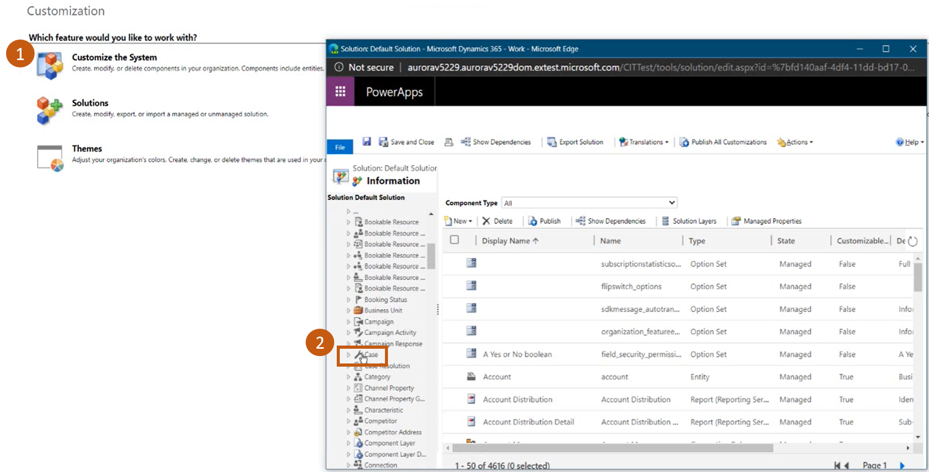
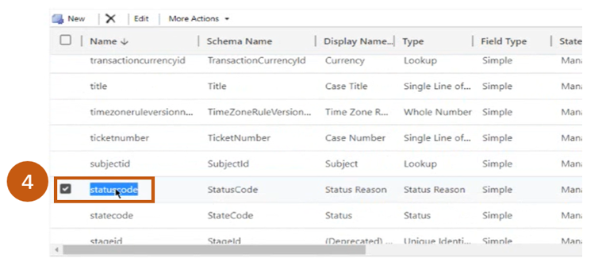
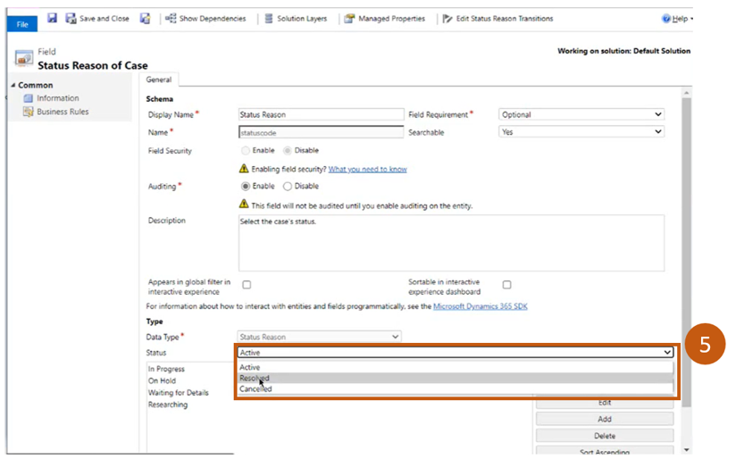
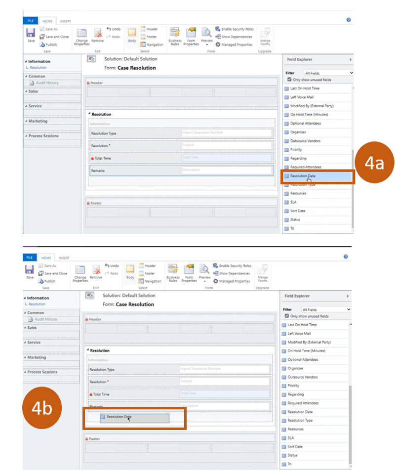
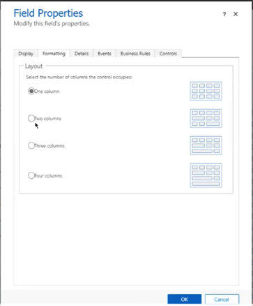

# Modify Case Resolution Dialog

Updates to the case resolution main form dialog (MFD) provides customers with additional functionality to support case resolution entities and edit dialog without code knowledge or experience.  The new functionality provides a powerful construct to expand the case resolution entity to support business needs that enable users to add and remove fields instantly without writing a single line of code. 

The new MFD experience is similar to the old experience, but behind the scenes this is a form which customers can freely edit.  Customers have the ability to go into the form designer and edit and modify fields as desired based on business needs.

## Set Resolution Type
One example of how case resolution can be used, is by resolving situations where you receive duplicate cases. You now can set the resolution type to display which cases have duplicate status.  

The following steps provide walk you through how to set the resolution type for duplicate cases:

**Step 1:** Select on **Customize the System**

**Step 2:** Select **Case**

  > [!div class=mx-imgBorder]
  > 

**Step 3:** Select Fields

  > [!div class=mx-imgBorder]
  > 

**Step 4:** Select the field you wish to update.  For this example, we’ll select, **Status Reason** 

  > [!div class=mx-imgBorder]
  > 

Once you select the entity, the **Status Reason** in the case window will display.

**Step 5:** From the **Status** field a drop down box will appear. For this example, we’ll select **Resolved**. 

  > [!div class=mx-imgBorder]
  > 

**Step 6:** In the bottom right, select on **Add**.

  > [!div class=mx-imgBorder]
  > 

Once you select Add, the **Add List Value** window will appear. 

**Step 7:**  In **Label** field, enter **Duplicate**. 

  > [!div class=mx-imgBorder]
  > 

You’ve successfully added a duplicate status to the status code field, now you can edit the form to add the field you just created.  

## Edit Form
Case resolution allows you to tailor form fields to support the needs of your business.  You now can add or remove fields that don’t apply to your business model without using code.  

For example, your business model does not require a **Billable Time** field because your case resolutions do not track billable hours, therefore you would like to remove that field from the form.  Also, your business process needs the ability to specify the date when a case was resolved, because your agents enter the resolution on a different date from when the case was actually resolved.

The following steps will walk you through how to remove the **Billable Time** field and add a new **Resolution Date** field in the Form Editor.

**Step 1:**  Go to the **Case Resolution** entity and select on **Forms**.  
  > [!div class=mx-imgBorder]
  > 

**Step 2:**  Select on the name of the form you want to edit. In this example, we’ll select the Information form.

  > [!div class=mx-imgBorder]
  > 

This will open up the form in the form designer.

**Step 3:** a. Select on **Billable Time field** 
b. On top nav bar, select on **Remove**. **Billable Time** field will disappear.

  > [!div class=mx-imgBorder]
  > 

**Step 4:** a. Go to **Field** section. Find field you want to add to form designer.  For this example, we’ll be adding the **Resolution Date** field.
  
  b. Drag field and drop into the position of your choice in the form designer. 

  

You also have the ability to resize the fields so that align with others in the form:

  > [!div class=mx-imgBorder]
  > 

Once you have updated the field(s) that you want you are done.

**Step 5:** a. Select **save** 

  b. Select **publish**

  > [!div class=mx-imgBorder]
  > 

Now when you open your case, the case resolution dialog should now display the fields you’ve added:

  > [!div class=mx-imgBorder]
  > 

You will know if a case has been successfully resolved per the status bar at the top of the form. 

  > [!div class=mx-imgBorder]
  > 

### See also

[Work with cases](customer-service-hub-user-guide-create-a-case.md) 

[Create a case](customer-service-hub-user-guide-create-a-case.md)

[Merge cases](customer-service-hub-user-guide-merge-cases.md)

[Resolve, cancel, and reassign as case](customer-service-hub-user-guide-resolve-cancel-reassign-a-case.md)

[Create and manage parent and child cases](customer-service-hub-user-guide-create-and-manage-parent-and-child-cases.md)

[Case Queues and routing](customer-service-hub-user-guide-case-queues-and-routing.md)

[Convert case to knowledge article](customer-service-hub-user-guide-convert-case-to-knowledge-article.md)

[Case SLAs](customer-service-hub-user-guide-case-sla.md)

[Learn the basics of the Customer Service Hub ](customer-service-hub-user-guide-basics.md)

[Use the Main form and its components](../customerengagement/on-premises/customize/use-main-form-and-components.md)