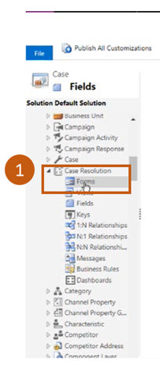
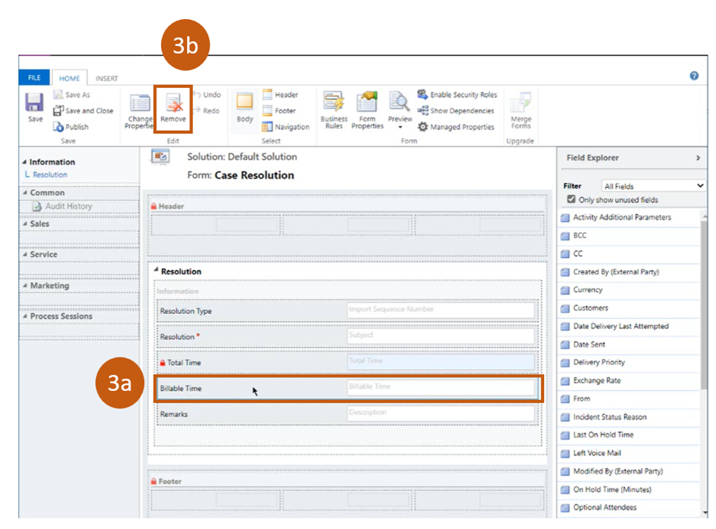

# Modify Case Resolution Dialog

Updates to the case resolution main form dialog (MFD) provides customers with additional functionality to support case resolution entities and edit dialog without code knowledge or experience.  This new functionality provides a powerful construct to expand the case resolution entity to support business needs that enable users to add and remove fields instantly without writing a single line of code. 

The new MFD experience is similar to the old experience, but behind the scenes this is a form which customers can freely edit.  Customers have the ability to go into the form designer and edit and modify fields as desired based on business needs.

Use the following steps to get started:

- **Step 1:** Set permissions (required)
- **Step 2:** Enable Customizable Dialog (required)
- **Step 3:** Create Status Values
  - Case Entity (status code)
  - Case Resolution Entity (Resolution Type Code)
- **Step 4:** Edit Form 

## Permissions

The first step is to set your security permission. This is critical requirement must be done first before you can enable customizable dialog on a form.  

Permissions must be set per the example below, otherwise you will not see the modified case resolution dialog, but the box case resolution instead.

> [!IMPORTANT] 
> If you have created your own security roles, you'll need to update your roles before you can use the modified case resolution dialog.

## Enable Customizable Dialog

Now that you have set your permissions, the admin must  enable customizable dialog on a form.  This is done by accessing the advanced settings in the Customer Service Hub (CSH) screen using the following steps:  

**Step 1:** Select **Service Management**

**Step 2:** Select **Service Configuration** 

**Step 3:**	Use the drop down and select **Customizable Dialog**

**Step 4:**	Click **Save**

  > [!div class=mx-imgBorder]
  > 

> [!NOTE]
> The default setting is **Standard Dialog**. Admin must select the **Customizable Dialog** option, otherwise changes made to the form will be saved, but will not be displayed. 

## Status Values 

After you have set your permissions and enabled customizable dialog, you can now create status values in your form. 

When adding custom status values, you must update them in the following two locations:

- **Case Entity** (status code)
- **Case Resolution Entity** (resolution status code)

> [!IMPORTANT] 
> - If you change the value in the **Case Entity**, you must update the value in the **Case Resolution Entity** to match.
> - If the values do not match, an error message will display when you try to resolve the case. 

The Case Entity and Case Resolution Entity can be accessed and updated via the Customize the System screen. 

The following steps to will take you to the Customize the System screen:

**Step 1:** Go to **Settings**

   > [!div class=mx-imgBorder]
   > 

**Step 2:** Click on **All legacy settings**
    
   > [!div class=mx-imgBorder]
   > 

**Step 3:** Click on **Customize the System**
    
   > [!div class=mx-imgBorder]
   > 

### Case Entity

One example of how you can use case resolution is by resolving situations where you receive duplicate cases. In this example, we will show you how to set the resolution type to display which cases have duplicate status.  

From the Customize the System screen use the following steps to set the case entity for duplicate cases:

**Step 1:** Select on **Customize the System**

**Step 2:** Select **Case**

  > [!div class=mx-imgBorder]
  > 

**Step 3:** Select **Fields**

  > [!div class=mx-imgBorder]
  > 

**Step 4:** Select the field you want to update.  For this example, we’ll select, **Status Reason** 

  > [!div class=mx-imgBorder]
  > 

Once you select the entity, the **Status Reason** in the case window will display.

**Step 5:** From the **Status** field a drop down box will appear. For this example, we’ll select **Resolved**. 

  > [!div class=mx-imgBorder]
  > 

**Step 6:** In the bottom right, select **Add**.

  > [!div class=mx-imgBorder]
  > 

Once you select Add, the **Add List Value** window will appear. 

**Step 7:**  In **Label** field, enter **Duplicate**. 

  > [!div class=mx-imgBorder]
  > 

You’ve successfully added a duplicate status to the status code field.  

### Case Resolution Entity

Now that we've added the duplicate status to the case entity, we need to add it to the case resolution entity using the following steps:

  > [!div class=mx-imgBorder]
  > 

**Step 1:** Select **Case Resolution** entity

**Step 2:** Select **Fields**

**Step 3:** Select **Resolution Type Code**

  > [!div class=mx-imgBorder]

  > 

  > 

**Step 4:** Under Options section, click on plus symbol. This will enable the **Label** and **Value** fields to be populated.

**Step 5:** In the **Label** field, enter a value name, for this example we used **Duplicate**

**Step 6:** In the **Value** field, you want to confirm that the variable listed matches the value listed in the case entity.  

**Step 7:** Click **Save**

  > [!div class=mx-imgBorder]
  > 

Now the a case resolution entity will appear in the dialog field as an option you can select. 

## Edit Form
Case resolution allows you to tailor form fields to support the needs of your business.  This feature allows you to add or remove fields that don’t apply to your business model without using code.  

For example, your business model does not require a **Billable Time** field because your case resolutions do not track billable hours, therefore you would like to remove that field from the form.  

The following will walk you through how to remove the **Billable Time** field in the Form Editor.

**Step 1:**  Go to the **Case Resolution** entity and select on **Forms**.  

  > [!div class=mx-imgBorder]
  > 

**Step 2:**  Select on the name of the form you want to edit. In this example, we’ll select the **Information** form.

  > [!div class=mx-imgBorder]
  > 

This will open up the form in the form designer.

**Step 3a:** Select on **Billable Time field**

**Step 3b:** On top nav bar, select on **Remove**. **Billable Time** field will disappear.

  > [!div class=mx-imgBorder]
  > 

**Step 4a:** Select **save**

**Step 4b:** Select **publish**

  > [!div class=mx-imgBorder]
  > 

Now when you open your case, the case resolution dialog should now display the fields you’ve added:

**Step 5:** Under Resolution Type use dropdown to select **Duplicate**

  > [!div class=mx-imgBorder]
  > 

You will know if a case has been successfully resolved per the status bar at the top of the form. 

  > [!div class=mx-imgBorder]
  > 

## See also

[Work with cases](customer-service-hub-user-guide-create-a-case.md) 

[Create a case](customer-service-hub-user-guide-create-a-case.md)

[Merge cases](customer-service-hub-user-guide-merge-cases.md)

[Resolve, cancel, and reassign as case](customer-service-hub-user-guide-resolve-cancel-reassign-a-case.md)

[Create and manage parent and child cases](customer-service-hub-user-guide-create-and-manage-parent-and-child-cases.md)

[Case Queues and routing](customer-service-hub-user-guide-case-queues-and-routing.md)

[Convert case to knowledge article](customer-service-hub-user-guide-convert-case-to-knowledge-article.md)

[Case SLAs](customer-service-hub-user-guide-case-sla.md)

[Learn the basics of the Customer Service Hub ](customer-service-hub-user-guide-basics.md)

[Use the Main form and its components](../customerengagement/on-premises/customize/use-main-form-and-components.md)