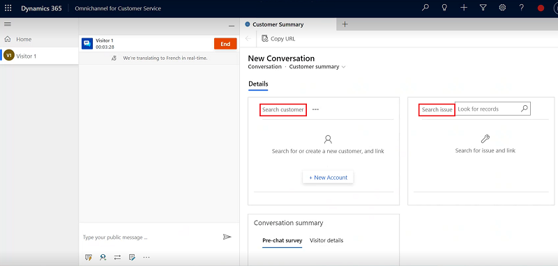

# Customize the Customer summary form

[!INCLUDE[cc-use-with-omnichannel](../includes/cc-use-with-omnichannel.md)]

## Introduction

You can customize the following for the **Customer summary** page:

- Add or remove custom controls
- Add a web resource or iFrame to the form
- Customize the layout

> [!NOTE]
> However, for a conversation entity, you can't add custom fields, forms, or views.

By default, the **Customer summary** page displays the sections that are listed in this topic. For information on how to customize these sections, see [Customize quick view forms](customize-quick-view-form.md).

## Customer profile

The **Customer profile** section provides details about the customer or account. These details include the name of the customer or account, category or job, title, relationship type, city, and the preferred channel of engagement. You can modify the quick view forms in this section by navigating to the respective entity forms. 

## Conversation summary

The **Conversation summary** section fetches details based on the context of the incoming conversation request.

This section includes **Pre-chat survey** and **Visitor details**. The details on these tabs help you to understand contextual channel-specific information about the conversation with the customer. The **Pre-chat survey** tab shows responses from the customer on the pre-chat questions.

The **Visitor details** tab provides some information such as the customer is authenticated or not, browser used by the customer for contacting support, an operating system used by the customer, location of the customer, interacting language of the customer, and so on. In addition, conversation and transfer details.

If the customer signs in to the portal to initiate a chat with the support, then as an agent, you can see the **Authenticated** field value as **Yes** in the **Visitor details** tab of the **Conversation summary** section. Otherwise, the **Authenticated** field value is shown as **No**.

## Issue snapshot

For an incoming conversation request, the system links an existing case to the conversation and shows it on the **Issue Snapshot** section. This section shows information such as the title of the case, the priority, the status of the case, the product, and the owner. You can modify the quick view forms in this section by navigating to the respective entity forms.

## Recent cases

This form section displays the recent cases that relate to the customer. You can modify the quick view forms in this section by navigating to the respective entity forms.

## Customize the labels for customer, account, and case on the conversation form

You can customize the labels for customer, account, and case that appear on the conversation form so that they are relevant to your business needs. These customizations are applicable to labels such as **Search customer**, **New customer**, **Search issue**, and **New case**. When you update a label, the updated name that you choose will reflect in all occurrences where that name exists.

   > [!div class="mx-imgBorder"]
   > 

For example, you could change **Search customer** to **Search client** or **Search issue** to **Search ticket** using the following procedure.

To customize labels on the conversation form:

1. Sign in to the Dynamics 365 instance.

1. Go to **Advanced Settings and Customizations** > **Customize the System** > **Web Resources**.

1. Select the filters icon, and then select to only display **String (RESX)** files.

1. In the **Name** column filter, select **Custom Filter**, and in the pop-up window, select operator for **Contains**, and **CustomerSummary** for the value. All of the available CustomerSummary labels for all of the languages are displayed.

1. Select the **CustomerSummary** labels for the language that needs to be modified. A pop-up window will open with the URL link to the content of the CustomerSummaryLabels.resx file.

1. Select the link in the URL field. A pop-up window displays the contents of the resource file. 

1. Copy and paste the content it in a text editor.

1. Update the **value** XML tag of the data XML tag with name **Customer**. This will replace the customer label used in the out-of-the-box Customer Summary Form.

1. Update the **value** XML tag of the data XML tag with name **Issue**. This will replace the issue iabel used in the out-of-the-box Customer Summary Form.

1. Save the file locally.

1. When the file has successfully been saved, go back to the **CustomerSummaryLabels Web resource** pop-up window that was opened, and select the **Upload** file.

1. Select the recently saved file, select **Save** in the pop-up window, and then publish the changes.

1. Manually refresh the webpage to view the published changes.

## Timeline

This section displays case-related and customer-related activities in the form of a timeline. You can create quick notes based on the discussion with the customer. Use the **Linked records** field to switch the timeline based on the Case, Contact, or Account record linked to the conversation.

You can customize the timeline dropdown labels for case, account, and contact by editing the display name for the corresponding entity and publishing your changes.

> [!div class="nextstepaction"]
> [Next topic: Customize quick view forms](customize-quick-view-form.md)

### See also

[Omnichannel system customizers](omnichannel-customizer.md)  
[Customize the conversation form](customize-session-form.md)  
[Configure agent and supervisor configurations in Unified Service Desk](../unified-service-desk/oc-customizer/create-agent-supervisor-configurations-unified-service-desk.md)  
[Configure notification for agents](../unified-service-desk/oc-customizer/configure-notification-screen-pop-agents.md)  

[!INCLUDE[footer-include](../includes/footer-banner.md)]
