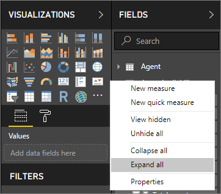
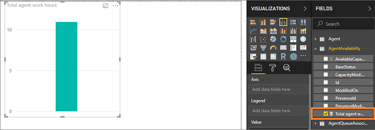

# Customize KPIs for intraday insights

To cater to your organizational needs, intraday insights allows you to customize KPIs. This allows supervisors to adapt to your organizational parameters that are specifically designed for your organization. Through the Power BI desktop application, you can customize these KPIs.

> [!NOTE]
> Do not customize out-of-the-box reports because they will be overwritten when new versions are made available by Microsoft. However, if you do customize them, save them with another name.

The customization of KPIs includes:

- [Add custom KPIs](#add-custom-kpis)

- [Edit measures and visuals of existing KPIs](#edit-measures-and-visuals-of-existing-kpis)

## Review prerequisites

Verify the following prerequisites before you add the custom KPIs:

1. Power BI desktop app is installed on your computer.

2. Administrator or equivalent role is assigned to you. 

3. Intraday insights dashboard is configured for your organization. To Learn more, see [Configure to view intraday insights dashboard](configure-intraday-dashboard-supervisor.md)


## Add custom KPIs

You can add the custom KPIs that are specific to your organization to intraday insights. This allows intraday insights to be more specific and helps supervisors adhere your organizational requirements. To add custom KPIs, follow these steps:

1. [Review the prerequisites](#review-prerequisites).

2. Open the Power BI desktop application and sign in with your administrator credentials.

3. From the **Home** menu, select **Get Data** > **Power BI datasets**.

   > [!div class=mx-imgBorder]
   > 

   The dataset selection dialog box opens.

4. Select **IntradayMonitoring** from the workspace that you have created through configuration ([Configure Power BI workspace in Omnichannel Administration app](configure-intraday-dashboard-supervisor.md#configure-the-power-bi-workspace-in-the-omnichannel-administration-app)), and then select **Load**.

   > [!div class=mx-imgBorder]
   > 

   The fields related to intraday insights are loaded.

5. From the field category list, select a category to create a measure and then select **More options** (**...**) > **New measure**.

    In this example, we are creating a measure for the field category **AgentAvailability**.

   > [!div class=mx-imgBorder]
   > 

    A new measure is created for the field.

6. The formula bar appears along the top of the Report canvas, where you can rename your measure and enter a DAX formula.

    In this example, we are adding a measure for calculating the total number hours that an agent is working on a workitem.

    ```
    Total agent work hours = Agent[Average Session Handling Time] + Agent[Average Conversations Per Online Agents]
    ```

    The measure is added.  

7. Select the measure and verify that the measure is working as defined.

   > [!div class=mx-imgBorder]
   > 

    To learn more about creating measure, see [Create a measures](https://docs.microsoft.com/power-bi/desktop-tutorial-create-measures#create-a-measure).

8. Add the measure to your report. To learn more, see [Use your measure in the report](https://docs.microsoft.com/power-bi/desktop-tutorial-create-measures#use-your-measure-in-the-report).

9. Publish the report.

    The custom KPI measure is added to the intraday insights dashboard.

To learn more about how to create custom measures, see [Tutorial: Create your own measures in Power BI Desktop](https://docs.microsoft.com/power-bi/desktop-tutorial-create-measures).

## Edit measures and visuals of existing KPIs

You can edit the measures and visuals of existing custom and out-of-the-box KPIs to match your organizational requirements. This helps in reducing the effort of adding a new KPI to the intraday insights. To edit measures of existing KPIs, follow these steps:

1. [Review the prerequisites](#review-prerequisites).

2. Open the Power BI desktop application and sign in with your administrator credentials.

3. From the **Home** menu, select **Get Data** > **Power BI datasets**.

   > [!div class=mx-imgBorder]
   > 

   The dataset selection dialog box opens.

4. Select **IntradayMonitoring** from the workspace that you have created through configuration ([Configure Power BI workspace in Omnichannel Administration app](configure-intraday-dashboard-supervisor.md#configure-the-power-bi-workspace-in-the-omnichannel-administration-app)), and then select **Load**.

   > [!div class=mx-imgBorder]
   > 

   The fields related to intraday insights are loaded.

5. To edit a measure:

    1. From the field category list, select a category and then select the field for which you want to change the measure.  

       > [!NOTE]
       > Fields with measures are preceded with a calculator icon. 

       In this example we are selecting **Total agent work hours** field from **AgentAvailability** category. The details of for the field is displayed including its formula bar.

       > [!div class=mx-imgBorder]
       > 

    2. From the formula bar, edit the formula as required.

        To learn more about change visualizations, see [Create and use your own measures](/power-bi/desktop-tutorial-create-measures#create-and-use-your-own-measures).
    
6. To edit a visual:

    1. From the field category list, select a category and then select the field for which you want to change the visual.  

       In this example we are selecting **Agent Handling Time** field from **Session** category. The visual for the field is displayed.

       > [!div class=mx-imgBorder]
       > 

    2. From the **VISUALIZATIONS** tab, edit the visualizations of the field as required. In this example, we are changing the chart to a pie chart.

       > [!div class=mx-imgBorder]
       > 

        To learn more about change visualizations, see [Add visualizations to a Power BI report](/power-bi/visuals/power-bi-report-add-visualizations-i).

7. Publish the report.

## Reference

The tables in the intraday insights dataset consists of entity attributes along with measures and calculated columns. The following are the list of entity that are supported in Intraday insights:

- **Agent**. To learn more about entity attributes for agent, see [SystemUser entity](../developer/reference/entities/overview.md#systemuser-entity).

- **AgentAvailability**. To learn more about entity attributes for agent availability, see [SystemUser entity](../developer/reference/entities/overview.md#systemuser-entity) and [msdyn_presence](../developer/reference/entities/msdyn_presence.md).

- **AgentQueueAssociation**. To learn more about entity attributes for agent queue association, see [SystemUser entity](../developer/reference/entities/overview.md#systemuser-entity) and [Queue Entity](../developer/reference/entities/overview.md#queue-entity).

- **AgentRoleAssociation**. To learn more about about entity attributes for agent role association, see [SystemUser entity](../developer/reference/entities/overview.md#systemuser-entity) and [role EntityType](/dynamics365/customer-engagement/web-api/role?view=dynamics-ce-odata-9).

- **Presence**. To learn more about entity attributes for presence, see [msdyn_presence Entity Reference - Writable attributes](../developer/reference/entities/msdyn_presence.md#writable-attributes).

- **Queue**. To learn more about entity attributes for queue, see [Queue Entity](../developer/reference/entities/overview.md#queue-entity).

- **RoleBase**. To learn more about entity attributes for role base, see [role EntityType](/dynamics365/customer-engagement/web-api/role?view=dynamics-ce-odata-9).

- **Session**. To learn more about entity attributes for session, see [msdyn_ocsession Entity Reference](../developer/reference/entities/msdyn_ocsession.md).

- **SessionParticipant**. To learn more about entity attributes for session participant, see [msdyn_sessionparticipant Entity Reference](../developer/reference/entities/msdyn_sessionparticipant.md).

- **WorkItem**. To learn more about entity attributes for work item, see [msdyn_ocliveworkitem Entity Reference](../developer/reference/entities/msdyn_ocliveworkitem.md).

- **WorkStream**. To learn more about entity attributes for work stream, see [msdyn_liveworkstream Entity Reference](../developer/reference/entities/msdyn_liveworkstream.md).

### See also

[Configure to view intraday insights dashboard](configure-intraday-dashboard-supervisor.md)
