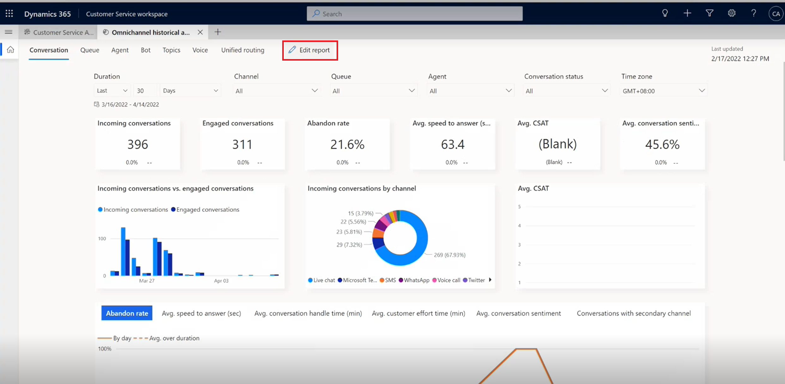
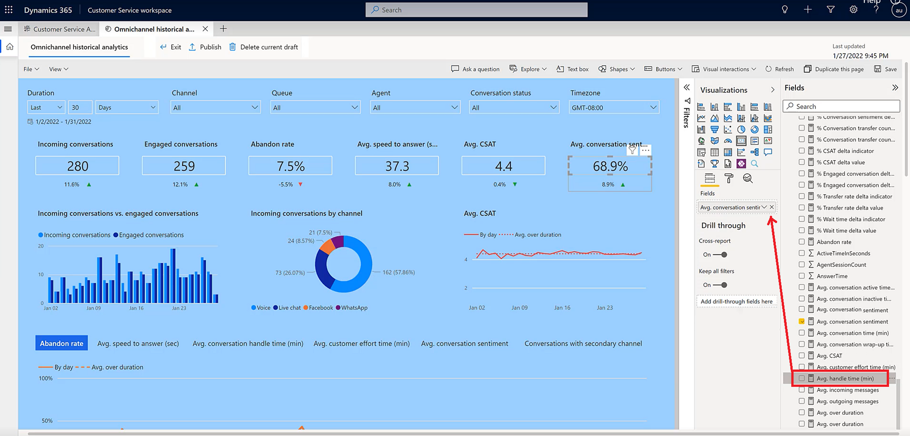

# Customize visual display of historical analytics reports in Customer Service

Dynamics 365 Customer Service provides out-of-box reporting capabilities, including industry-standard metrics that are critical for every support organization. These reports are designed to help supervisors in your organization to better understand and manage agent performance.

The nature of your business may require that you customize these standard reports based on your organization's needs. You can edit out-of-box reports in the following ways:

- Rearrange out-of-box report layouts and change themes.
- Modify the visual look of the data, such as to display a metric trend over time versus a tabular view.
- Create visuals using metrics in the data model that aren't directly exposed in the out-of-box reports.

> [!Note]
> Visual customization of historical analytics reports is currently available for Customer Service Workspace, Customer Service Hub, and Omnichannel for Customer Service. It is not available for unified routing or knowledge management analytical reports.

## Grant user privileges to edit analytics reports

To be able to edit analytics reports, users must have the **Analytics Report Author** role. For information about assigning user roles, go to [Assign roles to users](add-users-assign-roles.md#assign-roles-to-users).

## Customize the visual display of your analytics reports

1. Open the **Omnichannel historical analytics** or **Customer Service historical analytics** report in Customer Service workspace.
   
1. Select **Edit report**. The Power BI embedded editing experience is displayed.

   > [!div class="mx-imgBorder"] 
   > 

   The following panes open on the right-hand side of the page:

   - **Visualizations**: Displays a list of options you can use to create different visual views in your report. Choose which visuals you want in your report by deleting a currently displayed visual and then adding the visual you prefer by dragging and dropping it from **Visualizations** list to the area where you want it to display in your report. For example, if you wanted to change the background color of your reports, you would select **Page background**, and then select the color you want from the **Themes color** palette.

     > [!div class="mx-imgBorder"] 
     > 

   - **Fields**: Displays a list of KPIs, measures, dimensions, and attributes you can represent in your report. For example, if you wanted to track average handle time more closely, you could select **Avg handle time** from the list in the **Fields** pane, and then drag and drop it in the **Fields** section of the **Visualizations** pane.

     > [!div class="mx-imgBorder"] 
     > 
 
 
1. When you're done selecting the customizations you want for your report, select **Save** and then **Publish**. Once you publish the report, all customizations become visible to all users in your organization. 

1. (Optional) To continue editing the report after you've published it, select **Resume editing**. The **Visualizations** and **Fields** panes are reopened. You can further customize your report, and then save and publish it again.

1. If at some point you want to revert all of your changes to the original report settings, you can do so by selecting **Edit report** > **Checkout default report** > **Reset**. 
   > [!IMPORTANT]
   > Selecting **Reset** will permanently remove any customizations you've made.

### Future data model updates

In a scenario in which you've customized your reports and then Microsoft makes updates to the default data model for a report, the customizations you've made for your reports won't be overwritten by the updates to the data model. However, if there's a change to the naming conventions in the Power BI embedded editing experience, those changes will be reflected in the respective list and may require that you reselect the metric with the new name. For more information on data model and report mapping, see: [Data models and report mappings for historical analytics reports in Customer Service](oob-data-models.md#data-models-and-report-mappings-for-historical-analytics-reports-in-customer-service).

### See also

[Introduction to Customer Service Insights](introduction-customer-service-analytics.md)  
[Configure Customer Service analytics and insights](configure-customer-service-analytics-insights-csh.md)  
[Configure Customer Service Analytics dashboards in Power BI](configure-customer-service-analytics-dashboard.md)  
[Configure Omnichannel historical analytics](oc-historical-analytics-reports.md)
