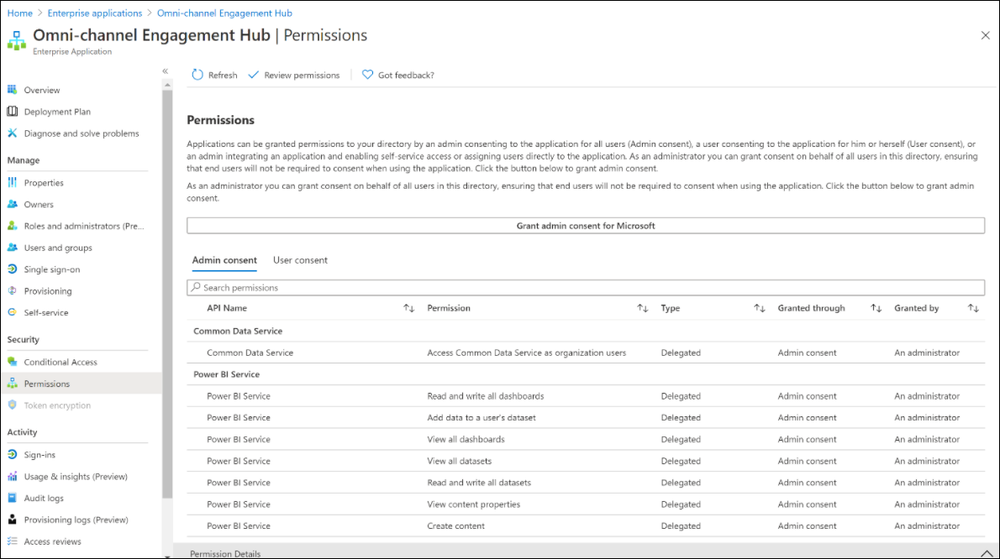

# Provide consent to access data to provision Omnichannel for Customer Service

[!INCLUDE[cc-use-with-omnichannel](../includes/cc-use-with-omnichannel.md)]

## Introduction

This topic provides information about the consent that is required to access the different components and data during the installation and provision of Omnichannel for Customer Service.

## Provide consent to access data

Omnichannel for Customer Service app requires the following permissions to read and write data on behalf of users:

- **Create content**: The app can automatically create content and datasets for you.

- **Read and write all dashboards**: The app can view and edit all your dashboards and any dashboards that you have access to.

- **Read and write all reports**: The app can view and edit all your reports and any reports that you have access to.

- **Read and write user settings and state**: The app can view and edit your user settings and the user-specific state associated with content you have access to.

- **Read and write all workspaces**: The app can view and edit all workspaces that you have access to.

- **Sign you in and read your profile**: Allows you to sign in to the app with your work account and let the app read your profile. It also allows the app to read basic company information.

- **Access Common Data Service as you**: Allows the app to access Microsoft Dataverse as you.

A detailed explanation is as follows:

- **Permissions Create content, Read and write all dashboard, Read and write all reports, Read and write user settings and state, and Read and write all workspaces**: During the provisioning of Omnichannel for Customer Service, "Omnichannel Insights for Dynamics 365" Power BI app is deployed to gain insights about your customer service omnichannel delivery performance and customer sentiment. The Power BI app consists of the following Power BI components. Omnichannel App needs the read and write permissions to deploy and interact with these components.

    - **Workspace**: Omnichannel Insights for Dynamics 365
    - **Dashboards**:
        - Omnichannel Insights for Dynamics 365
        - Omnichannel Sentiment Analysis (OCSA) for Dynamics 365
    - **Reports**: Omnichannel Insights for Dynamics 365
    - **Datasets**: Omnichannel Insights for Dynamics 365
  
    More information:
     [Omnichannel Insights for Dynamics 365 - Power BI App](https://appsource.microsoft.com/product/power-bi/ms_dynmcsfnp.ms_dynamics_cca_da_oc_analytics)  
     [Omnichannel Insights Dashboard](omnichannel-insights-dashboard.md#omnichannel-insights-dashboard)  
     [Omnichannel Sentiment Analysis dashboard](omnichannel-insights-dashboard.md#omnichannelsentiment-analysisdashboard)  

- **Sign in and read your profile**: This permission allows Omnichannel to sign into the app with user’s work account and let the app read the user profile. It also allows the app to read basic company information.

- **Access Common Data Service as you**: This permission is needed so that Omnichannel for Customer Service, on behalf of the administrator, can automatically create non-licensed, non-interactive application user, and assign security roles to the application user. This application user is primarily used to access omnichannel agents’ characteristics, such as capacity, skill, and presence, and to sync chat-related entities to Dataverse.

## What happens when I provide data access consent and provision Omnichannel for Customer Service?

The following enterprise applications will be created in your Azure Active Directory and corresponding security permissions mentioned during data consent will get propagated to these apps. The Omnichannel Application User created in Dataverse will have reference to these AAD enterprise applications thereby helping it to interact with Dataverse and Omnichannel satellite services.

- Omni-channel Engagement Hub
- Omni-channel Engagement Hub APIs
- Omni-channel Engagement Hub Provisioning Application

A screenshot of the engagement hub is as follows.

> 

## FAQ

### Why is an admin consent required? Is it only for giving consent to the delegated permissions that are listed? Or are more privileged operations performed in the tenant after the admin consent? If yes, which principals are created, and what roles or permissions are assigned?

Only the delegated permissions are required. On consent, the following two service principals are created:
– “Omnichannel APIs”
- “Omnichannel for Customer Service”

### Why is the global admin role required, and not a less powerful one?

We need to add the service principal to the Azure AD for the tenant as a requirement, and therefore, we need global admin permissions.

### Which are the Omnichannel principals? We found at least four Omnichannel principals.

“Omnichannel APIs” is the main application id which is leveraged for UI operations such as triggering provisioning of UR and loading the presence for an agent. “Omnichannel for Customer Service” is the app which has Dataverse permissions that is used to read data from Dataverse and write data to Dataverse for the Omnichannel service for the unified routing capability of classification and assignment.

The following applications were created as third-party applications. They will be moved to be first-party Microsoft applications.

- “Omnichannel for CS Provisioning App Primary” is the first-party app equivalent of “Omnichannel APIs”.  

- “Omnichannel for CS CRM ClientApp Primary” is the first-party app equivalent of “Omnichannel for Customer Service”.  

### How do all these principals interact with each other?  

These four principals do not interact with each other.  

### Which principal performs the background automation that unified routing seemingly enables, and what permissions does it have?

The “Omnichannel for Customer Service” application. This app has Dataverse permissions that is used to read data from Dataverse and write data to Dataverse for Omnichannel service for the unified routing capability of classification and assignment.

### See also

[Provision Omnichannel for Customer Service](omnichannel-provision-license.md)  
[Provision unified routing for Customer Service](provision-unified-routing.md)  