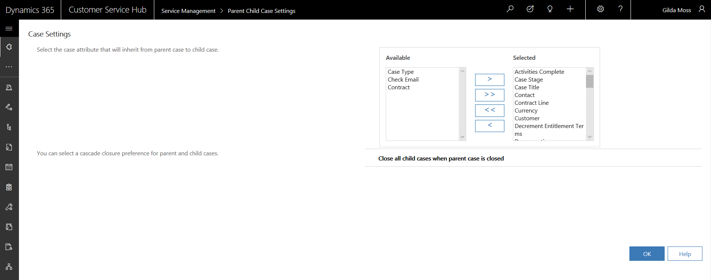

# Define settings for parent and child cases

[!INCLUDE[cc-applies-to-update-9-0-0](../includes/cc_applies_to_update_9_0_0.md)] [!INCLUDE[cc-applies-to-update-8-2-0](../includes/cc_applies_to_update_8_2_0.md)]

In [!INCLUDE[pn_dynamics_crm](../includes/pn-dynamics-crm.md)],  you can track multiple issues for a customer, or track the same issue that's affecting multiple customers, using parent and child cases. For example, you could track a case where work needs to be done by other departments. The primary case or issue is called the **Parent** case. Any related cases are called **Child** cases. Before your service team can start using this feature, you need to go to service management and set up a few rules about how information is inherited. 

> [!NOTE]
> With the October'18 release, parent child case settings in service management are available in the Customer Service Hub based on the Unified Interface experience. We recommend that you create and manage parent child case settings using the new experience.
  
## Set parent and child case attributes  (Customer Service Hub)
  
1. [!INCLUDE[proc_permissions_custsvcmgr_sysadmin_and_customizer](../includes/proc-permissions-custsvcmgr-sysadmin-and-customizer.md)]  
  
   - [!INCLUDE[proc_follow_steps_in_link](../includes/proc-follow-steps-in-link.md)] [!INCLUDE[proc_dont_have_correct_permissions](../includes/proc-dont-have-correct-permissions.md)]  
  
2. In the Customer Service Hub sitemap, go to **Service Management** and select **Case Settings** > **Parent Child Case Settings**.  
  
3. In the **Case Settings** dialog box, select the attributes that the child case will inherit from the parent case.  

   You can view **Available** and **Selected** attributes in the form of two lists. Using the arrows **>**, **<**, **>>**, and **<<**, you can move the attributes from one list to another. 
  
4. You can also select a case closure setting that defines how parent and child cases are closed. Select one of the case closure preference for parent and child cases:  
  
   - **Close all child cases when parent case is closed**: As soon as the parent case is closed, all the child cases are also closed.
   - **Don't allow parent case closure until all child cases are closed**: The parent case can’t be closed until all the child cases are closed.
  
5. When you’re done, select **OK**.  

   

## Set parent and child case attributes  (Customer Service app)

1. [!INCLUDE[proc_permissions_custsvcmgr_sysadmin_and_customizer](../includes/proc-permissions-custsvcmgr-sysadmin-and-customizer.md)]  
  
   - [!INCLUDE[proc_follow_steps_in_link](../includes/proc-follow-steps-in-link.md)] [!INCLUDE[proc_dont_have_correct_permissions](../includes/proc-dont-have-correct-permissions.md)]  
  
2. [!INCLUDE[proc_logo_settings](../includes/proc-logo-settings.md)]  
  
3. Choose **Settings** > **Service Management**.

4. Click **Parent and Child case settings**.  
  
5. In the **Case Settings** dialog box, select the attributes that the child case will be inherit from the parent case.  
  
6. Using the Parent and Child case settings, specify the information that will be inherited from a parent case to the child case. You can also select a case closure setting that defines how parent and child cases are closed. Select one of the case closure preference for parent and child cases:  
  
   - **Close all child cases when parent case is closed**: The parent case can’t be closed until all the child cases are closed.  
  
    > [!NOTE]
    >  If you choose **None**, parent and child cases are closed independently of each other. This is the default setting.  
  
7. When you’re done, click **OK**.  

  
### See also

[Create and manage parent and child cases](customer-service-hub-user-guide-case-sla.md#create-and-manage-parent-and-child-cases) 

  
