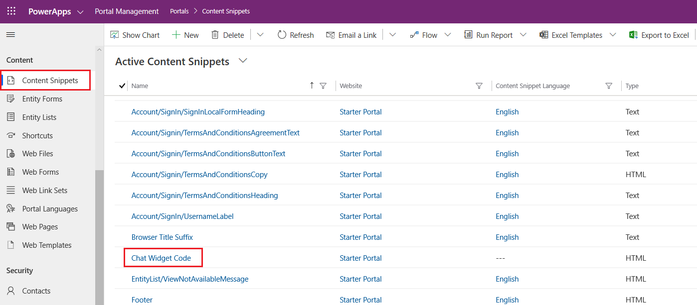
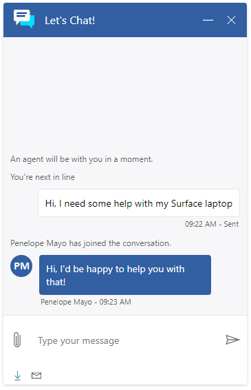

# Embed chat widget in your website or portal

[!INCLUDE[cc-use-with-omnichannel](../includes/cc-use-with-omnichannel.md)]

## Embed chat widget in your web portal

1. In Dynamics 365, go to one of the administrator apps.

1. Go to **Channels** &gt; **Chat**.

1. Open the chat widget you want to embed in your website.

1. On the **Basic details** tab, copy the widget snippet code from the **Code snippet** section.

1. Paste the chat widget snippet code in the HTML source \<body\> of your website.

## Embed chat widget in your Power Apps portals

1. In one of the administrator apps, open the chat widget you want to embed in Power Apps portals.

1. On the **Basic details** tab, copy the widget snippet code from the **Code snippet** section.
    > [!div class=mx-imgBorder]
    > 

1. [Open the Portal Management app](/powerapps/maker/portals/configure/configure-portal).

1. Go to **Portal** > **Content Snippets**.

1. Find the **Chat Widget Code** content snippet and open it.
    > [!div class=mx-imgBorder]
    > 

1. On the **General** tab, scroll down to the **Value (HTML)** section.

1. Paste the chat widget snippet code in the **HTML** tab.
    >[!div class=mx-imgBorder]
    > 

1. Save the changes. The chat widget is now embedded into the portal.

If you don't see your chat widget in the portal, see [Troubleshoot Omnichannel for Customer Service](troubleshoot-omnichannel-customer-service.md).

## Embed chat widget in mobile experiences

To embed a chat widget in a mobile app:

1. Create the code snippet. Refer to [Render a live chat widget on the mobile app](render-live-chat-widget-mobile.md) for samples showing how to enable rendering of the web version of the live chat widget on mobile devices.
2. Open one of the administrator apps.
3. Go to **Channels** &gt; **Chat**.
4. Open the chat widget you want to embed in your website or create a new one.
5. On the **Basic details** tab, copy the widget snippet code you created or modified into the **Code snippet** section.
6. Copy the widget snippet code from the **Code snippet** section and paste it in the source code of your mobile operating system.

## Customer experience of chat widget

After the chat widget is configured, it has the following capabilities:

- **Minimized mode**: By default, the chat widget is shown in minimized mode. If any messages are received while the widget is in this mode, a count of the messages is shown.

    > [!div class=mx-imgBorder]
    > 

- **Maximized mode**: A user can maximize the chat widget to start a conversation with an agent.

- **System events**: System-generated messages are shown for events, such as when an agent joins a chat, or a chat is transferred to another agent.

    > [!div class=mx-imgBorder]
    > 

- **Keyboard shortcut**: During the chat session, the customer can press **Ctrl+/** to return the cursor to the message send box from elsewhere on the page.

- **Pre-chat survey**: If a survey has been configured by an admin, it's shown to the user before the conversation is started. This survey also helps the user connect to an appropriate agent.

    > [!div class=mx-imgBorder]
    > 

- **End chat**: A customer can end the chat by selecting the **Close chat** button. A confirmation message is displayed before ending the chat.

> [!NOTE]
> For advanced configuration like embedding chat widget on specific web pages, see [Create and manage portals](/powerapps/maker/portals/portal-templates).

### See also

[Supported browsers for live chat widget](system-requirements-omnichannel.md#browsers-for-chat)  
[Add a chat widget](add-chat-widget.md)  
[Configure a pre-chat survey](configure-pre-chat-survey.md)  
[Configure agent display name](agent-display-name.md)  
[Configure file attachment capability](configure-file-attachment.md)  
[Create quick replies](create-quick-replies.md)  
[Create and manage operating hours](create-operating-hours.md)  
[Create chat authentication settings](create-chat-auth-settings.md)  
[Render a live chat widget on the mobile app](render-live-chat-widget-mobile.md)  

[!INCLUDE[footer-include](../includes/footer-banner.md)]
