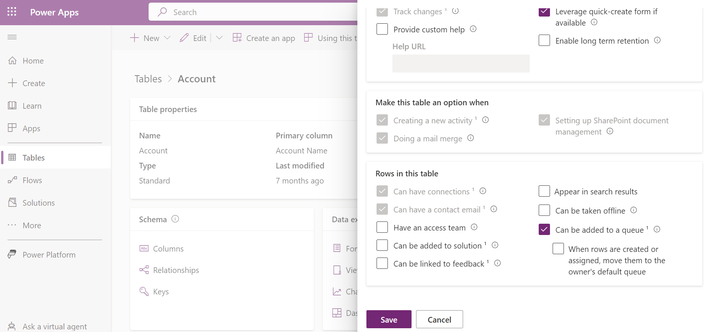

# Enable tables for queues in unified routing

Any record that you want to enable for routing needs to be enabled for queues.

## Enable a table for queues

1. Sign in to [Power Apps](https://make.powerapps.com/).

2. Go to the default solution.

3. In the site map, select **Tables**.

4. Select tables, like **Account** or **Email** from the list for which you want to enable queues.

5. In the **Table properties** section, select **Properties**.

6. Select **Advanced options**, scroll down to **Rows in this table** section and select **Can be added to a queue** checkbox.

7. Select **Save**.

> [!NOTE]
>
>- If you enable a table for a queue, you can't disable it. The app disables the **Can be added to a queue** checkbox after you select it.
>- If you enable the option - **When the rows are created or assigned, move them to the owner's default queue**, in the table customization, then the record won't be automatically distributed to the agents. You must clear the checkbox to automatically distribute the records.    

### See also

[Set up record routing](set-up-record-routing.md)  
[Set up unified routing for email records](configure-routing-for-email-records.md)  
