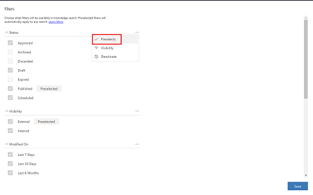
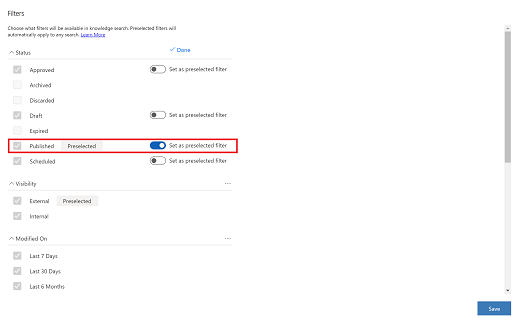

# Enable knowledge article search filters

As an administrator, you can configure standard (out-of-the-box) and custom fields as filters that can help your agents more quickly find what they’re looking for in search results and improve their productivity.

You can set up the customization of knowledge article search filters by first enabling the feature, and then setting the filter configurations. The fields that are present on the knowledge article entity are the fields that are available as a filter. Additionally, if a field has any of the following data types, it will be available to be added as a filter, including:

- Options set
- Multiselect options set
- Lookup
- Two choices
- Date and time

> [!NOTE] 
> Any filter configurations you set will apply anywhere that the knowledge search experience is configured, including, but not limited to, the form-based knowledge control, knowledge search page, productivity pane-based knowledge search control, Unified Service Desk embedded search control, and Omnichannel for Customer Service Application tab search experience.  
> By enabling this filter, the web client and maker experience knowledge management filter experience aren't deactivated.

1. Open the **Customer Service Hub** app and select **Change area** > **Service Management**.
2. Under the **Knowledge Base Management** section, select **Settings**.
3. On the **Settings** page, scroll down to **Knowledge articles search filters**, and then select **Yes** for **Enable search filters**.
   
    > [!div class=mx-imgBorder]
    > 

4. Select **Save**.
5. In the left pane, under the **Knowledge Base Management** section, select **Filters**. The **Filters** page is displayed.
6. Select the filters you want to make available for knowledge search. 
7. To set predetermined values that will appear for agents by default, select the ellipsis in the top-right corner of a filter area, and then select **Preselects**.
    > [!div class=mx-imgBorder]
    > 
8. To make a filter value available by default, toggle the preset next to the filter to the right so that **Preselected** appears next to the filter name.
   Values that are set as preselected automatically participate in the filtering without requiring the agent to manually select them. Only values made visible can be preselected.
    > [!div class=mx-imgBorder]
    > 
   
9. Select **Done**.
10. If you want to set which filters are shown to the agent, select the ellipsis in the top-right corner of a filter area, and then select **Visibility**.
   > [!NOTE]
   > For the **Status** filter that is available out-of-box, be aware that if you select the **Archived**, **Discarded**, or **Expired** status values, if you have Relevance Search enabled, you must modify the **Quick Find Knowledge Article** view, as this view currently filters out all articles that have these values, and they aren't synced by Relevance Search. No status values are returned if you don't modify the **Quick Find Knowledge Article** view. Additionally, if you don't have Relevance Search enabled, the **Archived**, **Discarded**, and **Expired** filter values won't work, and no corresponding search results for these values will be returned.
11. Select the values you want to show the agent, and then select **Done**.
12.	When you're finished with configuring the values you want, select **Save**.

## Add a default filter configuration
The following steps apply to these data types:
- Options set
- Multiselect options set
- Two choices
- Date and time
1. In the **Customer Service Hub** app, under the **Knowledge Base Management** section, select **Filters**. 
   The **Filters** page is displayed.
2. Scroll to the bottom of the page, choose the filter type you want from the drop-down menu, and then select **Add**. The filter is added to the page.

    > [!div class=mx-imgBorder]
    > 
    
3. Customize the filter according to your needs by selecting or deselecting the values displayed and then toggling the **Set as a preselected filter** option if you want the filter shown to the agent by default.
4. Select **Save**.

## Configure fields with data type as lookup as filters

Some configurable filter values may include lookup types, where there are numerous value options that can be set. Some examples of these filters are Created by, Modified by, and Owner. For these types of values, when you add the filter, you can manually search for and select the records you want to use.

To configure a lookup type filter:
1. In the **Customer Service Hub** app, under the **Knowledge Base Management** section, select **Filters**.
   The Filters page is displayed.
2. Scroll to the bottom of the page, choose the filter type you want from the drop-down menu, and then select **Add**. 
   A **Lookup Records** field is displayed on the right-hand side of the page.
   
   > [!div class=mx-imgBorder]
   > 

3. To find the values you want, either enter the value details in the field or select the magnifying glass icon to list available records.
4. Select the records you want in the results, and then select Add.
5. If you want to set the values as defaults, toggle the preset next to the filter to the right so that Preselected appears next to the filter name.
6. Select **Save**.

## Deactivate or reactivate a filter configuration
There may be times when you want to temporarily suspend a filter configuration but don’t want to lose the configuration settings. You can deactivate a filter configuration and then reactivate it later on. 
1. In the **Customer Service Hub** app, under the **Knowledge Base Management** section, select **Filters**. 
   The **Filters** page is displayed.
2. Select the ellipsis in the top-right corner for the filter you want to deactivate, and then select **Deactivate**.
3. Select **Done** > **Save**.
4. When you are ready to reactivate the filter, go to the **Filters** page, select the ellipsis next to the value you want to reactivate, and then select **Activate**. 
   All of the previous configurations will be reinstated.

## Allow agents to personalize their knowledge article search filters

You may have scenarios within your organization where agents are working on different areas and don’t all need the same filter settings. For example, an organization may have agents working on different product areas. One agent might need to see knowledge articles for Product A, while another agent might only want knowledge articles for Product B, and so forth. You can allow your agents to personalize the knowledge article search filters for their areas.

1. Open the **Customer Service Hub** app and select **Change area** > **Service Management**.

2. Under the **Knowledge Base Management** section, select **Settings**.
   > [!NOTE]
   > This option will be available only if **Enable search filters** is set to **Yes**.

3. Customize the filter according to your needs by selecting or deselecting the values displayed and then toggling the **Set as a preselected filter** option if you want the filter shown to the agent by default.
4. Select **Save**.

## Set a default knowledge article authoring language for your organization

There may be times when your agents prefer to author knowledge articles in a language other than the language that is set for your organization. You can set a language for your organization, but then also give agents the ability to personalize it to their own choice. Agents can also change the language for different articles. Review the hierarchy as described in the table below.

|Hierarchy |Personalization preference |Configurations allowed |
|-------------------|-------------------|--------------|
|Admin        |Language preference at the organization level   |<li>Set UI language</li><li>Choose a language-locale combination from the lookup</li>   |
|Knowledge managers        |Language preference at the individual author level     |<li>Set UI language</li><li>Choose a language-locale combination from the lookup</li>    |
|Agent         |Language preference at the individual knowledge base level      |Override administrative settings and choose a language-locale combination from the lookup</li>   |

The ability to override follows the hierarchy order of agent, then knowledge manager, then administrator.

1.	Open the **Customer Service Hub** app and select **Change area** > **Service Management**.
 
2.	Under the **Knowledge Base Management** section, select **Settings**.
3.	On the **Settings** page, scroll down to **Knowledge articles authoring language**, and then select **Yes** for **Set default knowledge authoring language for your users**.
4.	If you set Use organization’s UI language to **No**, you can select the language you want to use by searching or pressing **Enter** to browse in the **Select a language search field**.
5.	Select whether to allow your users to set their own default authoring language.
6.	Select **Save**.

## Personalize your knowledge search article filters

If your administrator has configured knowledge filter personalization settings, as an agent, you can select the filters you want to use.

Agents can do the following:
- Set preselects
- Activate or deactivate a filter 

1. In **Customer Service Hub**, go to **Service** > **Knowledge** > **Knowledge Personalization**.
2. For each filter value you want to change, select the ellipsis in the top-right corner, and then select **Preselects**.
3. To make a filter value available by default, toggle the preset next to the filter to the right so that **Preselected** appears next to the filter name.
4. When you are finished making your selections, select **Done** > **Save**.
5. If you want to deactivate a filter, select the ellipsis in the top-right corner for the filter you want to stop using, and then select **Deactivate**.
6. Select **Done** > **Save**.
7. When you are ready to reactivate the filter, select the ellipsis again, and then select **Activate**.
   All of the previous configurations will be reinstated. 

## Personalize your language preferences for authoring knowledge articles

If your administrator has enabled language personalization, you can select your preferred language when authoring knowledge articles.

1. In **Customer Service Hub**, go to **Service** > **Knowledge** > **Knowledge Personalization**.
2. Do one of the following:
   - Select the **Authoring** tab, and then toggle Use organization’s language to **No**.
   - From the drop-down list, select your preferred language.
3. Select **Save**.
   When you create a new knowledge article, the default language you selected is used.
4. If you need to change the language for a specific article only, select the **Summary** tab, and then select your preferred language in the **Language** field.
5. Select **Save**.

   
