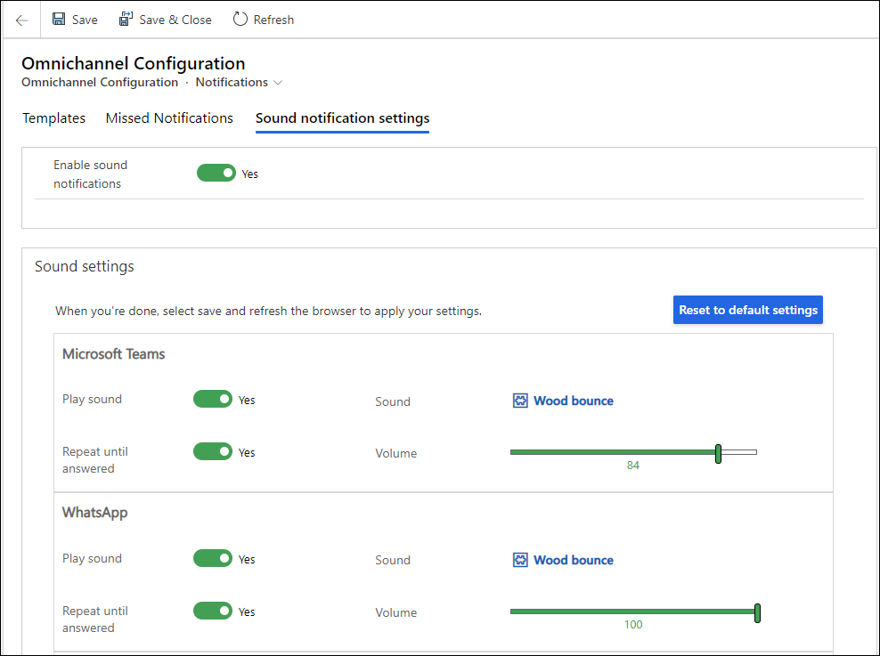

# Enable sound notifications for conversations

[!INCLUDE[cc-use-with-omnichannel](../includes/cc-use-with-omnichannel.md)]

## Introduction

Sound notifications for incoming conversation requests, such as live chat, that require immediate response are helpful in making sure the requests are not missed. Administrators can enable the sound notification settings in the configuration settings of Omnichannel for Customer Service. The option to personalize allows agents to customize their preferences for sound and volume selections, among other things. The sound notifications are available across all channels and can also be set for messages for ongoing conversations.

## Prerequisite for sound notifications

Make sure the browsers used by agents allow sounds to be played. In Microsoft Edge, sound is allowed by default. However, if for some reason, sound settings are turned off, you can enable them by going to the [media autoplay](edge://settings/content/mediaAutoplay) setting in Microsoft Edge. For information on how to enable sound notifications for other browsers, see the browser-specific documentation.

## Enable sound notifications

When you enable sound settings, the options to personalize settings are available for all the channels that are provisioned in your environment.

1. In Dynamics 365, go to one of the apps, and perform the following steps.

   ### [Customer Service admin center](#tab/customerserviceadmincenter)

     1. In the site map, select **Workspaces** in **Agent experience**.
     2. On the **Workspaces** page, select **Manage** for **Notification templates**.

   ### [Omnichannel admin center](#tab/omnichanneladmincenter)

    - In the site map, select **Agent experience** in **Advanced settings**, and then select **Manage** for **Notification templates**.

2. On the **Omnichannel Configuration - Notifications** page, select **Sound notification settings**.

3. Set the toggle to **Yes** for **Enable sound notifications**. The **Sound settings** area is displayed.

4. Customize the notification settings for the required channels. The following settings are for Microsoft Teams:

   - **Play Sound:** Set the toggle to **Yes**.
   - **Repeat until answered:** Set the toggle to **Yes** if you want the sound to be played till the agent responds.
   - **Sound:** Accept the default setting or search and select a different audio file. You can use the **New Audio File** option to upload and use an audio file of your choice. You also have the option to preview the audio.
   - **Volume:** Accept the default setting or use the slider to adjust the volume.

     > 
  
  - **Reset to default settings:** When you customize any setting, the button is enabled for you to reset to the out-of-the-box settings.

5. In the **Incoming messages for open sessions** section, customize the options for sound notifications for messages in open sessions, such as live chat or a social channe

    > 

6. Select **Save.**

### See also

[Get started with Customer Service admin center](../customer-service/cs-admin-center.md)  
[Personalize notifications](oc-personalize-sound-notifications.md)  

[!INCLUDE[footer-include](../includes/footer-banner.md)]
