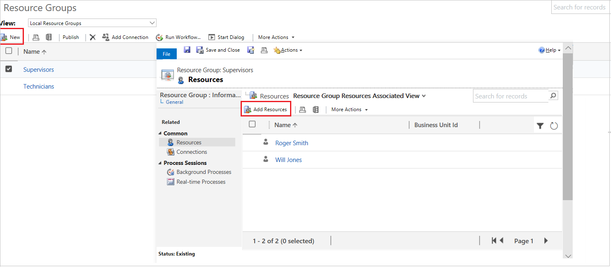
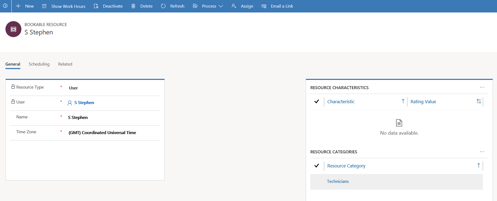

# Get the new Service Scheduling experience

Service scheduling is now built atop **Universal Resource Scheduling (URS)** to provide an efficient way to schedule service activity. It considers the availability of employees, facilities, and equipment to plan schedules accordingly. It also helps customer service organizations with improved service quality by preventing over-scheduling. This is done with the help of predictable workloads for employees, and reliable time estimates for customers and clients.

With the October'18 release, the new Service Scheduling will be available in the Customer Service Hub sitemap.

[!INCLUDE[proc_more_information](../includes/proc-more-information.md)] [Access Service Scheduling in the Customer Service Hub](basics-service-service-scheduling.md#access-service-scheduling-in-the-customer-service-hub)

> [!IMPORTANT]
> If you are a new customer who is using the Service Scheduling feature for the first time, see [Install and enable the new Service Scheduling experience](#install-and-enable-the-new-service-scheduling-experience) to know how you can install and enable Service Scheduling from the sitemap of your Customer Service Hub application.     
If you have been using the legacy Service Scheduling feature from either Service Management or Business Management, see [Migrate to the new Service Scheduling experience](#migrate-to-the-new-service-scheduling-experience) to know how you can migrate to the new Service Scheduling experience.

## About the new Service Scheduling experience

Here is what's updated in the new Service Scheduling experience:

- It's built on Universal Resource Scheduling (URS), thereby increasing efficiency in the scheduling process.
- All types of resources required to schedule a service are grouped under **Resources** entity group. So, you can create various types of resources records from the Resources entity itself.
- **Resource groups** are now referred as **Resource Categories**. Similarly, **Sites** are now **Organizational Units**. 
 - It's now based on the Unified Interface framework. This helps in an intuitive user interface and UI reflow and adaptivity across devices and form factors.

<<
Understand the difference between the legacy and the new Service Scheduling experience with the help of the following scenario:

Contoso bike repairs, a company that repairs bikes, schedules repair services for their customers. To facilitate this process, they compile the following information:

- Create resources and resource groups
  
  Contoso defines the **Resources** and groups them into **Resource Categories** (known as **Resource Groups** in legacy experience)

  ##### Legacy Service Scheduling
  
  [!INCLUDE[proc_more_information](../includes/proc-more-information.md)] [Create or change a resource group (Customer Service app)](create-edit-resource-group.md)
 
  ##### New Service Scheduling
  

  [!INCLUDE[proc_more_information](../includes/proc-more-information.md)] [Create and manage resource categories](resource-categories-service-scheduling.md)    [!INCLUDE[proc_more_information](../includes/proc-more-information.md)] [Create and set up bookable resources](resources-service-scheduling.md)
>>

## Install and enable the new Service Scheduling experience

Make sure that you have the Customer Service Manager, System Administrator, or System Customizer security role or equivalent permissions.

### Install or upgrade Universal Resource Scheduling (URS)

To enable or migrate to the new Service Scheduling experience, you should have the latest version of URS installed on your system.

- Check the URS version. Go to **Settings** and select **About** to see the current version of URS on your machine.
- Upgrade to the latest version of URS from <<here>>. Consider <<these>> points before you upgrade to the latest version.

[!INCLUDE[proc_more_information](../includes/proc-more-information.md)] [Schedule anything with Universal Resource Scheduling (Sales, Customer Service, Field Service, Project Service Automation)](../common-scheduler/schedule-anything-with-universal-resource-scheduling.md)

> [!NOTE]
> 

### Install the Service Scheduling package

### Enable Service Scheduling in the Customer Service Hub sitemap

## Migrate to the new Service Scheduling experience

You can migrate to the new experience either from the user interface or with the help of SDK.

### Migrate from user interface

### Migrate using SDK

To install SDK and migrate, see <<>>. Make sure that you have the Customer Service Manager, System Administrator, or System Customizer security role or equivalent permissions before performing the steps.

### See also

[Service Scheduling overview](basics-service-service-scheduling.md)