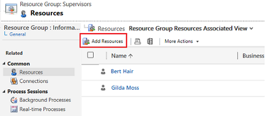
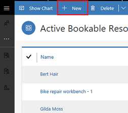
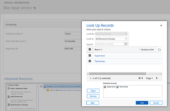
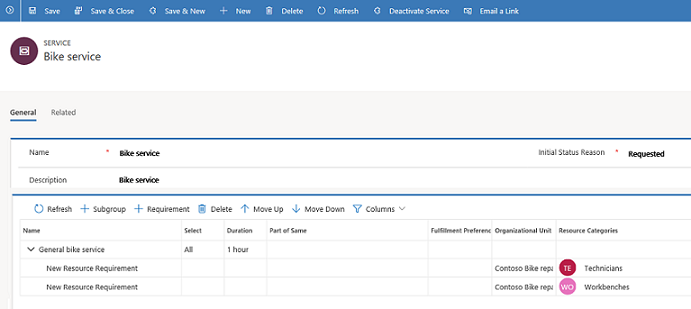
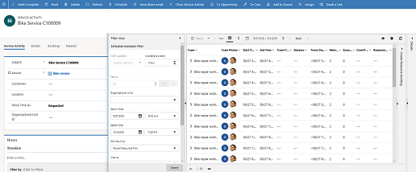

# Understand the new Service Scheduling experience

Service scheduling is now built atop **Universal Resource Scheduling (URS)** to provide an efficient way to schedule service activity. It considers the availability of employees, facilities, and equipment to plan schedules accordingly. It also helps customer service organizations with improved service quality by preventing over-scheduling. This is done with the help of predictable workloads for employees, and reliable time estimates for customers and clients.

With the Customer Engagement apps version 9.1 release, the new Service Scheduling is available from the Customer Service Hub sitemap.

[!INCLUDE[proc_more_information](../includes/proc-more-information.md)] [Access Service Scheduling in the Customer Service Hub](basics-service-service-scheduling.md#access-service-scheduling-in-the-customer-service-hub)

- To avail and enable the new service scheduling package, see [Avail the new Service Scheduling experience](#avail-the-new-service-scheduling-experience).
- To migrate and configure entity records from legacy to new experience, see [Configure entity records in the new Service Scheduling experience](#configure-entity-records-in-the-new-service-scheduling-experience).

The new experience lists the entities as follows, as compared to the legacy experience:

|Legacy Service Scheduling  |New Service Scheduling  |
|---------|---------|
|**Settings > Service Scheduling**   - Business Closure   - Services    - Facilities/Equipment   - Resource Groups   - Sites  |   **Customer Service Hub sitemap >   Service Scheduling**     Scheduling   - Resources   - Facilities/Equipments   - Resource Categories     - Service   - Service Activity   Tools   - Schedule Board   Settings   - Organizational Units   - Business Closures  |
|     |         |

- Sites are now Organizational Units.
- Resource Groups are now Resource Categories.
- You can now create all types of bookable resources using the **Resource** entity.

## Service Scheduling scenario
The difference between the legacy and the new experience can be explained with the help of the following scenario:

Contoso bike repairs, a company that repairs bikes, schedules repair services for their customers. To facilitate this process, they compile the following inputs:

 - **Define sites or organizational units**   
   Sites are the locations where Contoso will provide service to their customers. In this example, Contoso bike repair is the site for service.

   |Legacy Service Scheduling  |New Service Scheduling  |
   |---------|---------|
   |  |     |
   |[!INCLUDE[proc_more_information](../includes/proc-more-information.md)] [Use sites to manage your service locations (Customer Service app)](use-sites-manage-service-locations.md)     |  [!INCLUDE[proc_more_information](../includes/proc-more-information.md)] [Create and manage organizational units](create-org-units-cs-scheduling.md) |
   |   |         |  

- **Define resources** 
  Contoso defines the resources in the system. For example, two resources (contacts) Bert Hair and Gilda Moss are created. Similarly, two more resources (facility/equipment) Bike repair workbench - 1 and Bike repair workbench - 2, which will be required to perform the service.

  |Legacy Service Scheduling  |New Service Scheduling  |
  |---------|---------|
  |   |         |
  |[!INCLUDE[proc_more_information](../includes/proc-more-information.md)] [Create or change a resource group (Customer Service app)](create-edit-resource-group.md)     | [!INCLUDE[proc_more_information](../includes/proc-more-information.md)] [Create and set up bookable resources](resources-service-scheduling.md)    |
  |   |         |

 - **Define work hours for the resource, resource group or facility/equipment**  
   The availability of the resources is defined in the work hours section. 

   |Service Scheduling  |
   |---------|---------|
   |        |
   | [!INCLUDE[proc_more_information](../includes/proc-more-information.md)] [Set work hours to define availability](set-work-hours-resource.md)|
   |   |         |
  
 - **Define resource groups**  
   The resources are aligned to the resource groups. For example, Bert Hair and Gilda Moss are grouped as Technicians and Bike repair workbench - 1 and Bike repair workbench - 2 are grouped as Workbenches.

   |Legacy Service Scheduling  |New Service Scheduling  |
   |---------|---------|
   |  |        |
   |[!INCLUDE[proc_more_information](../includes/proc-more-information.md)] [Create or change a resource group (Customer Service app)](create-edit-resource-group.md)     |  [!INCLUDE[proc_more_information](../includes/proc-more-information.md)] [Create and manage resource categories](resource-categories-service-scheduling.md)|
   |   |         |

- **Create a service record**   
   Contoso now collates all the above inputs to create a bike repair service record for the customer. They also specify the resources/resource groups they will need for the service.

   |Legacy Service Scheduling  |New Service Scheduling  |
   |---------|---------|
   |  |     |
   |[!INCLUDE[proc_more_information](../includes/proc-more-information.md)] [Create or edit a service (Customer Service app)](create-edit-service-cs-app.md)    |  [!INCLUDE[proc_more_information](../includes/proc-more-information.md)] [Create or edit a service in Service Scheduling](create-edit-service-csh.md) |
   |   |         | 

- **Book the service in the service calendar or schedule board**   
  Contoso can now book the service for their customers in the service calendar or schedule board and mark it as either Open, Scheduled, or Completed as per its status.

   |Legacy Service Scheduling  |New Service Scheduling  |
   |---------|---------|
   | |   |
   |[!INCLUDE[proc_more_information](../includes/proc-more-information.md)] [Navigate the service calendar (Customer Service app)](navigate-service-calendar-cs-app.md)   |   [!INCLUDE[proc_more_information](../includes/proc-more-information.md)] [Schedule a service activity](schedule-service-activity-csh.md)      [!INCLUDE[proc_more_information](../includes/proc-more-information.md)] [Use the schedule board to configure service activity](use-schedule-board-configure-service-activity.md)  |
   |   |         | 

## Avail the new Service Scheduling experience

Make sure that you have the Customer Service Manager, System Administrator, or System Customizer security role or equivalent permissions.

1. Install or upgrade Universal Resource Scheduling (URS)

   For the new experience, you should have the latest version of URS installed on your system.

   - Check the URS version. Go to **Settings** and select **Solutions** to see the current version of URS on your machine.
   - Upgrade to the latest version of URS from <<here>>. Consider that importing the service scheduling package will upgrade URS to the latest version. If Field Service or Project Service is already installed on your org with an older version of URS, then URS will also be upgraded. 

      > [!NOTE]
      > The latest version of URS might not be compatible with the old versions of Field Service or Project Service.

2.  Get the Service Scheduling package

    To avail the service scheduling package, the administrator of your organization needs to fill and submit a form. 
  
3. Enable Service Scheduling in the Customer Service Hub sitemap

   After you have installed the service scheduling package, navigate to the Customer Service Hub sitemap and select **Enable**.

## Configure entity records in the new Service Scheduling experience

If you have been using the legacy service scheduling, you can configure all your entity records in the new experience either from the user interface or by running SDK code samples.

### Configure from user interface

Create the new entity records manually in the new user interface. Make sure that you have the Customer Service Manager, System Administrator, or System Customizer security role or equivalent permissions

To follow the correct sequence, see [Service Scheduling scenario](#service-scheduling-scenario).

### Configure using SDK code samples

All entity records can be configured from the user interface except Service Activity. To migrate and configure Service Activity, see [Sample: Migrate Service Activity entity](migrate-service-activity-org-service.md).

### See also

[Service Scheduling overview](basics-service-service-scheduling.md)

[Sample: Migrate Service Activity entity](migrate-service-activity-org-service.md)