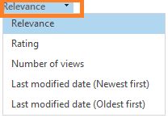
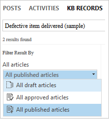

# Find knowledge articles from within a record

For any customer service team, it’s important to give customers the right information at the right time. After your administrator sets up knowledge management for your organization, you can search for articles while working on a customer’s case or other records in Dynamics 365 Customer Service, give customers accurate and consistent information, and also redirect frequently-asked questions. With rich knowledge at your fingertips, you’re likely to spend less time finding information, potentially reducing issue handling time and increasing customer satisfaction.
  
> [!IMPORTANT]
> [!INCLUDE[pn_parature](../includes/pn-parature.md)] knowledge base as a knowledge management solution has been deprecated. For more information, see [Important changes coming](/dynamics365/get-started/whats-new/customer-engagement/important-changes-coming).
  
 You’ll see knowledge articles residing either in Dynamics 365 Customer Service. 
  
 The search options that you get while you search for knowledge articles will differ based on the knowledge management solution your organization is using.  
  
1. [!INCLUDE[proc_service_cases](../includes/proc-service-cases.md)]  
  
2. Open a case record.  
  
3. On the Activity wall, select **KB Records**.  
  
    You’ll see a list of suggested knowledge articles based on the case title. You’ll also see a short description of the article along with its rating and number of views the article had.  
  
    If an article is still in draft or is expired, you’ll see its status before the title, so you know if you really want to share the article with the customer.  
  
   > [!IMPORTANT] 
   > If you see a message that knowledge management hasn’t been set up, ask your system administrator to set it up for you.  
  
4. If you want to search the knowledge articles for a different keyword, start typing the keyword in the **search** box and you’ll start seeing matching results as you type.  
  
5. To sort articles in the search results, in the **Select how to sort results** drop-down list, select a sort order. You can sort the search results based on relevance, number of views, or modified date.
  
     
  
6. To filter the search results, in the **Filter Result By** drop-down list, select a filter. You can filter the search results to show all approved articles, all draft articles, or all published articles.  
  
   
  
7. To see the full content of the article, select the article name link.  
  
    You’ll be able to see the full content of the article along with images and videos, if the article has any.  
  
8. You can take the following actions on the search results:  
  
   1. To associate a knowledge article with the current case, select a knowledge article, and then click the **Link the KB article to the current case** button . Dynamics 365 Customer Service adds the associated knowledge article to the **Associated Knowledge Base records** section. This association helps customer service managers determine which knowledge articles were effective in resolving cases.  
  
       You can also choose to disassociate the article from the case by clicking the **Unlink the KB article from the current record** button .  
  
   2. To copy the external URL of the article so you can share it with your customers over channels like chat or email, click the **Copy Link** button . This option is available only if you are using [!INCLUDE[pn_Internet_Explorer](../includes/pn-internet-explorer.md)].  
  
      > [!NOTE]
      > - If you don’t see a URL when you try to paste it, it could be because the article is still in draft state or is expired.
      >
      > - The Copy Link option is available only for published articles.  
  
   3. To associate an article with a case and share the article link with the customer through email, click the **Link the KB article to the case and email the link to the customer** button . An email form opens with the **To** field automatically filled with the customer’s information and the link added to the email body. Fill in any additional details, and then click **Send**.  
  
       This action also associates the knowledge article with the case automatically.  
  
       If you’re using the native [!INCLUDE[pn_crm_shortest](../includes/pn-crm-shortest.md)] knowledge management solution, the **Email Link** option is available only for published articles.  
  
       For published articles, an external link is copied to the email body.  
  
       If your administrator has not selected the **Use an external portal** option when setting up knowledge management, the **Email Link** option will not be available. 
  
   4. To associate an article with a case and share the article content with the customer through email, click the **Link Article to the Case and Email Content** button . An email form opens with the **To** field automatically filled with the customer’s information and the knowledge article content added to the email body. Fill in any additional details, and then click **Send**.  
  
   5. To open the article in a new window, click the **Pop Out** button .  
  
### See also  

[Understand knowledge base search mechanisms](knowledge-base-search-methods.md)

[!INCLUDE[footer-include](../includes/footer-banner.md)]
