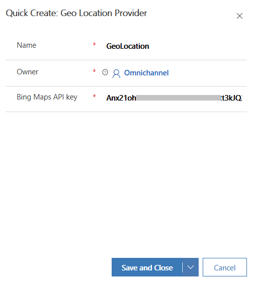
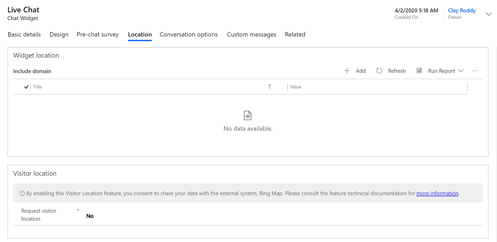

# Set up visitor location detection

[!INCLUDE[cc-use-with-omnichannel](../includes/cc-use-with-omnichannel.md)]

You can configure your chat widget to detect a visitor's location based on their latitude and longitude. With location detection enabled, visitors receive a prompt in their web browser when they start to chat. If the visitor allows their location to be shared, it will passed through to the agent. Agents can then use this information to provide a personalized support experience.

> [!NOTE]
> If a customer has turned off location sharing from their web browser, the location cannot be detected even if you have enabled location detection.

To enable location detection, you must first get your Bing Maps API key and create a geo location provider record. After you create a geo location provider record, you must add it in the **Location** tab of the appropriate chat widgets to enable location detection. For information on how to get the Bing Maps API key, see [Getting a Bing Maps Key](https://docs.microsoft.com/bingmaps/getting-started/bing-maps-dev-center-help/getting-a-bing-maps-key).

## Create a geo location provider record

1. In the site map of Omnichannel admin center, select **Customer settings** under **Advanced settings**, and then select **Manage** for **Geo location**. If you're using the Omnichannel Administration app, go to **Geo Location** under **Settings**. A list of existing records is displayed.

2. Select **New** to add a geo location provider record.

3.	In the **Quick Create: Geo Location Provider** pane, provide the following information:

    - **Name**: Name of the geo location record.

    - **Bing Maps API key**: API key of Bing Maps to get the visitor's location.

    > [!div class=mx-imgBorder]
    > 

4.	Select **Save and Close**.

## Enable visitor location detection

If you're using Omnichannel admin center app, do the following:

1. In Omnichannel admin center, go to the chat channel settings of the chat widget in which you want to enable geo location.

2. On the **Behaviors** tab, for **Customer location detection**, set the toggle to **On**.

3. In the Geo location provider list, select the provider that you've configured.

4. Save the settings.

If you're using the Omnichannel Administration app, do the following:

1. Open the chat widget in which you want to add geo location.

2.	Go to the **Location** tab.

3.	In the **Visitor location** section, select **Yes** in the **Request visitor location** field.

4.	In the **Geo Location Provider** field, browse and select the geo location provider record.

    > [!div class=mx-imgBorder]
    > 
    
## Privacy notice

**Location data**: If a user approves the browser request for detecting location, the app or website may collect and use precise data about the user’s location. Precise location data can be Global Position System (GPS) data, as well as data identifying nearby cell towers and Wi-Fi hotspots. The app or website collects latitude and longitude information from the user’s browser and sends it to Bing Maps for converting it into precise location data such as street, city, state, country, and zip code of the user. The app or website may also send location data to Microsoft Dynamics 365. A user may disable the location detection by turning off the location settings in their web browser settings. All use of Bing Maps is governed by the Bing Maps End User Terms of Use available at https://go.microsoft.com/?linkid=9710837 and the Bing Maps Privacy Statement available at https://go.microsoft.com/fwlink/p/?LinkID=248686. An administrator can turn off this visitor location feature by setting the “Request visitor location” to “No”, so that no further information will be sent to Bing Map from the app or website.

NOTE: Bing Maps is not provisioned in a dedicated data center for exclusive use by you and does not provide data segregation, such as for the Government Community Cloud. Your use of Bing Maps shall not be subject to any product-specific terms and conditions applicable to Dynamics 365 online for Government. If you do not wish to use the Visitor Location feature, then you must ensure that your administrator keeps the feature off.

[!INCLUDE[footer-include](../includes/footer-banner.md)]
