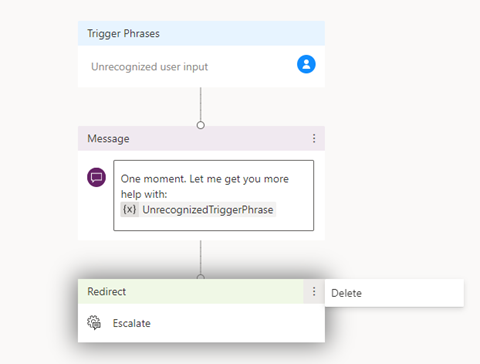
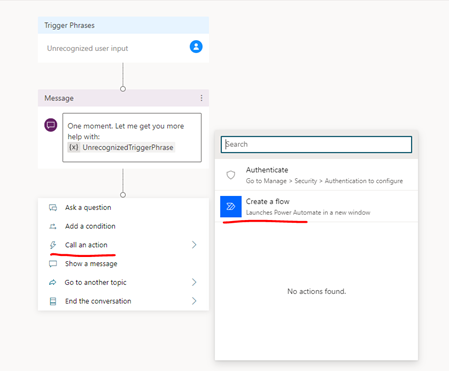
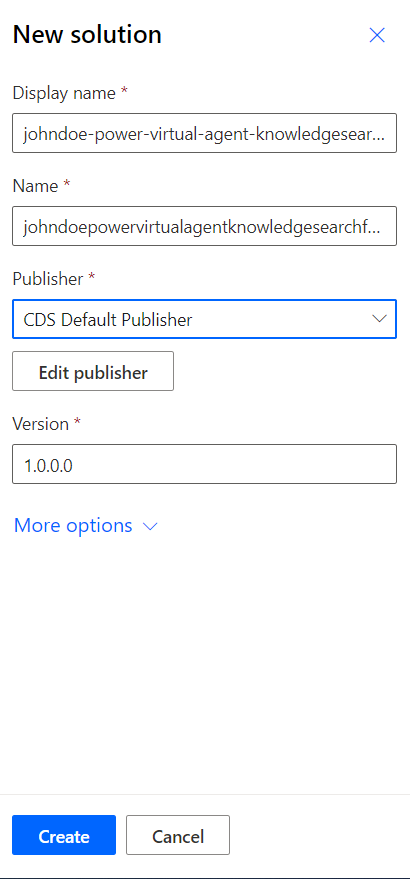

# Integrate knowledge management with a Power Virtual Agents bot

Integrate a Power Virtual Agents bot to assist in knowledge management by performing the following steps:

1. Create and publish knowledge articles to a portal created in Power Apps.
2. Create a topic for the Power Virtual Agents bot, and add an action.
3. Use a Power Automate template to add the solution to the bot.
4. Test the flow to publish and share the bot.

## Create and publish knowledge articles

Set up your portal with the Power Apps portals feature before integrating knowledge management with the Power Virtual Agents bot. More information: [Use settings to set up knowledge management](set-up-knowledge-management-embedded-knowledge-search.md). For more information on setting up your Power Apps portal, see : [Power Apps portal documentation](/powerapps/maker/portals/).

You can create and manage knowledge articles by setting the **Internal** field to **No**. More information: [Create and manage knowledge articles](customer-service-hub-user-guide-knowledge-article.md)

## Create a topic for the Power Virtual Agents bot, and add an action

The system fallback topic can help agents present answers to customers when the knowledge search doesn't provide relevant knowledge articles. You can create the fallback topic and add an action. The action allows the fallback topic to be displayed as a message to agents.

1. Sign in to Power Virtual Agents.

2. Select **New bot**. More information: [Create and delete bots](/power-virtual-agents/authoring-first-bot)

3. Select **Topics** to see the knowledge articles and topics that are provided by the bot.

4. Select **Settings** > **System Fallback**.

5. Select **Add**.

6. After the topic is added, select **Go to Fallback topic** to author the topic.

7. On the authoring canvas, delete the **Escalate** item by selecting **Options.**

    > [!div class="mx-imgBorder"]
    > 

8. Select the connector flowing to the message box, and then select **Call an action** > **Create a flow**.

    > [!div class="mx-imgBorder"]
    > 

The Power Automate application opens on a new tab, where you'll configure the template settings.

## Use the Power Automate template to add the solution to the flow

Use the Power Automate template that you created to connect to the knowledge base by performing the following steps:

1. On the Power Automate page, select **Templates**. On the pop-up window that appears, select **Leave** and exit the current browser page.
 
2. On the templates page, search for the **Generate answers from Dataverse knowledge articles to Power Virtual Agent** template. 

    > [!div class="mx-imgBorder"]
    > 

3. Select **Continue**. You'll be redirected to the Power Automate flow template.

4. Save the template, and then select **Solutions**. 

5. Select **New solution**.

6. Enter a display name. The list of solutions includes every solution in your organization. Choose a naming convention that helps you filter to just your solutions. For example, you might prefix your email to your solution name: *johndoe-power-virtual-agent-knowledgesearch-fallback*.

7. Select your publisher from the list of choices.

8. Accept the default values for name and version.

9. Select **Create** to finish the process.
 
     > [!div class="mx-imgBorder"]
     > 

10. In the list of solutions, select the solution you just created. It should appear at the top of the list. If it doesn't, search by the convention you used in step 6 to name the solution.

11. In the solution, select **Add existing**, and then select **Cloud Flow** from the list.

12. In the **Outside solutions** list, select your flow, and then select **Add** to finish the process. If there are several flows, look at the **Modified** column to find the most recent version.

### Add the solution's flow to the Power Virtual Agents bot

1. Open the browser with the authoring canvas.

2. Above the **Message** action box, select the connector, and then select **Call an action**.

3. From the flow pop-up window, select the new flow named **Generate answer from Dataverse knowledge articles for Power Virtual Agent**. The new action appears in the flow.

4. To correctly set the input variable to the action, select **Select a variable**, and then select **bot.UnrecognizedTriggerPhrase**.

     > [!div class="mx-imgBorder"]
     > 

5. To return the knowledge article search results to the bot, follow one of these steps:

    - To correctly set the output variable to the **Generate answer from Dataverse knowledge articles for Power Virtual Agent** action, select **UnrecognizedTriggerPhrase** from the **Message** action box. Select the drop-down box next to {x} to insert a variable. Select  **textResult**, which contains the article result in text format. This will render the whole article content as text in the message.

    - Use thumbnail cards to show the article. More information: [Respond with cards](/composer/how-to-send-cards#thumbnailcard)

    - Use the following sample code to render search results in adaptive cards.

    
#kbcardjson()
```
- 
{
  "type": "AdaptiveCard",
    "body": [
        {
            "type": "ColumnSet",
            "columns": [
                {
                    "type": "Column",
                    "items": [
                        {
                            "type": "Image",
                            "height": "35px",
                            "url": "https://th.bing.com/th/id/R4fbade037f8209666b06aa22641708fc?rik=ya%2bpnPJ41EFFMg&riu=http%3a%2f%2fmolnar-institute.com%2ffileadmin%2f_processed_%2fcsm_KnowledgeManagement_icon_forWebsite_bcda89676b.png&ehk=J%2bz2G15xtbJgd7ssSXo7X2q7LDLaMGl7EuGUSQU6P2s%3d&risl=&pid=ImgRaw",
                            "size": "Small"
                        }
                    ],
                    "width": "auto"
                },
                {
                    "type": "Column",
                    "items": [
                        {
                            "type": "TextBlock",
                            "weight": "Bolder",
                            "text": "${dialog.currentarticle.title}",
                            "wrap": true,
                            "size": "Large"
                        },
                        {
                            "type": "TextBlock",
                            "spacing": "None",
                            "text": "Last modified on ${dialog.currentarticle.modifiedon}",
                            "isSubtle": true,
                            "wrap": true
                        }
                    ],
                    "width": "stretch"
                }
            ]
        },
        {
            "type": "TextBlock",
            "text": "${json(virtualagent.jsonResult).articles[0].description}",
            "wrap": true,
            "size": "medium"
        }
    ],
    "actions": [
        {
            "type": "Action.OpenUrl",
            "title": "View article in Dynamics App",
            "url": "${dialog.currentarticle.articleurl}"
        }
    ],
    "$schema": "http://adaptivecards.io/schemas/adaptive-card.json",
    "version": "1.0"
}
```

## Test and publish the Power Virtual Agents bot

After you've saved the fallback topic, you can test your bot by typing some queries. If an existing topic can't answer the question, the topic that you created is displayed as a message. After publishing the Power Virtual Agents bot, you can also share your bot.

  > [!div class="mx-imgBorder"]
  > 

To publish the Power Virtual agent bot, select **Publish** and look for the demo link that you'll find on the same page.

You can share the demo by configuring it as a channel: 

1. Select **Manage** > **Channel**.

2. From the list of channels, select **Demo website**.

3. Copy the link, and then select **Save**.

### See also

[Create and edit topics](/power-virtual-agents/authoring-create-edit-topics)
