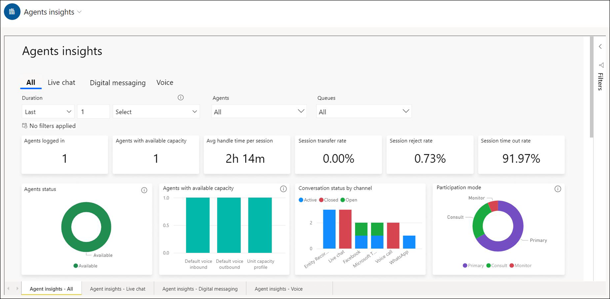
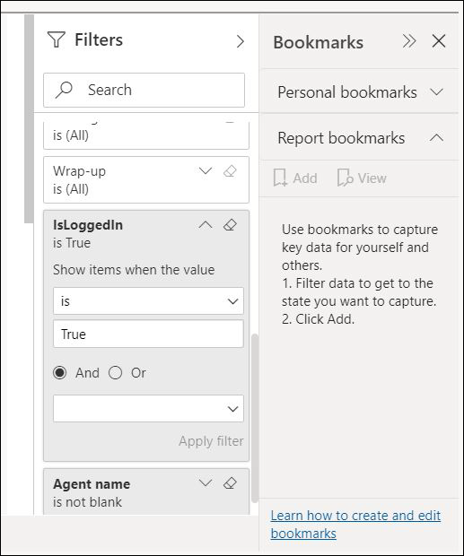

# View and understand the Agents insights report in Omnichannel intraday insights

[!INCLUDE[cc-use-with-omnichannel](../includes/cc-use-with-omnichannel.md)]

> [!NOTE]
> With the release of [real-time analytics reports in Omnichannel for Customer Service](enable-realtime-analytics-dashboard-administrator.md), our latest analytics capability, we announce that the intraday insights for Omnichannel for Customer Service will be deprecated on October 31, 2023. We recommend that you use real-time analytics reports, which provide real-time information about the health and key performance indicators of your organization. For more information on the deprecation, go to [Intraday insights for Omnichannel for Customer Service to be deprecated](deprecations-customer-service.md#intraday-insights-for-omnichannel-for-customer-service-to-be-deprecated).

## Introduction

The Omnichannel intraday insights dashboard contains the Agents insights report that helps provide an overview of agent performance.

## The Agents insights report

The **Agents insights** report consists of metrics from an agent’s standpoint. The report shows all-up agent metrics across all channels or channel-wise agent performance. Supervisors can select the **All** tab to view agent performance across all channels, or select the **Live chat**, **Digital messaging**, or **Voice** tabs to view the agent performance for the corresponding channel.

The Digital messaging report includes metrics from the social channels, SMS, Microsoft Teams, entity records, and custom messaging channels.

You can view specific insights about the performance of individual agents or groups of agents, such as their availability, average length of time in conversations, and average response time per session.

> [!div class="mx-imgBorder"]
> 

> [!div class="mx-imgBorder"]
> 

The agents insights report consists of the following metrics.

| Metric | Description |Availability|
|-------|-------|--------|
| Agents logged in | The number of agents who are signed in.| Live chat, Digital messaging, Voice |
| Agents with available capacity | The number of signed-in agents who can accept incoming conversation requests as well as their available capacity across all capacity profiles. Unit-based capacity is accounted against the unit capacity profile. |Live chat, Digital messaging, Voice|
| Average handle time per session | The average handle time is derived as the total session handle times by the number of sessions handled by the agents. The session handle time is the total duration an agent spent on the session when it is in focus in the session panel until an agent closes the session. The handle time is paused when the agent switches to another session and is resumed when the agent returns to the session. |Live chat, Digital messaging, Voice |
| Session reject rate | The percentage of sessions rejected by the agents out of the total sessions assigned to them. |Live chat, Digital messaging, Voice |
| Session time out rate | The percentage of sessions that were timed out, out of the total sessions assigned. |Live chat, Digital messaging, Voice |
| Session transfer rate | The percentage of sessions that were transferred to another agent or queue. |Live chat, Digital messaging, Voice |
| Agent status | The presence status of an agent. |Live chat, Digital messaging, Voice |
| Chat status | Displays the number of chat conversations that are in the different statuses.| Live chat|
| Conversation status by channel | The distribution of the different conversations statuses across different channels. | Digital messaging|
|Call status| Displays the number of calls that are in the different statuses. | Voice |
| Participation mode | The distribution of the sessions across various participation types - Primary indicates the agent who's assigned the session, Consult indicates agents who are engaged in a consulting session and Monitor indicates an ongoing Supervisor's monitor session. |Live chat, Digital messaging, Voice |
| Transfer rate by agent | The percentage of sessions transferred by the agent to another agent or queue. |Live chat, Digital messaging, Voice |
| Transfer rate by queue | The percentage of sessions within a queue that were transferred to another agent or queue. |Live chat, Digital messaging, Voice |
| Consult acceptance rate | The percentage of consult requests accepted by an agent out of the total requests received. |Live chat, Digital messaging|
| Avg. talk time (min)| The average time an agent spent talking with a customer over a voice call. | Voice |
| Avg. hold time (min) | The average time an agent put a customer on hold over a voice call. |Voice |
|||

You can filter on a specific queue or set of queues to view more specific information about an agent or group of agents. You can also hover over an agent's name and a pop-up window will appear, showing details such as the agent's presence, current conversations, and the sentiments of those conversations, as well as an agent's available capacity across different capacity profiles. Unit-based capacity is accounted against Unit capacity profile.

The table in the **Agent insights** report displays the following information.

| Agent details | Description |
|-------|-------|
| Agent name | A list of the agent names for the queue. |
| Status | The current presence of the agent: **Available**, **Offline**, **Do not disturb**, or **Busy**. |
| Active | The number of conversations that are active.|
| Waiting | The total number of conversations waiting to be picked up by an agent. |
Wrap-up | The total number of conversations in the wrap-up stage. |
| Closed | The number of conversations that are closed. |
| Avg handle time (min) | The average of an individual agent's handle time in minutes for all closed conversations that the agent is involved in. More information: [Average handle time](intraday-insights-dashboard.md#average-handle-time). |
| Email ID | The email address of the agent handling the conversation; the email address should be unique so that the agent filter works as expected. |

> [!div class="mx-imgBorder"]
> 

You can use the filters pane on the right to see only the signed-in agents in the table. Do the following:

1. Select the agent table.
2. Select the filter pane, and set **IsLoggedIn** field to **True**.
    >

### Agent details

You can also view details about a specific agent by right-clicking the agent's name and then selecting **Drill through** > **Agent details** on the shortcut menu, as shown in the following image.

> [!div class="mx-imgBorder"]
> 

> [!NOTE]
> The **Drill through** feature isn't supported outside of Omnichannel for Customer Service.

Details about the agent are displayed as shown in the following image.

> [!div class="mx-imgBorder"]
> 

> [!div class="mx-imgBorder"]
> 

This section displays the following details.

| Detail | Description |
|-------|-------|
| Profile | The capacity profiles that are assigned to an agent. If a profile is force assigned, it is displayed in red. |
| Total capacity | The total capacity as configured in the profile. |
| Available capacity | The current available capacity. Available capacity can be displayed as negative due to supervisor assigns. |
| Status | The agent's current presence : **Available**, **Offline**, **Do not disturb**, or **Busy**. |
| Status since | The amount of time that the agent's presence has been in its current state. |
| Logged in duration 24 hrs | The total duration for which the agent has been signed in during the past 24 hours.|
| Logged off duration 24 hrs | The total duration for which the agent has been signed out during the past 24 hours. |
| Logged in duration 12 hrs | The total duration for which the agent has been signed in during the past 12 hours.|
| Logged off duration 12 hrs | The total duration for which the agent has been signed out during the past 12 hours. |
| Queues | The queues that the agent is mapped to. |
| Skills | The skills that are assigned to the agent.|
| Conversation status reason | The status of the latest conversation between the agent and a customer. | 
| Avg handle time per session | The average handle time per session is calculated as the average of all the handle times of the sessions handled by the agent. The session handle time is the total duration an agent spent on the session when it is in focus in the session panel until an agent closes the session. The handle time is paused when the agent switches to another session and is resumed when the agent returns to the session. This includes the time the agent takes to wrap up the conversation. More information: [Average handle time](intraday-insights-dashboard.md#average-handle-time). |
| Logged in states duration | The agent's presence when the agent is signed in.|
| Subject | For an identified customer, the customer's name is displayed with the subject. For unidentified customers, static text is displayed with the label **Visitor**. More information: [Automatically identify customers](record-identification-rule.md). |
| Participation mode | **Primary** indicates that the agent is engaged in a session. **Consult** means that the agent is engaged in a consulting session with another agent. **Monitor** means that this agent is monitoring the session. |
| Work stream | The work stream that the conversation is assigned to. |
| Channel | The channel that the conversation was created from. |
| Queue | The queue that the conversation is currently part of. |
| Status reason | The current conversation status. |
| Customer sentiment | The current sentiment. |
| Created on | The conversation creation time. |
| Capacity and status timeline | Every change in capacity or status is plotted on the timeline. Negative capacity is displayed if a supervisor assigns a conversation to an agent that's beyond the agent's available capacity.|
|||

### Change agent status

You can select the **Status** field to modify the presence indicator for an agent. The agent has to be signed in for you to change the agent status.

### See also

[Introduction to intraday insights dashboard](intro-intraday-insights-dashboard.md)  
[Intraday insights dashboard](intraday-insights-dashboard.md)  
[View and understand conversation insights](intraday-conversation-insights.md)  
[View and understand Ongoing Conversations dashboard](ongoing-conversations-dashboard.md)  
[Seller details page for sales managers](../sales/conversation-intelligence-seller-details.md#seller-details-page-for-sales-managers)  

[!INCLUDE[footer-include](../includes/footer-banner.md)]
