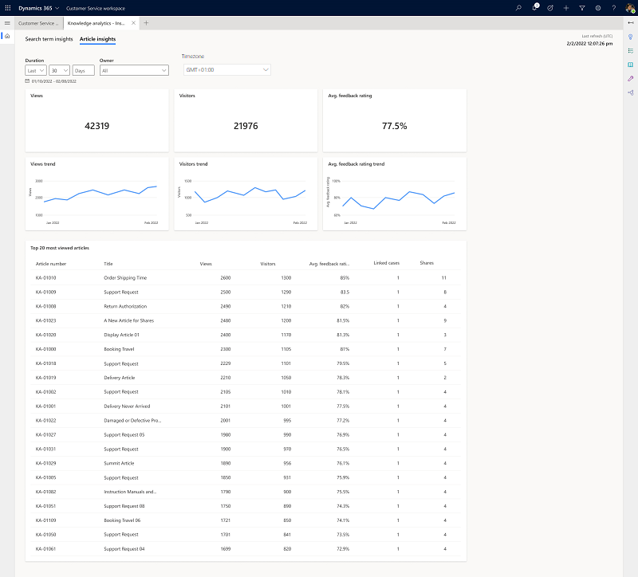

# Introduction to knowledge analytics

Knowledge analytics help provide knowledge workers and supervisors with valuable insights about how knowledge articles are being used and searched. Supervisors can use these insights to improve their knowledge management system.

Knowledge analytics includes the following features:

- [Article insights](#article-insights)
- [Search term analytics](#search-term-analytics)

## Article insights

The article insights dashboard can help your organization's knowledge workers to understand the impact that knowledge management is making on the overall support experience. The insights include details about articles that are shared.

### Metrics in Article insights dashboard

The Articles insights dashboard represents the following metrics.

| Metrics or chart | Definition |
|----------------------|-------------------------|
| Views | The total number of views on the knowledge articles. |
| Visitors | The total number of unique visitors who viewed the knowledge articles. |
| Feedback rating | The average feedback rating provided by the consumers of the knowledge articles. |
| Most viewed articles | The top 20 articles used, along with visitors, average feedback rating, linked cases and shares metrics. |
| Linked cases | The total number of cases that were linked to the articles. |
| Shares | The total number of the article that were shared by the support representative. |
| Owner (Filter) | The owner of the knowledge article. |

## Search term analytics

The knowledge search term analytics dashboard is designed to provide supervisors and knowledge workers with valuable insights into how agents find and use knowledge articles.

Your administrator must enable the dashboard for you to access it. More information: [Configure Knowledge search insights](enable-knowledge-search-insights.md).

> [!NOTE]
> Knowledge search term analytics won't provide information about customer search behavior. Data is from internal knowledge searches only. 

As a knowledge manager, it's your responsibility to maintain and improve your organization's overall knowledge base article offerings. By identifying searches that have low success or return no results, the Knowledge search term analytics dashboard can help you identify knowledge gaps, improve search results, and surface the most relevant articles.  

### Metrics in Knowledge search term analytics dashboard

The Knowledge search term analytics dashboard represents the following metrics.

| KPIs or chart | Definition |
|----------------------|-------------------------|
| Search count | The total number of searches completed within a given period. |
| Search count over duration | The number of searches completed within a certain amount of time. |
| Avg. search rate trend | The day-by-day trend of the average list position of the link selected by a user when presented with search results. |
| Avg. search rank | The average position of the link selected by a user when presented within search results. |
| Engagement rate | The percentage of events where a user interacted with the search results compared to the search events presented with results. |
| Engagement rate trend | The day-by-day trend of the percentage of events where a user interacted with the search results compared to the search events presented with results. |
| Rate of no-result searches | Percentage of instances where the searched term displayed no results. |
| Rate of no-result searches trend | The day-by-day trend of the percentage of search instances that displayed "no results". |
| Top 20 search terms | The top 20 terms being searched, showing the number of times searched, the average search rate, and engagement rate. |
| Top 20 search terms with no results | The top 20 search terms that returned no results when searched. |
| Top 20 search terms with high avg. search rank | The top 20 search topics by volume with an average click position of greater than five. |
| Top 20 search terms with low engagement rate | The top 20 search topics by volume with engagement rate of less than 40 percent. |
| Search volume by application | The percentage of searches across multiple applications. |
| Search volume by search type | The percentage of searches based on whether they were manual or automatic searches. |

### See also

[Configure knowledge search insights](enable-knowledge-search-insights.md)
[Search for knowledge articles](search-knowledge-articles-csh.md)  
[Understand knowledge base search mechanisms](knowledge-base-search-methods.md)  
[Use embedded knowledge search to set up knowledge management](set-up-knowledge-management-embedded-knowledge-search.md)

[!INCLUDE[footer-include](../includes/footer-banner.md)]
