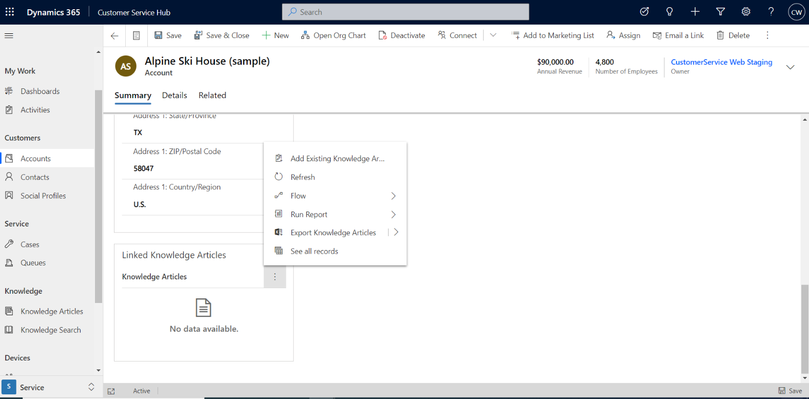

# Link and unlink knowledge articles

## Link and unlink the knowledge article to a record

You can associate and dissociate a knowledge article with a record. By default, the articles aren't linked to the case. When you select to link the article to the case, the link icon changes, and **Linked to Case** is displayed for the article.

:::image type="content" source="media/csw-link-unlink-km.png" alt-text="Link or unlink an article to a case":::

## Linked knowledge articles subgrid

The linked knowledge article subgrid is available for an entity, such as a case or account, only if your system administrator has added the subgrid to the entity form. The knowledge article subgrid displays the knowledge articles that have been linked with the entity. Some of the options available are as follows:

- Add a knowledge article
- Select and edit an article's content
- Sort
- Bulk operations
 
You can also edit a knowledge article by double-clicking it in the linked articles list.

To link the knowledge article to an entity, you need to do the following steps. For the sake of this example, let us consider the entity as Accounts.

1. In the Customer Service Hub site map, go to **Customers** > **Accounts**.

2. Select any active account from the list of accounts.

3. On the **Summary** tab, scroll down to the **Linked Knowledge Articles** subgrid.

  > [!NOTE]
  > The name of the subgrid can vary depending on the customizations your organization has made.

4. Select **More commands** (⁝), and then select **Add Existing Knowledge Article**.

   > [!div class=mx-imgBorder]
   > 

5. Search for the knowledge article that you want to link, and select **Link.**

   > [!div class=mx-imgBorder]
   > 

6. Select **Done**. The article will appear in the **Linked Knowledge Articles** subgrid.

### See also

[Create and manage knowledge articles](customer-service-hub-user-guide-knowledge-article.md)  
[Understand knowledge base search mechanisms](knowledge-base-search-methods.md)  

[!INCLUDE[footer-include](../includes/footer-banner.md)]
