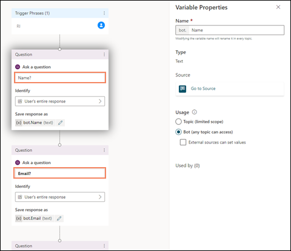

# How to link customer and case to conversations when bots escalate to human agents

When the bot escalates a conversation to a human agent, the customer and case can be linked to the conversation so that the human agents can see the related customer and case information in the customer summary section when they start interacting with the customers. To link the customer or case, set the values for the associated attributes, such as the name and phone number. These attributes will be searched for in Dynamics 365 in the corresponding entities, such as customer and case, and the result will be linked to the conversation if a single record is found to be matched. The bot will need to set context parameters for the following that are also set in [automatically identify a customer](record-identification-rule.md).

|Entity to be linked|Variable name to be set by bot|Attribute for Dynamics 365 entity to match with corresponding variable name in bot|
|------------|----------------|----------------------|
|Account|<ul><li> Name</li><li> Email </li><li> Phone</li></ul> |<ul><li> name</li><li>emailaddress1</li><li>telephone1</li></ul> |
|Contact|<ul><li> Name</li><li> Email </li><li> Phone</li></ul>|<ul><li> name</li><li>emailaddress1</li><li>telephone1</li></ul>|
|Case|CaseNumber|ticketnumber|
||||

For bots in Power Virtual Agents, you will set the values for the context variables to "User's entire response". To set the values for the bot in Power Virtual Agents, perform the steps mentioned in [Configure context variables for the bot](configure-bot-virtual-agent.md#configure-context-variables-for-the-bot).

A sample screenshot is as follows that outlines how the variables need to be set in Power Virtual Agents.

You do not need to select the **External sources can set values** checkbox in the variable properties.

To create context variables for Azure bot and set the values to "string", see [Enable a bot to escalate and end conversation](bot-escalate-end-conversation.md).

### See also

[Configure a Power Virtual Agents bot](configure-bot-virtual-agent.md)  
[Configure Azure bot](configure-bot.md)  
[Context variables for bots](context-variables-for-bot.md)  
