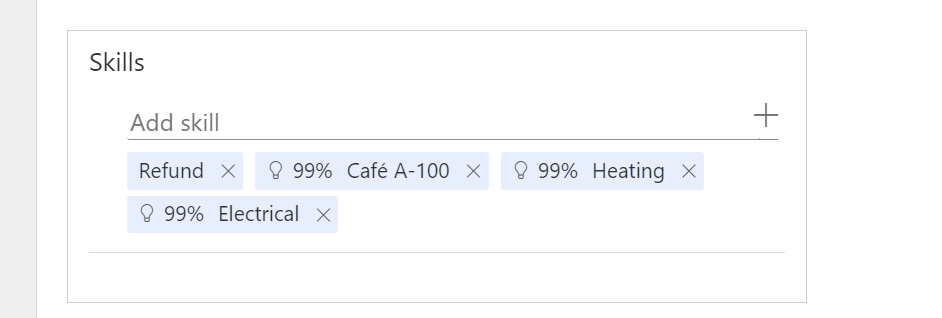

# View, add, and remove skills

[!INCLUDE[cc-use-with-omnichannel](../includes/cc-use-with-omnichannel.md)]

Dynamics 365 comes with an out-of-the box skill control for messaging channels. Your administrator can enable the setting that allows you to update skills at runtime.

When you receive a work item in your queue, you can view the skills required to do the work in the **Skills** field of your case record. 

You can view skills manually added by your administrator and skills identified by the machine-learning models, as shown in the following illustration.

> [!div class="mx-imgBorder"]
> 

If upon assessing the work item, you think that the relevant skills are incorrect or missing, you can choose to remove or add skills as appropriate.

To add skills, select **Add skill**, enter one or more skills, and select the plus (**+**) symbol.

To remove skills, select **X**.

### See also

[Allow agents to update skills](allow-agents-update-skills.md)
[Set up record routing](set-up-record-routing.md)  
[Set up unified routing](set-up-routing-process.md)  

[!INCLUDE[footer-include](../includes/footer-banner.md)]