# Preview: Migrate automatic record creation rules and service-level agreements

[!include[cc-early-access](../includes/cc-early-access.md)]

The Dynamics 365 Customer Service Hub app has several features and functionalities that replace the rules in the legacy Customer Service app. The automatic record creation rules and service-level agreements (SLAs) are now supported by Power Automate-based flows to make the transition to the new platform easier to manage.

This topic provides an overview of the migration tool that allows legacy rules for automatic record creation rules and SLAs to be transferred to the Customer Service Hub app for easier access.

The migration tool is designed to migrate the existing legacy rules to Unified Interface, ensuring all the rules, items, and actions are converted accordingly into the Unified Interface format. This also includes the conversion of the workflow to a Power Automate-based flow.

The migration tool provides the following functionality:

- Ability to run the migration tool multiple times and see what the status looks like at any point in time.
- Flexibility to choose which legacy rules need to be migrated.
- Flexibility to decide when to activate new rules and deactivate the legacy rules so you are not forced to activate all or none.
- Existing legacy rules are not modified or deactivated automatically. 
- Messages on potential issues on why a ruled failed the migration process.
- Legacy rules continue to run on existing cases until the rules are deactivated. 

## Prerequisites

- Customer Service license.
- For migrating automatic record creation rules, your environment must have Customer Service version 9.0.20034.20XX or later to opt in for migration.
- For migrating SLAs, your environment must have Customer Service version 9.0.20053.1030 or later to opt in for migration.
- Administrator permissions.

## Things to consider

Before you run the migration tool, it is important to understand how the modern automatic record creation and SLA rules work in the Customer Service Hub app.

- **Working with rules or items:** When you perform your migration, you will be able to view detailed results only for rules that have failed the premigration check or those that were partially migrated (incomplete). 

  To learn more about how to create rules in the Customer Service Hub app, see [Automatically create or update records in Customer Service Hub](automatically-create-update-records.md) and [Define service-level agreements](define-service-level-agreements.md).

  > [!Note]
  > After you successfully migrate a rule, any edits made to the rule in the web client will not be visible in Unified Interface. For the edits to be visible in Unified Interface, you must delete the rule in Unified Interface and migrate it again from the web client.

- **Editing rules or items:** If you rerun the migration tool, it will pick up any updates or edits in the web client if the rule has been:

    - Edited in the web client prior to the actual migration.
    - Edited in the web client to resolve errors after a failed migration attempt.

  The following updates or edits to a rule will not be considered if:

    - The rule is edited on the web client after it is successfully migrated to Unified Interface.
    - Any edits were made in the migrated rules in Unified Interface as well.

- Only one level of related entity hierarchy in a rule or item is supported for migration. If any rule or item contains related entity in group clause, you need to remove them before migrating the rule.

## How the migration process works

The migration progress is indicated on the page as follows; the colored circle indicates the migration stage.
> 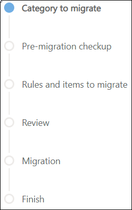

1. **Category to migrate:** Allows you to pick and choose the rules you want to migrate.

2. **Pre-migration checkup:** Provides insights into any potential migration failures you might incur prior to beginning your migration.

3. **Rules and items to migrate:** Allows you to select the rules you want to migrate. 

4. **Review** Provides you with the opportunity to go through any rules that have been identified as having errors or issues and fix them prior to migration.

5. **Migration:** Post-migration, allows you to review the successfully migrated rules and rules that failed migration.

6. **Finish:** Provides you with a summary and status page of the successfully migrated rules, pending rules, and rules that failed migration.

## Access the migration tool

You can access the migration tool using the following steps:

1. In Customer Service Hub, select **Service Management** in **Change area**.

2. Under **Data Management**, select **ARC & SLA Migration Tool (Preview)**.

> 
> 
## Migration Summary

When you select **ARC & SLA Migration** in the left pane, the **Summary** page is displayed as follows.

> 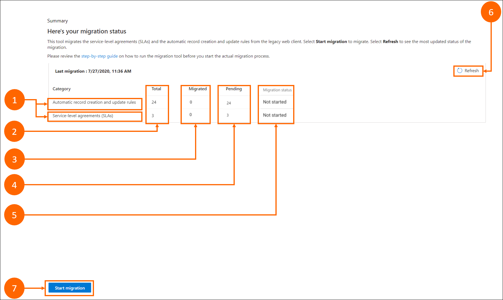

The annotations are explained as follows.

|label|Description|
|-------|----------|
|1|**Category**: An overview of the automatic record creation rules and SLAs.|
|2|**Total**: Displays the number of legacy rules available overall.|
|3|**Migrated**: Displays the number of rules you have migrated.|
|4|**Pending**: Displays the number of rules you have pending migration (includes failed rules, partially or incomplete migrated rules, and rules that have not been attempted).|
|5|**Migration status**: Displays whether migration has started.|
|6|**Refresh**: Allows you to update migration status.|
|7|**Start migration**: Allows you to begin the migration process.|
|||

## Migrate the automatic record creation rules and SLA items

You can migrate both the automatic record creation rules and SLA items together or separately. The information in the following sections is organized according to the [migration process](#how-the-migration-process-works) on the left of the migration pages that leads you through the migration states.

### Category to migrate

When you select **Start migration**, the **Step 1** page is displayed. Select the categories that you want to migrate.

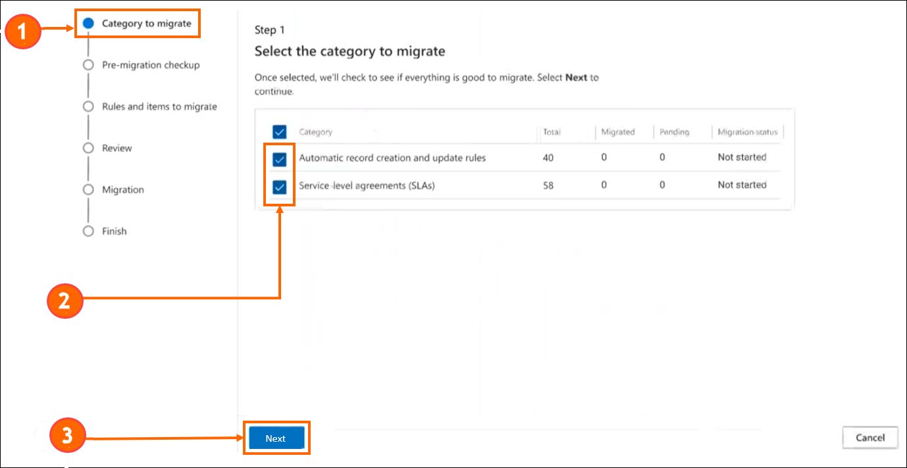

The annotations are explained as follows.

|Label|Description|
|------|------|
|1 |A tracker that is displayed on the left, shows you where you are in the migration process at any time.|
|2| You can migrate the automatic record creation rules and SLAs separately or both at the same time. |
|3|	You must select a category for migration before you can proceed. select **Next** to go to the next stage.|
|||

### Premigration checkup

The **Step 2** page provides a premigration check that displays what the actual migration results will look like so you can mitigate potential migration failures before you begin.  

The check can be done on automatic record creation rules and or SLAs, depending on your selection from the previous screen.

When you run the migration process for the first time, you won't have any insights until you complete the premigration checkup. After the premigration check is complete, the following overview is displayed.

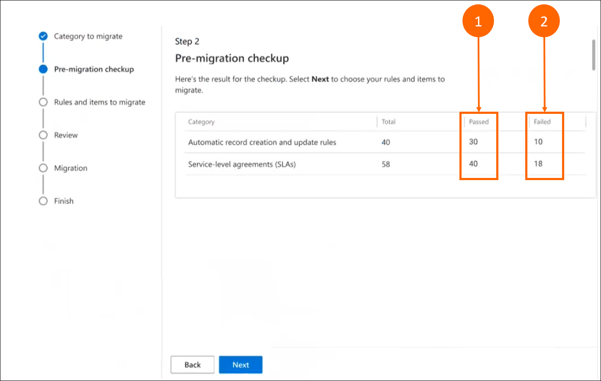

|Label|Description|
|-------|-------|
|1|	The number of rules that will successfully complete migration.|
|2|	The number of rules that might fail the migration.|
|||

### Rules and items to migrate

If you have selected both automatic record creation rules and SLAs, the step 3 page is divided into **Step 3.1** and **Step 3.2** pages, one each for automatic record creation rules and SLAs.

By default, the rules and items that successfully complete the premigration check are selected to be migrated. You can select the rules and items that you want to migrate.  

The rules and items that fail the premigration check can still be migrated; however, the data will not completely migrate. If you want to migrate both passed and failed rules, use the **Migrate all rules** option to override any current selection and migrate all rules.

#### Automatic record creation and update rules

In this section, the Step 3.1 page that appears for the rules that you select for migration is shown as an example.

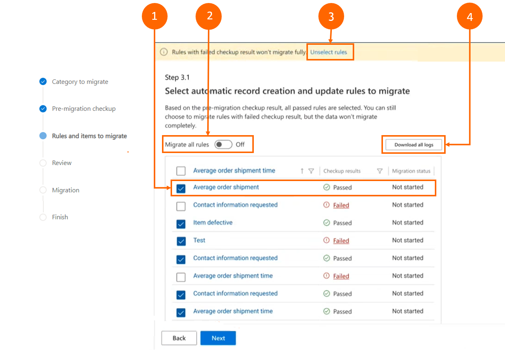

|Label|Description|
|----|------|
|1|	Rules that pass are automatically selected for migration. You can clear the selection for any rules that you don't want to migrate. Rules that failed are not selected for migration. To understand why a rule failed, you can select it and [view the details about the failure](#view-details-of-rules-that-failed), and then use the information to fix the failure prior to or after migration.|
|2|	**Migrate all rules** provides you the ability to override the current selection to select all rules, regardless of their premigration check result. |
|3|	This alert notifies you that while you can migrate rules that failed the premigration check, the data on failed rules will not migrate completely and provides the option to **unselect rules** that failed.|
|4|	Lets you **download all logs** for review and troubleshooting purposes.|

#### View details of rules that failed

When you select a rule that failed the premigration check, you have a choice of **Basic** and **Advanced** views to understand why a rule failed. You can use this information to either troubleshoot and fix the ruled that failed, or choose to migrate the rule and fix it in Customer Service Hub after migration is complete.

##### Basic view

The **Basic** view provides an overview for each individual rule that failed.

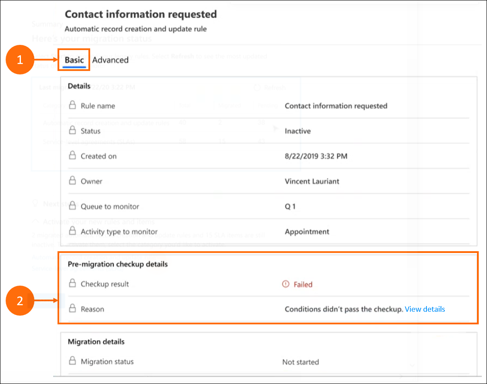

|Label|Description|
|---|--------|
|1|	High-level details on rules that fail.|
|2|	**Pre-migration checkup details** shows results along with details of why a rule failed.|
|||

##### Advanced view

The **Advanced** view provides the problem details on rules that failed.

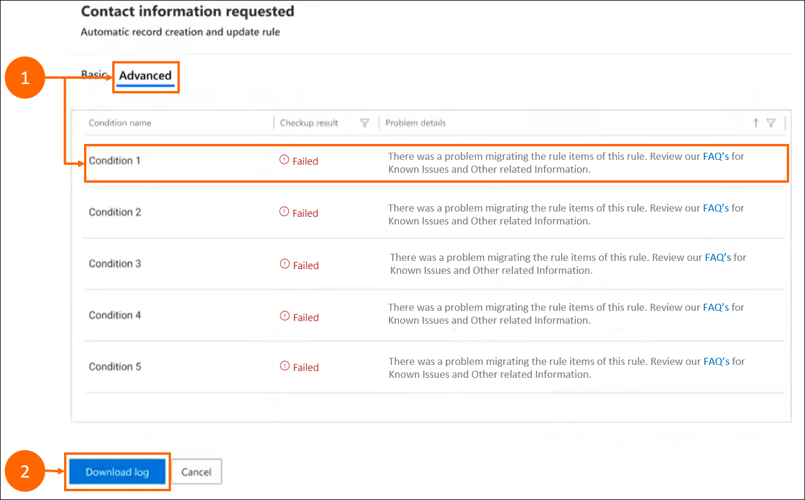

|Label|Description|
|---|----|
|1|	Additional details about why the rule might have failed migration, which you can use to troubleshoot and resolve prior to migration.|
|2|	The **Download log** provides a list of failed rules to review and troubleshoot.|
|||  

### Review

When you have selected the automatic record creation rules and SLA items, a list is displayed for your review.

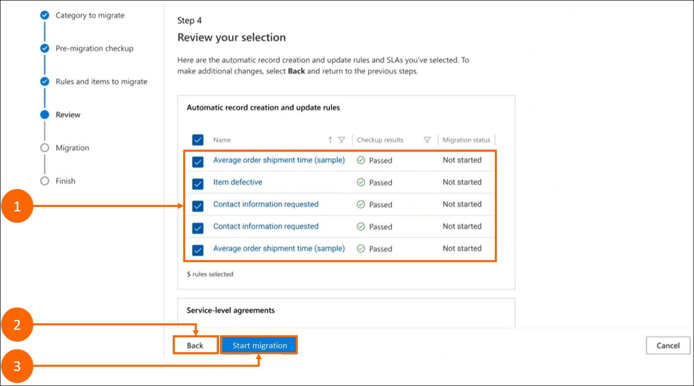 

|Label|Description|
|---|----|
|1|	View a list of all the rules that you've selected for migration.
|2|	Select **Back** to return to the previous step to make additional changes.|
|3|	Select **Start migration** to begin the migration.|
|||

### Migration

After you begin your migration, the details are displayed on the page.

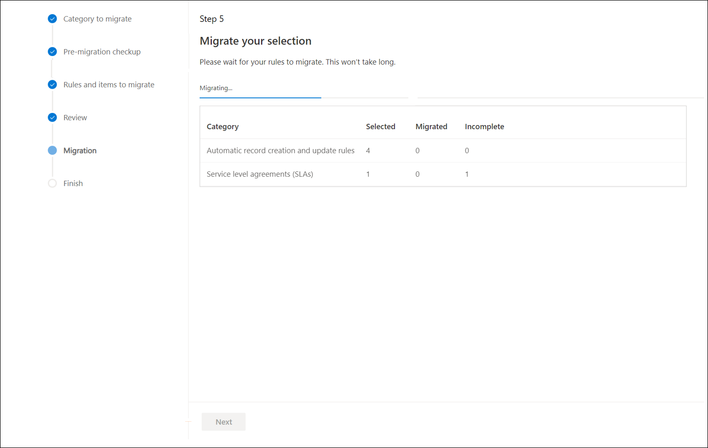

The migration details are displayed after the migration is complete.

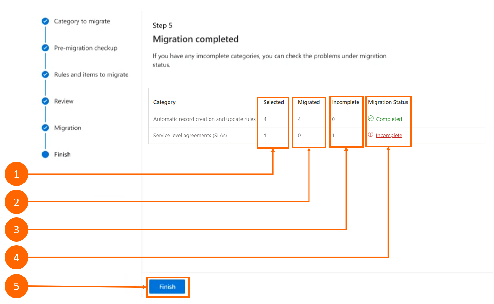

|Label|Description|
|---|----|
|1|	**Selected**: Displays the total number of rules that were selected for the current migration run.|
|2|	**Migrated**: Displays the total number of rules that successfully completed migration.|
|3|	**Incomplete**: Displays the total number of rules that encountered errors and didn't successfully complete migration.|
|4|	**Migration Status**: Displays either a green check mark , which represents rules successfully migrated, or a red exclamation mark ,   which represents some or all rules did not successfully complete migration.|
|5|	**Finish**: Completes the migration process when finished.|
|||

#### Incomplete migration details

To view ARC or SLA rules that did not successfully complete migration, you can select **Incomplete** in the **Migration status** section.  

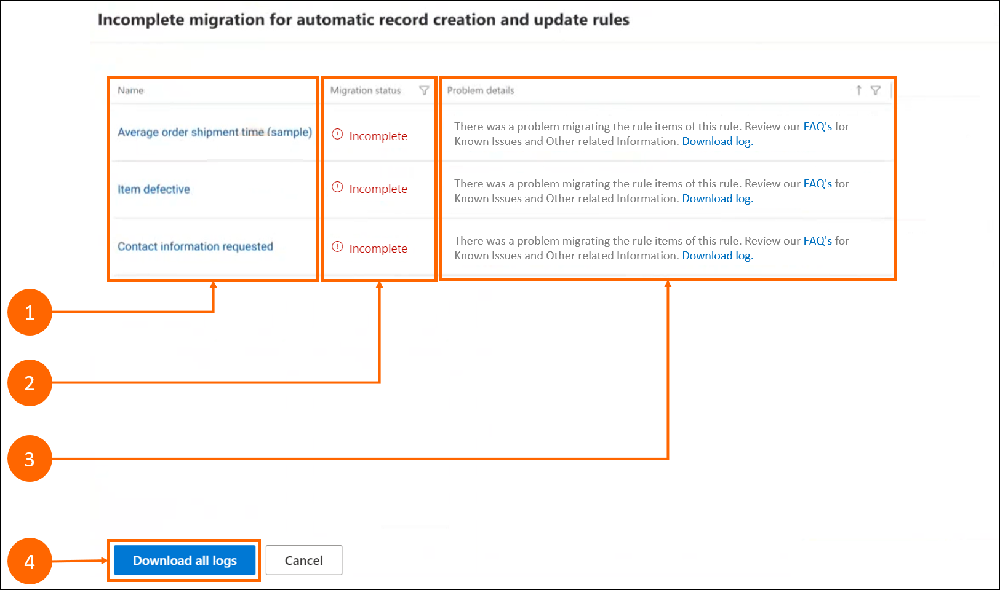

|Label|Description|
|---|----|
|1|	**Name**: Displays each individual rule that failed.|
|2|	**Migration status**: Displays the status as incomplete.|
|3|	**Problem details**: Displays why the rule failed and has a **Download log** option that provides more details.
|4|	**Download all logs**: Let you download the logs of the rules that you can use for reviewing and troubleshooting.|
|||

### Finish

When you've completed your first run and selected **Finish**, a migration **Summary** page is displayed.

|Label|Description|
|---|----|
|1|	**Refresh**: Lets you view your updated migration status.|
|2|	**Total**: Displays the number of legacy rules present overall.|
|3|	**Migrated**: Displays the number of rules you have completely migrated to date.|
|4|	**Pending**: Displays the number of rules you have pending migration (includes failed rules, partially/incomplete migrated rules, and rules that have not been attempted).|
|5|	**Next Step**: Provides links to all the automatic record creation rules and SLA items that you can review and choose to activate them.|
|||

## Review and activate migrated rules in Customer Service Hub

You can select the links on the migration summary page to view the automatic record creation rules or SLA items in Customer Service Hub. On the respective pages that appear, you can review and activate the migrated rules or items.

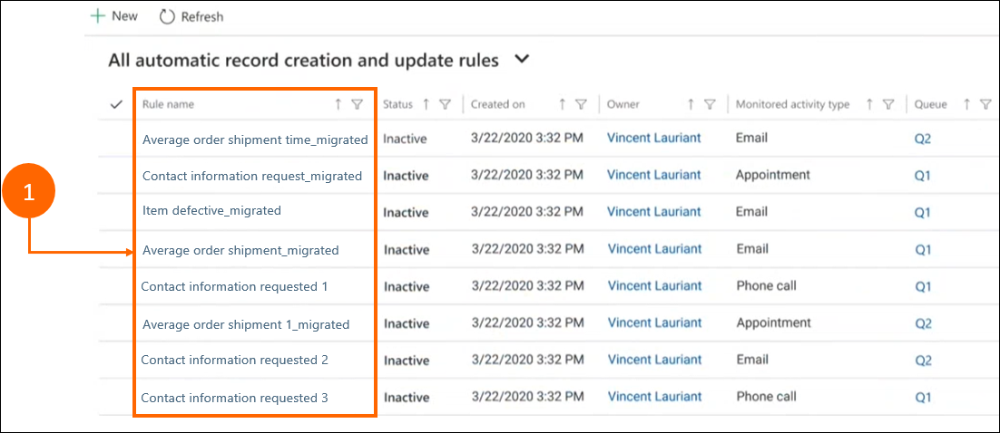

|Label|Description|
|---|----|
|1|	**Rule name**: Displays migrated rules with an underscore (\_) to make it easier to identify the migrated rules. For example: **\_migrated**.|
|||

### Take action on partially migrated rules

Select a rule with the **\_migrated** suffix to view its details. On the **Migration details** tab, you can review the problem details and set the **Mark as complete** toggle to Yes after resolving the migration issue.

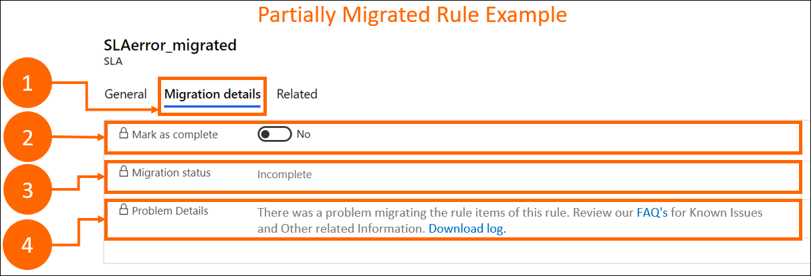

|Label|Description|
|---|----|
|1|  The **Migration details** tab.|
|2|	**Mark as complete**: If set to yes, the migration status changes to **Migrated**. **Note**:<ul><li> When the toggle is **Yes**, the rule won't be picked up in subsequent migrations.</li><li> If you don't take any action on an incomplete rule, the rule continues to be picked up in subsequent migrations. Also, the rule will be replaced when it is selected to migrate again.</li></ul>|
|3| **Migration status**: Displays the status of the rule as either **Migrated** or **Incomplete**.|
|4| **Problem Details**: Provides high-level detail on any errors encountered for the rule during migration.|
|||

### View successfully migrated rules

A successfully migrated rule's migration status is set to migrated by default.

|Label|Description|
|---|----|
|1| **Mark as complete**: Toggled to **Yes** by default.|
|2| **Migration status**: Displays the status of the rule as either **Migrated** or **Incomplete**.|
|||

## Rerun the migration tool

If you have many rules and items to migrate and want to perform the migration in batches or want to attempt to migrate the unsuccessfuly migrated rules and items again, you can rerun the migration tool. If you need to migrate a successfully migrated rule or item again, make sure you delete the migrated rule in Customer Service Hub, and then run the migration process.

1. Select **ARC & SLA Migration tool (Preview)** in the left pane in **Service Management**. The **Summary** page displays the status of the previous migration. In the **Pending** column, the number indicates the rules and items that are pending migration. These include failed rules, partially or incomplete migrated rules, and rules that have not been attempted.
 
    
2. Select **Start migration**, and perform the steps to run the migration of the rules and items again.

The steps to rerun the migration are same as when you run the migration for the first time. More information: [Migrate the automatic record creation rules and SLA items](#migrate-the-automatic-record-creation-rules-and-sla-items)

In the **Premigration checkup** state, the tool reviews only those rules that were previously not migrated, partially migrated, or failed the migration. On this page, the **Total** column lists the number of rules that are available for migration.

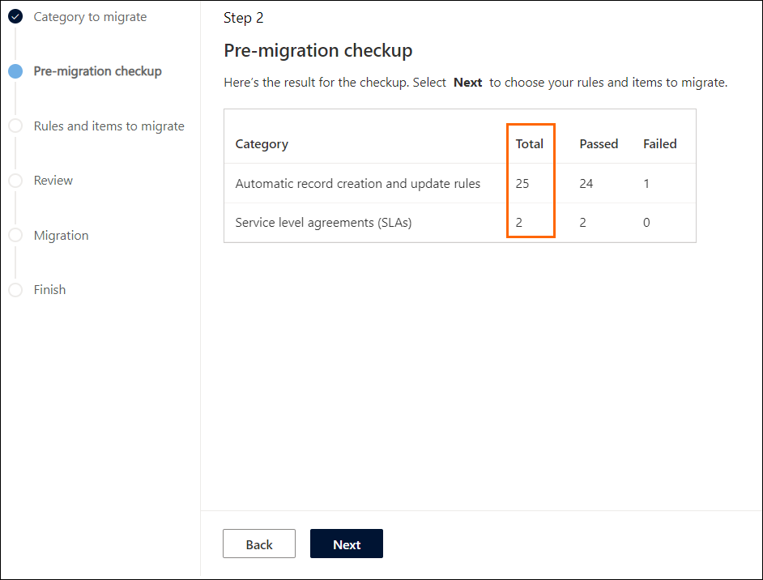

### See also

[Migration tool FAQs](migrate-tool-faqs.md)

[Set up rules to automatically create or update records](set-up-rules-to-automatically-create-or-update-records.md)  
[Define service-level agreements](define-service-level-agreements.md)  
[Important changes (deprecations) coming](https://docs.microsoft.com/power-platform/important-changes-coming)  