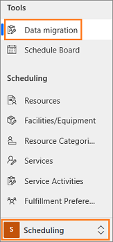
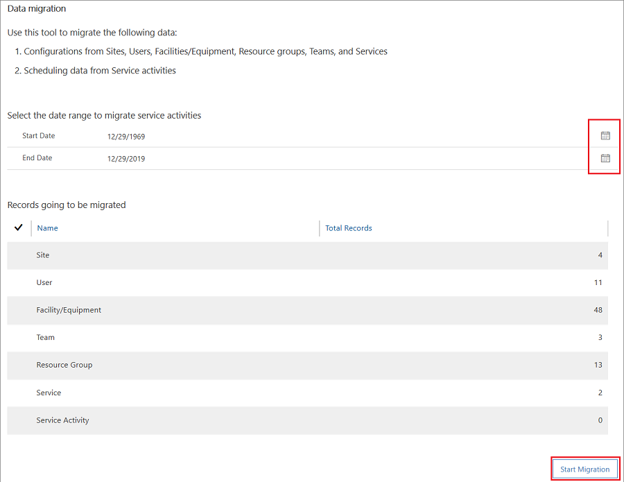
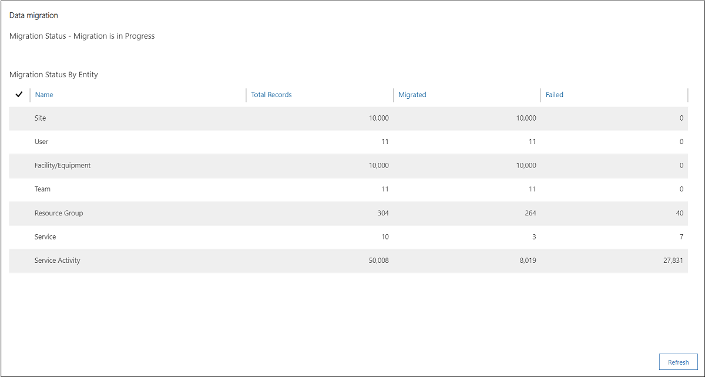
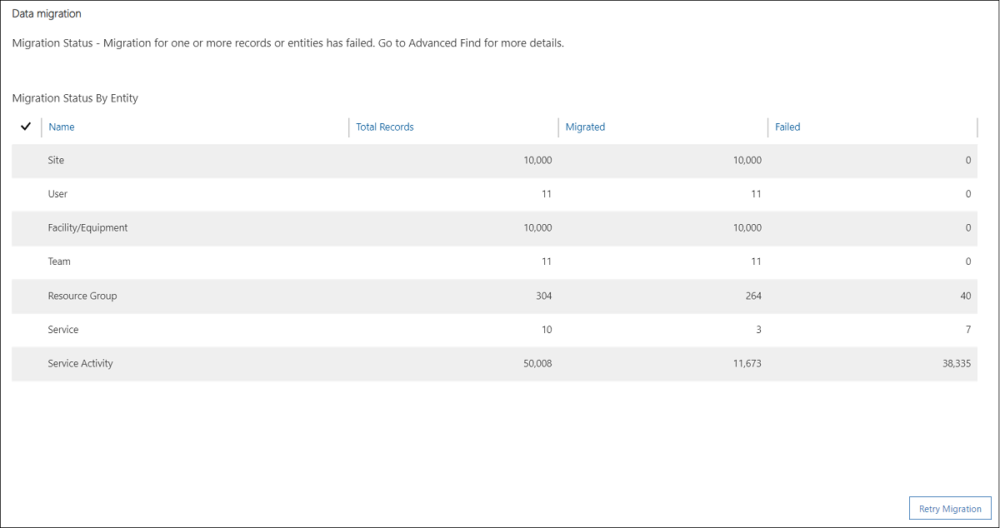

# Migrate entity records data from legacy Service scheduling using migration tool

[!include[cc-beta-prerelease-disclaimer](../includes/cc-beta-prerelease-disclaimer.md)]

Follow these steps to migrate entity records from legacy scheduling experience to the new scheduling experience.

1. Sign in to Dynamics 365 Customer Service with Administrator or System Customizer role privileges.

2. Select the **Customer Service Hub** app.

3. Select **Scheduling** from **Change area**.

4. Select **Data Migration** under the Tools section.

    

5. Select a date for the **Start Date** and **End Date** fields. The data migration tool migrates all configuration and service activities data that falls in the specified date range.

6. View the number of records for each entity available for the migration and select **Start Migration**.

    

    > [!Note]
    > - The migration tool doesn’t consider the records whose status is marked as Ignore. To learn more, see [Understand migration status](#understand-migration-status).
    >
    > - If you create any records after you start the migration, the newly created entity records will not be reflected and migrated.

7. View the migration status.

    As you begin migration, you can view the number of entity records migrated in the grid. Select the **Refresh** button to refresh the grid and view the updated status of the migration. If the migration is successful, you see a message stating, **Migration is Successful**.

    

    > [!Note]
    > - After you’ve migrated an entity record, if you update the record in the legacy service scheduling, the difference of update can’t be migrated using the tool. You must manually update the changes in the new service scheduling experience.
    >
    > - After you successfully migrate all the entity records, you can’t use the tool again on the environment.

    The page shows the number of records that are migrated and failed.

    

    If the migration of certain entity records fails, then the Migration status is displayed with a message stating the migration for one or more records or entities has failed.

    Select **Retry Migration** to try again the migration for the failed entity records.

    > [!Note]
    > In case of retry scenario, the migration tool shows the number of records that need to be migrated in that retry scenario of migration.    

## Understand migration status

Understand what happens when the migration has failed and how you can successfully migrate the entity records after resolving errors.

### Failed migration

If the migration of one or more entity records has failed, a failure message is displayed, and you can view for which entity records the failure has occurred.

One of the reasons for the failure of entity record migration is a dependency between the entity records. That is, an entity record **B** has a dependency on entity record **A**. If the migration of entity record **A** fails, then migration of entity record **B** also fails due to its dependency on the entity record **A**.

For example, In the **Services** entity, you might have defined some selection rules which are dependent on **Resources Group**, **Team**, or **User** records for the service activities. Now, when any of the dependent record migration fails, the corresponding records in the **Service** entity also fails the migration.

You can troubleshoot to find the reasons of failure and then take an action resolve the failed migration. Use the **Advanced Find** section to see the details of migration failure.

To learn more, see [Troubleshoot using migration information](#troubleshoot-using-migration-information)

## Troubleshoot using migration information

Follow the steps to view the migration information.

1. Select the **Advanced Find** icon in the command bar. Advanced Find opens in a new window.

2. Select an entity in the **Look For** field. For example, select **Sites**.

3. Select **\<entity\>MigrationStatus** from the list. For example, **SiteMigrationStatus**.

4. Select **Enter value: SiteMigrationStatus** and select the ellipsis. The **Select Values** dialog opens.

5. Select a status from the **Available Values** list and add it and select **OK**.

    | Status | Description |
    |-------------------|----------------------------------------------|
    | Failed | Select this value when you want information about the entity records that failed in the migration process. |
    | Ignore | Select this value when you want information about the entity records that are ignored in the migration process. |
    | In Progress | Select this value when you want information about the entity records that are in progress in the migration process. |
    | Migrated | Select this value when you want information about the entity records that are migrated in the migration process. |
    | Not Started | Select this value when you want information about the entity records that are not yet started for migration. |

6. Select **Results** from the **Advanced Find** menu. The list appears.

7. Select Edit Columns from the **Advanced Find** menu. The **Edit Columns** dialog opens.

8. Select **Add Columns** from the **Common Tasks** list. The **Add Columns** dialog opens.

9. Select **\<entity\> Migration Info** from the list. For example, **Site Migration Info**. Select **OK**.

10. Select **Results** from the **Advanced Find** menu. The **Site Migration Info** column appears.

11. Review the information for migration failure and take appropriate action.

## See also

[Introduction to migration of entity records](introduction-migration-entity-records.md)
