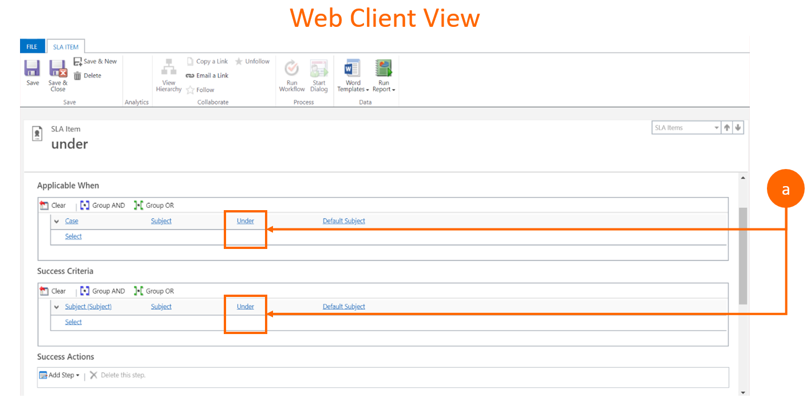
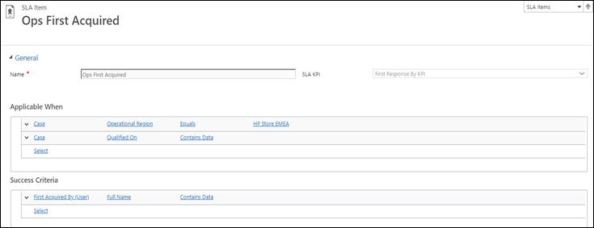
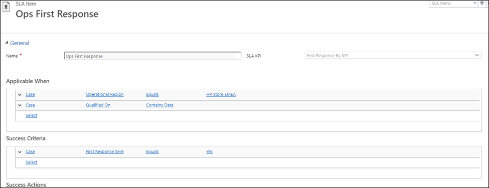

# Migration tool FAQ

## FAQ on migration tool for automatic record creation rules and service level agreements (SLAs)

### Who can access or run the migration tool?

Administrators and users with CSR manager roles can run the migration tool.

### Are migrated rules automatically activated post-migration?

No. You must manually activate the migrated rules when migration is complete.

### Can I still use my legacy rules after the deprecation deadline?

Yes, any active legacy rules after the deprecation deadline will still run until they're deactivated. However, supportability and the editing experience will stop after deprecation.

### Can I activate a rule with an incomplete migration status?

No. A migrated rule can only be activated when **Mark as complete** is toggled to **Yes** (that's when the rule is considered successfully migrated).

> [!Note] 
> Review the incomplete rule to resolve any issues before you toggle the **Mark as complete** to **Yes**, and then activate the rule.

### Will the legacy rule be deactivated?

- **For ARC, yes.** When you activate a migrated ARC rule in Unified Interface, the corresponding legacy rule will be deactivated.
- **For SLA, no.** When you activate a migrated SLA rule in Unified Interface, the corresponding legacy rule remains active because they can coexist.  

### What does an "incomplete" status mean?

- If located in the **Summary** section, it means the overall migration process couldn't successfully complete the migration of all selected rules.
- If listed next to a rule, it means the rule has either failed or couldn't be fully migrated (meaning one or more items or conditions failed to migrate).

### Where can I find a list of partially migrated rules that are tracked in the migration tool?

Rules that are partially identified or identified as "incompletely migrated" are tracked under **Pending** in the **Summary** section since they aren't considered fully migrated. Only rules that completed migration successfully are counted under **Migrated**.

### Are custom forms or fields supported by the migration tool?

- **For ARC, yes.** The migration tool does support custom entities and custom fields, attributes, and configurations.
- **For SLA, no.** Custom entities, fields, attributes, and configurations aren't fully supported by the migration tool. Users would need to modify any existing customization flows, workflows, plugins, or any other custom code on the custom entities, fields, attributes, and configurations to complete the migration.

### Do I need a separate license for Power Automate before running migration?

No. For more information on licensing guidelines, go to [What are Microsoft Power Apps and Power Automate use rights for Dynamics 365 applications?](/power-platform/admin/powerapps-flow-licensing-faq#what-are-microsoft-power-apps-and-power-automate-use-rights-for-dynamics-365-applications)

### Some of my rules are incomplete or partially migrated. What should I do?

You can either fix the rule in the web client based on the problem details and rerun your migration, or fix the migrated rule directly in Unified Interface.

### Can I rerun the migration tool for a specific migrated rule?

Yes, you can rerun the migration tool for a specific migrated rule based on the following:
    
- **For incomplete or failed migration rules:** Select the same rule when you rerun the migration tool. It automatically replaces the existing failed or incomplete rule with the newly migrated one.
- **For successfully migrated rules:** Delete the migrated rule in Unified Interface before rerunning the migration tool.

### What happens to existing SLA records that are associated with legacy SLAs after the migration is complete?

1. If the legacy SLA is deactivated after migration: The timer will continue to run until the terminal state for such SLA records but the **Resolve** or **Pause** functionality won't work.

1. If the legacy SLA is still in **Active** state: Existing SLA records with legacy SLAs will continue to work as expected.

1. If you want to use SLAs created in the Unified Interface apps on existing records: You'll need to update the SLA field to Unified Interface SLA manually or write the plugin to update the records. For example, the plugin logic could be Modern Flow or Workflow.

For information about migrated rule or flows in modern ARC, go to [FAQ about modern automatic record creation](arc-faqs.md#faq-about-modern-automatic-record-creation).

## Known condition conversion issues

The following are key scenarios where rules or items won't successfully complete migration:

### If my rule items or conditions have related entities inside a nested group clause (and/or), will they be migrated to Unified Interface?

No. We currently only support one level of the related entity hierarchy. For such rule items or conditions to successfully migrate, you need to remove any related entity in group clause before you migrate. If you don't take any action, the rule will fail during the **Premigration checkup** step, and if you then choose to continue with the migration, the rule will have an empty condition for the respective item.
    
**Example: Premigration view**
  
**a.**	Premigration web client view.

    
**Example: Post-migration Unified Interface view** 
  
**2a.** The migrated item title changes to **\_FailedMigration** appended.
    
**2b.** The same standard placeholder, **Created On equals 2200-01-01**, is added to the condition.

### Why do my rule items or conditions with a DateType field that uses a "not on" operator fail during the premigration checkup and actual migration?

The **Not on** operator for the **Date** data type isn't supported in Unified Interface, and therefore isn't supported as part of migration. To fix this issue, you can change the legacy items or conditions from **{not-on selecteddate}** to **{selecteddate less than and selecteddate greater than}** in the web client before rerunning the migration tool for the respective rule.

**Example: Premigration view**
    
**a.**	Premigration web client view.
        

**Example: Post-migration Unified Interface view**
    
**2a.** The migrated item title changes to **\_FailedMigration** appended. 

**2b.** The condition **Created On equals 2200-01-01** is added to the condition.

### Why does the data in my DateTime field change during migration?

A separate time field doesn't exist in Unified Interface, so the DateTime field will change from a calendar control to text field. Input should be in a specific format as shown in the text box below:
    
**Example: Premigration view**
    
**a.**	Premigration **Date and time** location.
    
**b.**	Premigration **Date only** location.
    

**Example: Post-migration Unified Interface view** 

**a.**	Post-migration **Date and time** location

**b.**	Post-migration **Date only** location

### Why are some of my operator fields blank in Unified Interface after migration?**

For lookup data types, only the **equal / not equal, null /not null** operators are supported in Unified Interface and the migration tool. **Under** and **not-under** operators aren't supported in Unified Interface, and therefore aren't supported in the migration tool. Any conditions that have **under** or **not-under** operators are translated as **related entities** after migration and are shown as blank in Unified Interface after migration, and can't be edited.

**Example: Premigration view**
    
**a.**	Premigration web client view.
    
 

**Example: Post-migration Unified Interface view**

**b.**	Post-migration Unified Interface view.
    
 

> [!Note]
>
> The following limitations are applicable when defining a condition in Customer Service Hub:
>
> - The Date & Time picker control is no longer available in the conditions; however, you can still edit the date and time in the text field.
> - Only one level of the related entity hierarchy is supported, though the application lets you select nested, related entities.
> - The related entity inside a group of the and/or clause isn't supported.
> - The "not-on" operator for the Date data type is not supported.
> - For the lookups data type, only the "equal," "not equal," "null," and "not null" operators are supported. The "under" and "not-under" operators aren't supported.

### Can I migrate a rule again after it’s been activated?

 - **Yes, for automatic record creation rules.** You can migrate an activated rule again, but you must first deactivate and delete it from Unified Interface before you can migrate it again.
 - **No for SLAs.** After a migrated SLA rule is activated, it's linked to another entity (such as a case or is in use). To attempt to migrate an activated rule (which is a successfully migrated rule by default) again, you'd need to delete that specific rule.

However, there's a limitation with Unified Interface SLA rules, and once a rule is associated with a case or entity (that is, if it has been activated even once), you can't delete the rule even if it is deactivated. Therefore, the rule cannot be migrated again if it has been previously activated or applied.

### Can I migrate deprecated standard SLA rules?

No. The migration tool only supports enhanced SLA rules. Standard SLA rules have been deprecated and are no longer supported in Unified Interface and therefore aren't supported in the migration tool. For more information, go to [Standard SLAs in Dynamics 365 Customer Service are deprecated](/power-platform/important-changes-coming#standard-slas-in-dynamics-365-customer-service-are-deprecated). 

## Known issues

### Channel property deprecation

If you've used any channel properties in legacy rules customization, those rules won't be migrated successfully using the migration tool. There isn't a general workaround that can be applied to resolve this gap for all users. The workaround is highly dependent on how you use the channel properties in the legacy rules.

### Behavior difference when the option “Create cases for activities associated with a resolved case” option is selected.

- Legacy behavior: If the email has a related case that was resolved since the specified time, the resolved case will be reactivated out of the box without customization.
- Modern behavior: If the email has a related case that was resolved since the specified time, a new case will be created out of the box. Customization is required to reactivate an existing case instead of creating a new case.

### Behavior difference when the option “Create case if a valid entitlement exists for the customer” option is selected.

- Legacy behavior: If the email sender doesn't have a valid entitlement and the email has a related case, the existing related case will be updated.
- Modern behavior: If the email sender doesn't have a valid entitlement, no flow will be invoked.

### Parity gaps between workflow and Power automate flow, applies only to customization on rule item actions

- “First not null” expression can’t be migrated automatically. Customization can be manually applied on the flow for the migration.
- Mapping a lookup record’s display name to a string field can’t be migrated automatically. Customization can be manually applied on the flow for the migration.
- Activity party fields used as source fields aren't supported in flow.

### Migration doesn't handle polymorphic lookups on non-lookup fields

A legacy ARC rule item using an attribute such as **Sender**  results in an invalid lookup when assigned to a text field. In legacy ARC rule item, using an attribute such as **Sender (Email)** would have used the display name of the entity, and become **Sender (Value)**however, it results in an error.

## Known flow issues

### Migration doesn't support multiple items or conditions having the same "applicable when" within same SLA

In the web client, multiple items can be defined with the same "applicable when" condition and different success criteria for an SLA. However, the same capability isn't supported in Unified Interface. Therefore, during migration, the second or subsequent such SLA item with the same "applicable when" condition won't be created. The following screenshots capture the scenario that isn't supported in Unified Interface.

### Activity party-type attribute issues during workflow-to-flow conversion

Any activity party-type attribute assigned to another activity party-type field (the most commonly impacted fields are: to, from, cc, and bcc, in emails) won't migrate during the workflow-to-flow conversion, as Flow currently doesn't support this scenario. Although the migration of the rule won't fail, the data value for such activity party-type fields that relies on another activity party-type attribute will be empty post-migration. 
        
 **Example: Premigration view**
    
**a.** The **From** field, which is an activity party-type field that's assigned another activity party-type attribute **{Bcc(Email)}** will be empty post-migration.

**b.**	The **To** field will migrate.
    

**Example: Post-migration Unified Interface view**

**b.**	The **To** field post-migration.

### First not null checks in expressions within legacy workflow during workflow-to-flow conversion is not supported.

In legacy workflows, a lookup field can be mapped with multiple expressions where you check and assign the **First Not Null** expression, as shown in the web client example below. Currently, this isn't supported as part of workflow-to-flow conversion, as it's a known limitation from the legacy workflow designer. Therefore, the workflow converter assigns the first expression (without performing the null check) and removes the rest of the expressions, irrespective of whether they have **non-null** values. In the sample snapshot that follows, the flow will only have **Regarding(Email)** in the **Customer** field within this step.

**Example: Premigration view**

**a. Unified Interface view:** In Flow, the Customer field will only have: **Regarding(Email)** regardless of whether it is null.

**b. Web client view:** In the workflow, the Customer field has: **{Regarding(Email); Contact(Create (Case)); Customer(Create (Case))}**

> [!Important] 
> 
> If you're still experiencing issues with the migration tool, contact your administrator or Microsoft support.

### See also

[FAQ about modern automatic record creation](arc-faqs.md#faq-about-modern-automatic-record-creation)

[Migrate automatic record creation rules and SLAs](migrate-automatic-record-creation-and-sla-agreements.md)

[Dynamics 365 SLA and ARC Migration Playbook](https://www.d365implementationguide.com/books/aiij/) 

[!INCLUDE[footer-include](../includes/footer-banner.md)]
