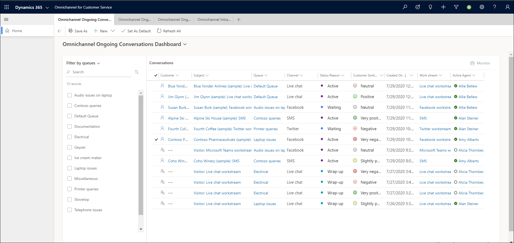
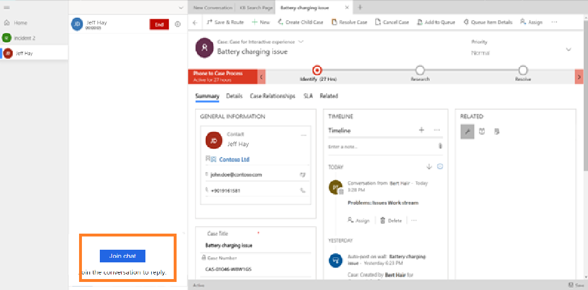

# Monitor and assign conversations

[!INCLUDE[cc-use-with-omnichannel](../includes/cc-use-with-omnichannel.md)]

> [!IMPORTANT]
> This feature is intended to help customer service managers or supervisors enhance their team's performance and improve customer satisfaction. This feature is not intended for use in making, and should not be used to make, decisions that affect the employment of an employee or group of employees, including compensation, rewards, seniority, or other rights or entitlements. Customers are solely responsible for using Dynamics 365 Customer Service, this feature, and any associated feature or service in compliance with all applicable laws, including laws relating to accessing individual employee analytics and monitoring, recording, and storing communications with end users. This also includes adequately notifying end users that their communications with agents may be monitored, recorded, or stored and, as required by applicable laws, obtaining consent from end users before using the feature with them. Customers are also encouraged to have a mechanism in place to inform their agents that their communications with end users may be monitored, recorded, or stored.

As a supervisor, you can monitor the conversations that are being handled by agents. Monitoring the conversations helps you identify the conversations that need your attention to provide your expertise or suggestions to close. You can select a conversation from the dashboard and choose the **Monitor** action from the grid command bar. You can also join a conversation. When you join, notifications about your presence are sent to the agent and customer who are in the conversation. You join the conversation in consult mode, which enables you to provide your expertise to the agent who is interacting with the customer.

As a supervisor, if your administrator has enabled the **Assign** feature, you can also manually assign conversations to agents in cases where a conversation is not assigned. Only conversations that are in an open state can be assigned by supervisors.

Use the **Omnichannel Ongoing Conversations** dashboard to access the monitor and assign features. To learn more, see [Omnichannel Ongoing Conversations dashboard](ongoing-conversations-dashboard.md).

The following screenshot is an example of Omnichannel Ongoing Conversations:

> [!div class=mx-imgBorder]
> 

## Things you must know

Before you start using the **Omnichannel Ongoing Conversations** dashboard, here are a few things you must be aware of:

- The monitor feature is supported for work streams configured for all channels except Entity Records.

- You can monitor only conversations that are in the **Active** and **Wrap-up** states.

- You can't monitor conversations that are assigned to you.

## Monitor and join a conversation

By monitoring the conversations, you will get an overview of how each conversation is trending, such as sentiments and agent responses, and can choose to join a conversation that might need your attention.
  
By joining the conversation, you provide necessary inputs to both agent and customer based on the selected message mode (public or internal) in the communication panel.

1. Sign in to the **Omnichannel for Customer Service** app.

2. From the dashboard view selector, select the **Omnichannel Ongoing Conversations** dashboard.

    The list of conversations currently being handled by your agents is displayed.

3. Choose a conversation to monitor and select **Monitor** on the top-right corner.

    > [!div class=mx-imgBorder]
    > 

    The conversation page opens.

4. You can choose to join a conversation as required. Select **Join chat** in the communication panel.

    > [!div class=mx-imgBorder]
    > 

    When you join the conversation, a notification will be sent to both agent and customer stating that you have joined as a consultant. Depending on your requirement, you can start a consultation with the agent and customer by using a messaging mode (public or internal). By default, the messaging mode is internal.

    To learn more, see [View communication panel](oc-conversation-control.md).

## Assign a conversation

At times, you may need to manually assign a conversation. In such cases, the conversation should be in an open status or not assigned to any agent. You can override the agent's presence and allocated capacity when assigning conversations to them. When you override agent capacity, the number of units by which their capacity is exceeded will be displayed.

1. Sign in to the **Omnichannel for Customer Service** app.

2. From the dashboard view selector, select the **Omnichannel Ongoing Conversations** dashboard.

    The list of available agents and their capacities, and queues, is displayed.
    > [!div class=mx-imgBorder]
    > 

3. Choose a conversation in an **Open** state, and select **Assign** on the top-right corner.
    > [!div class=mx-imgBorder]
    > 

4. On the **Assign conversations** dialog box, choose one of the following options:

  - **Agent:** Select to assign the conversation to an agent, and choose an agent name from the list. Agents whose presence matches with one of the allowed presence values in the work stream configuration only will be listed.
  - **Queue:** Select a queue from the queues list. All queues are listed except the queue to which the conversation is currently assigned.

5. Depending on the option you chose in Step 4, choose the agent or queue, and then select **Assign**.

## Transfer a conversation

At times, you may need to transfer an ongoing conversation from an agent to another agent or queue. In such cases, the conversation should be in an active or waiting status.

1. Sign in to the **Omnichannel for Customer Service** app.

2. From the dashboard view selector, select the **Omnichannel Ongoing Conversations** dashboard.

    The list of available agents and their capacities, and queues, is displayed.
    > [!div class=mx-imgBorder]
    > 

3. Choose a conversation in an **Active** or **Waiting** state, and select **Transfer** on the top-right corner.
    > [!div class=mx-imgBorder]
    > 

4. On the **Transfer conversations** dialog box, select **Agent**.

  Select to transfer the conversation to an agent, and choose an agent name from the list. Agents whose presence matches with one of the allowed presence values in the work stream configuration only will be listed.

5. After choosing the agent, select **Transfer**.

### See also

[Configure Intraday insights dashboard for Unified Service Desk](configure-intraday-dashboard-supervisor.md)  
[Enable sentiment analysis](enable-sentiment-analysis.md)  
[Enable supervisors to monitor and assign conversations](configure-intraday-dashboard-supervisor.md)  

[!INCLUDE[footer-include](../includes/footer-banner.md)]