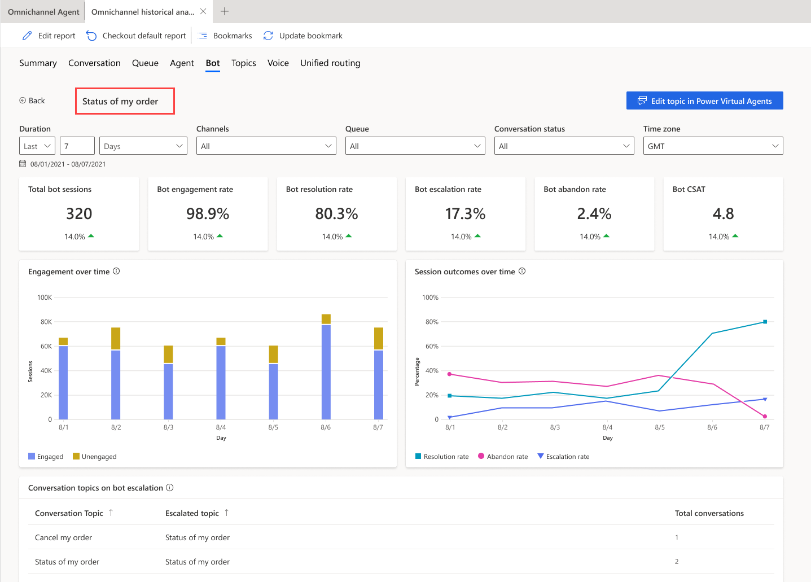
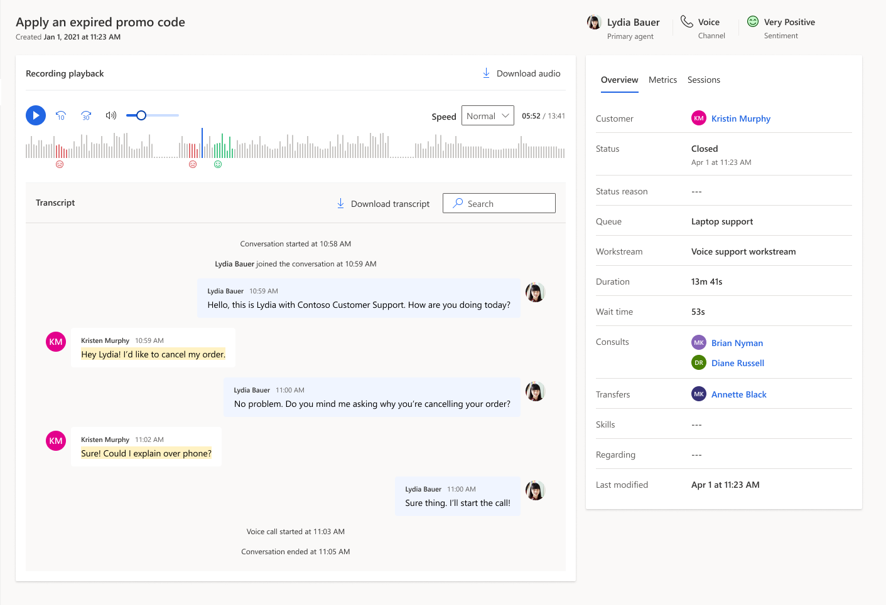
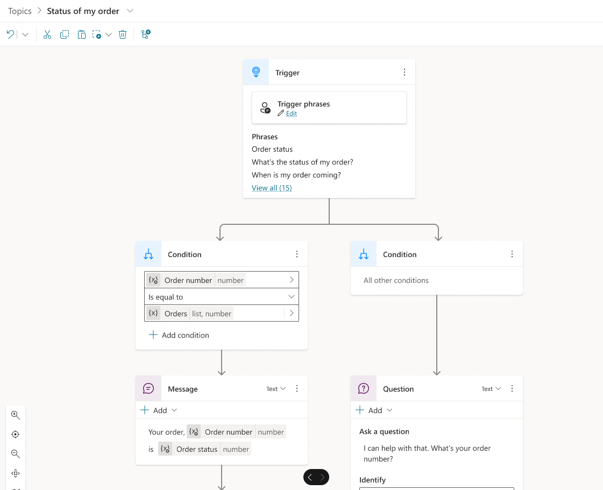
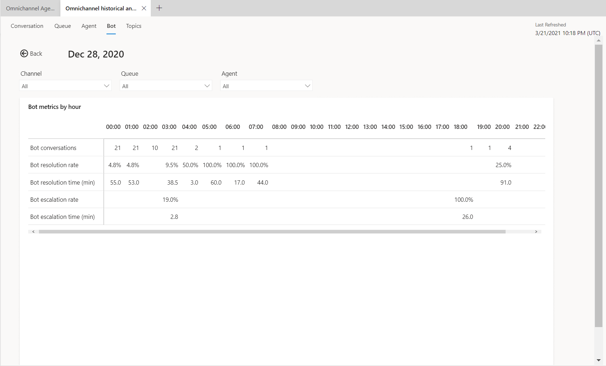

# Bot dashboard

In Omnichannel for Customer Service, you can integrate both Azure and Power Virtual Agents bots to perform tasks like starting a conversation with the customer, providing automated responses, and then transferring the conversation to a human agent, as required. The bot dashboard shows key performance indicators (KPIs) and charts that you can use to understand how bots are performing in a support organization. 

If your administrator has enabled **Add historical analytics for bots** in Customer Service admin center, then the dashboard displays the metrics, KPIs, and charts specific to the type of bots integrated with the application.

### Access the Bot dashboard

[!INCLUDE[cc-navigation](../includes/cc-navigation.md)]

## Power Virtual Agents bot dashboard

The bot dashboard displays metrics specific to Power Virtual Agents bots only if Power Virtual Agents bots are integrated with Omnichannel for Customer Service and the **Add historical analytics for bots** checkbox in Customer Service admin center is enabled.

 :::image type="content" source="media/oc-bot-session-dashboard.png" alt-text="Screenshot showing the Omnichannel bot dashboard.":::

 ### Report details

The report summarizes KPIs for the specified time period and the percentage change over that period. These metrics are specific to Power Virtual Agents bots. You can filter these areas by duration, channel, queue, or agent.

 :::image type="content" source="media/oc-bot-KPI.png" alt-text="Screenshot showing the Power Virtual Agents bot dashboard KPIs.":::

| KPI | Description |
| ------- | ------------------ |
| Total bot conversations | The number of conversations initiated by the customer and engaged by a bot. |
| Bot escalation rate |  The percentage of bot sessions that were escalated by a bot to a human agent.  |
| Total bot sessions |  The total number of sessions within the specified time period. A bot session is defined as a conversation in which a bot is invoked. The bot can be invoked at the beginning, during, or end of a conversation. |
| Bot engagement rate |  The percentage of total sessions that are engaged sessions. An engaged session is a session in which a user-created topic (as opposed to a system topic) is triggered, or the session ends in escalation. Engaged sessions can have one of three outcomes: they're either resolved, escalated, or abandoned. |
| Bot resolution rate | The percentage of sessions that were closed by interacting with a bot out of all the sessions engaged by a bot. |
| Bot abandon rate  | The percentage of engaged sessions that are abandoned. An abandoned session is an engaged session that isn't resolved or escalated after one hour from the beginning of the session. |
| Bot CSAT | The graphical view of the average of customer satisfaction (CSAT) scores for sessions in which customers respond to an end-of-session request to take the survey. |

The following table shows the bot KPI chart metrics.

 :::image type="content" source="media/oc-bot-summary-charts.png" alt-text="Power Virtual Agents bot chart description.":::

| Title | Description |
| --------------- | ----------------- |
| Total conversations | A graphical view of the total number of bot conversations with the number of escalated and deflected conversations over time. |
| Engagement over time | A graphical view of the number of engaged and unengaged sessions over time. An engaged session is a session in which a user-created topic is triggered or the session ends in escalation. |
|Session outcomes over time | A graphical view of the daily resolution rate, escalation rate, and abandon rate over the specified time period. | 

### Metrics by bot 

The **Metrics by bot** section displays a comprehensive set of analytics that show you the key performance indicators. You can also view the trends and usage for your bot's topics at a granular level, highlighting the topics that have the greatest impact on your bot's performance.

### Summary

The **Summary** tab gives you a broad overview of your bot's performance.

 :::image type="content" source="media/oc-metrics-summary.png" alt-text="Screenshot that shows the bot summary.":::

KPIs for the following areas are displayed.

| Title | Description |
| --------------- | --------------- |
| Bot conversations | The number of conversations initiated by the customer and engaged by a bot. |
| Bot resolution rate | The percentage of conversations that were closed by interacting with a bot, out of all conversations engaged by a bot. |
| Bot resolution time | The length of time, in minutes, for which a customer interacted with a bot before the conversation was closed. |
| Bot escalation rate | The percentage of conversations that were escalated by a bot to a human agent.|
| Bot escalation time (min) | The length of time, in minutes, during which a customer interacted with a bot before the conversation was escalated to a human agent. | 

### Details

The **Details** tab gives you an insight into the bot sessions.

 :::image type="content" source="media/oc-summary-details.png" alt-text="Screenshot that shows the bot details.":::

KPIs for the following areas are displayed.

| Title | Description |
| --------------- | --------------- |
| Total sessions| The total number of sessions within the specified time period. |
| Bot sessions engaged | The number of sessions the bot is engaged in within the specified time period. |
| Bot sessions resolved| The number of engaged sessions that are resolved by the bot. |
| Bot sessions abandoned|The number of engaged sessions that are abandoned. An abandoned session is an engaged session that is not resolved or escalated after one hour from the beginning of the session.|
| Bot sessions per conversation | The average number of Power Virtual Agents bot sessions per conversation. | 
| Session resolved rate | The percentage of total sessions that were resolved by the bot within the specified time period. | 
| Sessions escalated rate | The percentage of total sessions that were escalated by the bot to a human agent within the specified time period.| 

## Bot drill-down view

In the **Metrics by bot** section, you can select a Power Virtual Agents bot to view the individual bot's performance on the bot drill-down view. Bot topics and their corresponding metrics are also displayed, giving supervisors further insights into individual topic performance. 

To access the drill-down view, select the bot that you're interested in, and then select **Detailed view**.

The application displays the key performance metrics and charts for the individual bot.
> [!div class="mx-imgBorder"]
> 

| Title | Description |
| --------------- | --------------- |
| Total conversations | The number of conversations initiated by the customer and engaged by the bot. |
| Total sessions | The total number of sessions within the specified time period. A bot session is defined as a conversation in which a bot is invoked. The bot can be invoked at the beginning, during, or end of a conversation. |
| Engagement rate | The percentage of total sessions that are engaged by the bot. An engaged session is a session in which a user-created topic (as opposed to a system topic) is triggered, or the session ends in escalation. Engaged sessions can have one of three outcomes—they're either resolved, escalated, or abandoned. |
| Resolution rate | The percentage of engaged sessions that are resolved. A resolved session is an engaged session in which the user receives an end-of-conversation survey that asks the question "Did that answer your question?" and the user either doesn't respond or responds **Yes**.|
| Escalation rate | The percentage of engaged sessions that are escalated by the bot. An escalated session is an engaged session that is escalated to a human agent. | 
| Abandon rate | The percentage of engaged sessions that are abandoned. An abandoned session is an engaged session that isn't resolved or escalated after one hour from the beginning of the session.|
| Bot CSAT | The average of customer satisfaction (CSAT) scores for sessions in which customers respond to an end-of-session request to take the survey. | 

The following charts are displayed:

| Title | Description |
| --------------- | --------------- |
| Total conversations over time | The number of conversations initiated by the customer and engaged by the bot that were either escalated or deflected. |
| Engagement over time | Provides a graphical view of the number of engaged and unengaged sessions over time. An engaged session is a session in which a user-created topic is triggered or the session ends in escalation. |
| Session outcomes over time | Provides a graphical view of the daily resolution rate, escalation rate, and abandon rate over the specified time period.|

### Metrics by bot topic

The **Metrics by bot topic** section provides insights into the performance of individual bot topics and their key business metrics. The metrics give the supervisor an overview of which topics the bot was able to deflect or escalate. 

You can also select a topic and drill down into the individual topic performance and metrics. The topic-level metrics help supervisors further analyze how the bot is handling the topic. 

> [!div class="mx-imgBorder"]
> 

The **Bot conversation metrics** section provides the topic transcripts, allowing supervisors to go through the bot's interactions for the topic and take corrective measures.

### View and improve bot topics

You can view and improve the performance of individual topics associated with a Power Virtual Agents bot by performing the following steps:

1. On the bot drill-down page, for a bot, select the topic to view the topic-specific metrics. 
   You can also view and download up to seven days of bot conversation transcript sessions from the past 30 days.
   > [!div class="mx-imgBorder"]
   >  

1. To edit the bot responses to a topic, select **Edit Power Virtual Agents** on the Topics metrics grid. This opens the corresponding Power Virtual Agents bot. You can modify both the topic name and trigger phrases, and for trigger phrases, you can add more.

  > [!div class="mx-imgBorder"]
  >  

## Dashboard for all bots 

The **bot** dashboard summarizes the KPIs for all the bots integrated with Omnichannel for Customer Service for the specified time period and percent change over a period. The application displays this view only if your administrator has disabled the **Add historical analytics for bots** checkbox in Customer Service admin center. You can filter these areas by duration, channel, queue, or agent.

> [!div class="mx-imgBorder"]
> 

### Report details

KPIs for the following areas are displayed.

| KPI | Description |
| ------- | ------------------ |
| Bot conversations | The number of conversations initiated by the customer and engaged by a bot. |
| Bot resolution rate | The percentage of conversations that were closed by interacting with a bot out of all conversations engaged by a bot. |
| Bot resolution time (min) | The time in minutes for which a customer interacted with a bot before the conversation was closed. |
| Bot escalation rate | The percentage of conversations that were escalated by a bot to a human agent. |
| Bot escalation time (min) | The time in minutes for which a customer interacted with a bot before the conversation was escalated to a human agent. |

> [!div class="mx-imgBorder"]
> 

The following table explains the bot KPI chart metrics.

| Title | Description |
| --------------- | ----------------- |
| Bot conversations | The total number of bot conversations occurring per day. |
| Bot resolution rate versus Bot resolution time (min) | The number of customer issues resolved by a bot versus the amount of time it took to resolve them. |
| Bot escalation rate versus Bot escalation time (min) | The number of customer sessions escalated by a bot to human agent versus the amount of time the bot was engaging before escalation. | 

| Title | Description |
| --------------- | --------------- |
| Bot conversations | The number of conversations initiated by the customer and engaged by a bot. |
| Bot resolution rate | The percentage of conversations that were closed by interacting with a bot out of all conversations engaged by a bot. |
| Bot resolution time | The time in minutes for which a customer interacted with a bot before the conversation was closed. |
| Bot escalation rate | The percentage of conversations that were escalated by a bot to a human agent. |
| Bot escalation time (min) | The time in minutes for which a customer interacted with a bot before the conversation was escalated to a human agent. | 

## Bot hourly detail drill-down view

The **Bot metrics by hour** drill-down view provides more granular insight into the hour-by-hour breakdown of key conversation metrics within the contact center. The metrics are the same as the day-by-day view ensuring that supervisors can consistently analyze their contact center operation regardless of desired duration granularity. To view the bot metrics by hour in the drill-down view, select any single metric value on the desired day, then select **Hourly details**.

> [!div class="mx-imgBorder"]
>  

### See also

[Conversation dashboard](oc-conversation-dashboard.md)  
[Dashboard overview](customer-service-analytics-insights-csh.md)  
[Queue dashboard](oc-queue-dashboard.md)  
[Conversation Topics dashboard](oc-conversation-topics-dashboard.md)  
[Manage report bookmarks](manage-bookmarks.md)  

