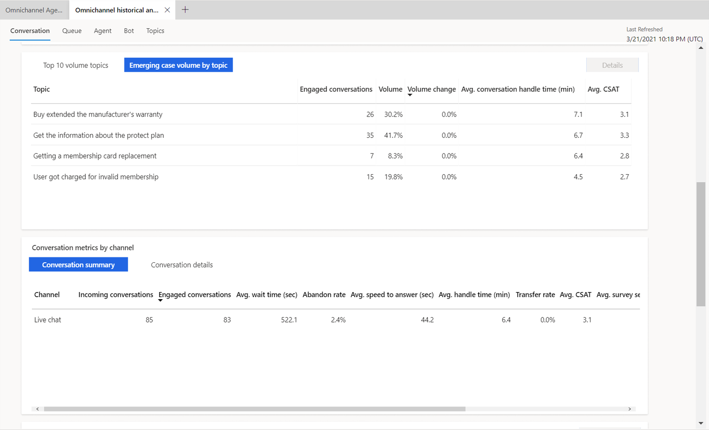
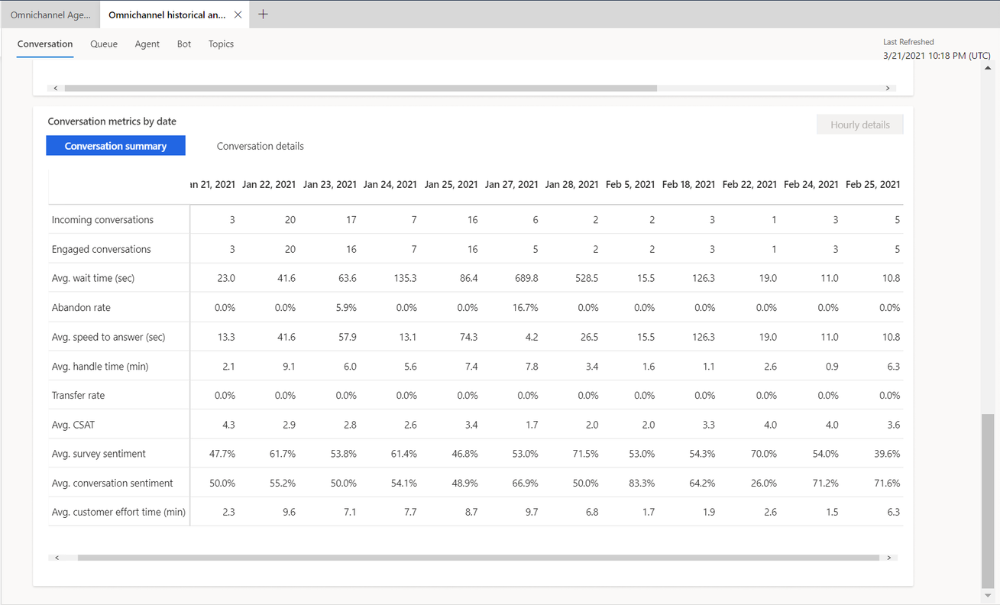
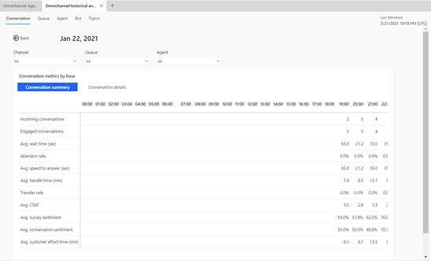

# Conversation dashboard

The Conversation dashboard gives you a broad overview of the customer service experience in your organization. It uses AI to surface insights into the topics that  are generating the highest volume and the topics that are emerging with the fastest increase in volume.

> [!div class="mx-imgBorder"]
> 

You can view the Conversation dashboard in the Omnichannel for Customer Service app. Select the plus (**+**) icon, and then select **Analytics and insights**. The **Conversation** tab is displayed in the default view in your workspace. The dashboard includes a variety of charts with graphical views of your organization's key performance indicators (KPIs).

The charts for conversation volume drivers and emerging conversation volume by topic charts use natural language understanding to group support conversations as topics that are a collection of related conversations. These charts display the customer support topics that are generating the most volume and emerging topics that are increasing rapidly in volume, helping you identify areas for improvement that can have the greatest impact on support performance.

By default, the dashboard shows you KPIs for the past month and for all channels, queues, and agents in your system. You can use the data filtering options to select data for specific time periods, channels, queues, agents, conversation status, and timezones.

> [!NOTE]
> If you switch to a different dashboard, the filter you specified will persist, and be applied to the data on all dashboards.

## Report details

The following table displays the KPIs Conversation dashboard.

| Metric | Description | Derivation |
| -------- | --------------------- | --------------------------- |
| Incoming conversations | The number of conversations initiated by the customer that can be presented to a human agent. | All conversations are considered, except bot conversations. |
| Engaged conversations | Offered conversations that are engaged by an agent. Customer-to-agent communication can begin at this point. | All conversations are considered. |
| Abandon rate | The percentage of conversations that aren't engaged by agents.| All conversations are considered. |
| Avg. speed to answer (seconds) | The average time customers waited in the queue before connecting to an agent. (time for acceptance) | Conversations engaged and conversations that are in the closed state are considered. |
| Avg. CSAT | The average of the customer satisfaction ratings provided by customers. Only available if Dynamics 365 Customer Voice has been configured as a post-conversation survey tool. |
| Avg. conversation sentiment | The average sentiment score based on the customer's conversation experience. |

> [!div class="mx-imgBorder"]
> 

Conversation charts are displayed as shown in the image and described in the tables.

> [!div class="mx-imgBorder"]
> 

| Title | Description |
| -------------------- | ----------------- |
| Incoming conversations vs. engaged conversations | The number of conversations initiated by the customer versus the number of conversations that are accepted and engaged in by agents. |
| Incoming conversations by channel | The number of conversations initiated by the customer and presented to an agent, sorted by channel. |
| Avg. CSAT | The average of the customer satisfaction ratings provided by customers. Only available if Dynamics 365 Customer Voice has been configured as a post-conversation survey tool.  |
| Abandon rate | The trend in percentage of conversations that aren't engaged by agents, by day. |
| Avg. speed to answer (sec) | The average time customers waited in the queue before connecting to an agent. (time for acceptance). |
| Avg. conversation handle time (min) | The average total conversation active time across engaged conversations. |
| Avg. customer effort time (min) | The average time from the start of a conversation to the start of the conversation wrap-up time. |
| Avg. conversation sentiment | The average of predicted customer sentiment in a given timeframe for a set queue or agent, which indicates the degree of positive sentiment expressed by customers at the end of their interaction. |
| Conversations with secondary channel | The breakdown of conversations across secondary channels. |
| Top 10 volume topics | The top 10 AI-discovered topics from conversation data sorted by conversation volume.|
| Emerging conversation volume by topic | The top emerging AI-discovered topics, from conversation data that featured the greatest increase in volume over the duration being evaluated. |

> [!div class="mx-imgBorder"]
> 

| Conversation summary | Description |
| ------------------------ | --------------------- |
| Incoming conversations | The number of conversations initiated by the customer and can be presented to a human agent |
| Engaged conversations | Offered conversations that are engaged by an agent. Customer-to-agent communication can begin at this point |
| Avg. wait time (sec) | The average time customers waited before connecting to agents. This is similar to “speed to answer” but it includes wait time from each session within a conversation. |
| Abandon rate | The percentage of conversations that aren't engaged by agents. |
| Avg. speed to answer (sec) | The average time customers waited in the queue before connecting to an agent (time for acceptance). |
| Avg. handle time (min) | The average total conversation active time across engaged conversations. |
| Transfer rate | The percentage of conversations that are transferred to another agent or queue. |
| Avg. CSAT | The average of customer satisfaction ratings provided by customers. Only available if Dynamics 365 Customer Voice has been configured as a post-conversation survey tool. |
| Avg. survey sentiment | The average of customer sentiment based on verbatim provided in survey responses. Only available if Dynamics 365 Customer Voice has been configured as a post-conversation survey tool. |
| Avg. conversation sentiment | The average of predicted customer sentiment in each timeframe for a set queue or agent, which indicates the degree of positive sentiment expressed by customers at the end of their interaction. |
| Avg. customer effort time (min) | The average time from the start of the conversation to the start of the conversation wrap up time. |

This following table displays the conversation details and their descriptions.

| Conversation details | Description |
| -------------------- | ------------------- |
| Avg. session per conversation | The average number of sessions in each conversation |
| Avg. conversation time (min) | The average total time to complete conversations across engaged conversations. |
| Avg. time for first response (min) | The average total time for first responses across engaged conversations. |
| Avg. response time (min) | The average total time for first responses on conversations.  |
| Avg. conversation active time (min) | The average time that conversations remain active across engaged conversations. |
| Avg. conversation inactive time (min) | The average time that conversations remain inactive across engaged conversations. |
| Avg. conversation wrap-up time (min) | The average time that conversations take to wrap up across engaged conversations. |
| Avg. incoming messages | The average of the total number of messages sent by customers  |
| Avg. outgoing messages | Average of the total number of messages sent as a response from an agent. This doesn’t include any consult/monitoring messages a supervisor/team lead has sent to an agent. |
| Incoming messages | The average of the total number of messages sent by customers|
| Outgoing messages | The average of the total number of messages sent as a response from an agent. This doesn’t include any consult or monitoring messages that a supervisor or team lead has sent to an agent. |

## Conversation hourly details drill down view

The Conversation hourly details drill down view provides more granular insight into the hour-by-hour breakdown of key conversation metrics within the contact center. The metrics for conversation summary and conversation details metrics are the same as the day-by-day view, ensuring that supervisors can consistently analyze their contact center operation regardless of desired duration granularity.  

To view the drill-down, select any single metric value on the day you're interested in, and then select **Hourly details**.  

> [!div class="mx-imgBorder"]
> 

