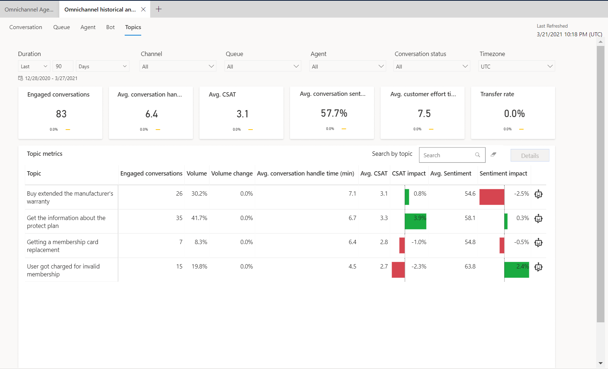
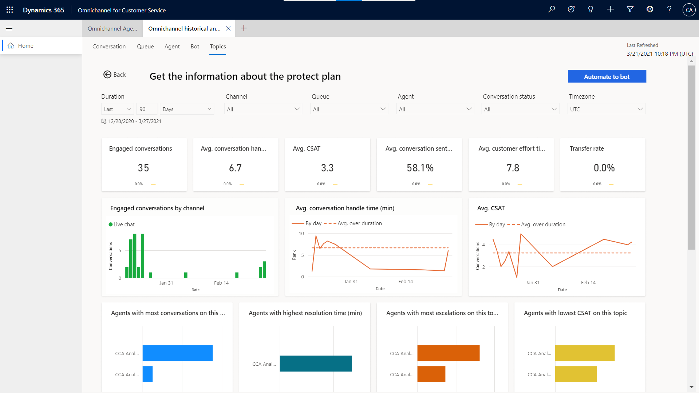

# Conversation Topics dashboard

The Topics dashboard shows a detailed breakdown of conversations and their assigned topics. Customer Service Insights uses AI-generated topics and natural language understanding to automatically group your conversations to help you better understand how different topic areas are impacting your organization’s support performance. 

> [!div class="mx-imgBorder"]
> 

To view the Topics dashboard, go to Omnichannel historical analytics and select  **Topics** in the workspace.

## Report Details

The KPI summary charts summarize the key performance indicators for the specified time and the percent change over the period. You can filter these areas by duration, channel, queue, agent, conversation status and time zone. 

KPIs for the following areas are displayed: 

| KPI | Description |
| ----------- | ------------------------------ |
| Engaged conversations | Offered conversations that are engaged by an agent. Customer-to-agent communication can begin at this point. |
| Avg. conversation handle time (min)  | The average total conversation active time across engaged conversations. |
| Avg. CSAT | Average CSAT score provided by customers from Customer Voice survey responses.  |
| Avg. conversation sentiment | Average predicted sentiment of the customer across engaged conversations | 
| Avg customer effort time (min) | Average time from the conversation start to conversation wrap-up start time  |
| Transfer rate | Number of sessions transferred by an agent. |

The topics metrics chart displays the following metrics.

| KPI | Description |
| ---------------- | ------------------- |
| Engaged conversations | Offered conversations that are engaged by an agent. Customer-to-agent communication can begin at this point.  |
| Volume | Total conversation volume from customers |
| Volume change | Change in conversation volume from customers over the specified duration. |
| Avg conversation handle time (min) | The average total conversation active time across engaged conversations.  |
| Avg CSAT | Average CSAT score provided by customers from Customer Voice survey responses. Only available if Customer Voice has been configured as a post conversation survey tool.  |
| CSAT impact | The impact (downward or upward) that the conversations in the selected topic group are driving the overall organization CSAT. |
| Avg sentiment | Average of customer sentiment based on verbatim provided in survey responses. Only available if Customer Voice has been configured as a post conversation survey tool. |
| Sentiment impact | The impact (downward or upward) that the conversations in the selected topic group are driving the overall organization sentiment.  |
| Power Virtual Agents icon | Enables supervisors to select that topic for automation to Power Virtual Agents. |

## Conversation Topic Drill Down view

The Topic drill down view provides supervisors with a holistic look into individual topics in reference to key business metrics and can be valuable in understanding why end customers are contacting support.  

To access the drill-down, select any metric value for the required topic and select **Details**.  

> [!div class="mx-imgBorder"]
> 

## Topic automation to Power Virtual Agents

AI-discovered topics in Omnichannel Historical Analytics are often prime candidates as topics for automation in Power Virtual Agents bots. If Power Virtual Agents is available in the region that your Customer Service organization is in, the feature can be enabled by your organization’s administrator for use.  

Once a topic is identified as a good automation candidate, the automation workflow can be triggered by selecting the PVA icon on the Topics metrics grid or by selecting **Details** and then **Automate to Bot** in the drill -down view. This will launch the topic editing form.

Suggested trigger phases as well as topics related to the case title are provided.The first step is to select the Power Virtual Agents bot that is ideal for adding the topic to. If no bot exists, select **Create Bot**. You will be redirected to the Power Virtual Agents application for bot creation. Both the topic name and trigger phrases can be modified, and in the case of trigger phrases, additional ones can be added. Once this step is complete, select **Automate Continue** . The Power Virtual Agents Topic will redirect to Power Virtual Agents for completion of authoring.

> [!NOTE]
Bots created through the Microsoft Teams channel will not be listed in the bot selection list.

### See Also

- [Conversation dashboard](oc-conversation-dashboard.md)
- [Dashboard overview](customer-service-analytics-insights-csh.md)
- [Agent dashboard](agent-dashboard.md)
- [Bot dashboard](oc-bot-dashboard.md)

