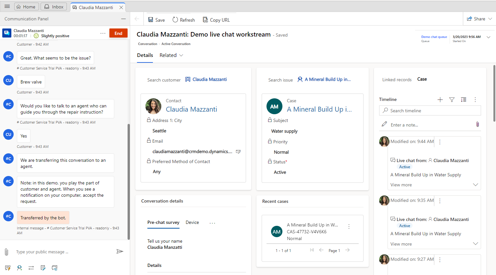
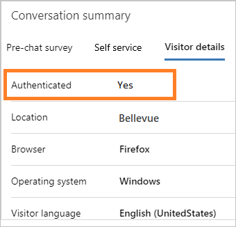
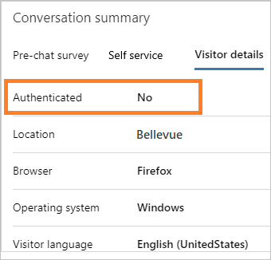
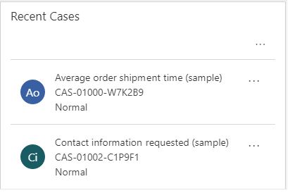

# View customer summary to get available information about customers

[!INCLUDE[cc-use-with-omnichannel](../includes/cc-use-with-omnichannel.md)]

One of the major challenges that customers face when contacting customer support is repeatedly giving the same information about the issue to each support agent they talk to. And if they want to review the status of their request later, they'll have to share the same information with another support agent to explain the context of the engagement. To avoid this situation, support agents need access to all the information the customer has provided, including details about the product or service, issue, case history, related cases, and location.

Having this information ready can help support agents reduce the hold time that they spend retrieving customer information, reduce average handling time, and increase customer satisfaction by resolving issues faster.

## What is a customer summary?

**Customer summary** is a page that appears when you accept an incoming request from any channel and gives you complete information about a customer. The default **Customer summary** view provides the following sections:

- Customer (Contact or Account)
- Conversation summary
- Case
- Recent cases
- Timeline

> [!div class='mx-imgBorder']
> 

However, for closed conversations, you will be able to view only those sections that are supported.

## Customer (Contact or Account)

This section provides details like the contact name or account name. For a contact, you can view the location, email, and other details of the contact. For an account, you can view location, telephone number, and primary contact person for the account.

Use the customer section to search for an existing contact or account record in Omnichannel for Customer Service, and select the record to link it to the conversation. If the record doesn't exist, you can create a new contact or account record by using the **+ Add Contact** or **+ Add Account** button, respectively. After you create it, search for the record and then select it to link it to the conversation.

> [!div class='mx-imgBorder']
> 

## Conversation summary

The **Conversation summary** section provides detailed information about the conversation between the agent and customer. The details shown in the **Conversation details** area include the following:

- Engagement channel
- Waiting time
- Skills
- Queue
- Start time

  > [!div class='mx-imgBorder']
  > 
 
In addition, the **Conversation summary** section includes several tabs:

- Pre-chat survey
- Self service
- Visitor details
- Additional details, if they've been configured and additional context variables are available

These tabs are described in the following sections.

### Pre-chat survey

The **Pre-chat survey** tab displays the customer's answers to the survey questions that were posed by your organization, which helps your interaction with the customer.

### Self service

The **Self service** tab displays information about the activities that the customer performed before initiating a conversation with an agent. This information helps you understand why the customer reached out and helps you provide a personalized service for enhanced customer satisfaction. The activity information, which is categorized into the following action types, appears in reverse chronological order:

| Action type | Description |
|-------------|-----------------------------------|
| Page visited | The page visited on the portal, with time stamp.|
| Phrase searched | The keyword or phrase that was searched for, with time stamp. |
| Knowledge article viewed | The knowledge article viewed, with time stamp. |
| Custom action performed | Any other custom action that's being tracked by your organization, with time stamp. |

To configure the appearance of the **Self service** tab, see [Enable self-service settings for customer actions in a conversation summary](enable-self-service-settings.md).

### Visitor details

The **Visitor details** tab provides information such as whether the customer is authenticated, the browser the customer used to contact support, the operating system used by the customer, the customer's location, and the language used during the interaction.

If the customer has signed in to the portal to initiate the chat with a support agent, the **Authenticated** field value is **Yes**; otherwise, the **Authenticated** field value is **No**.

 

To learn more, see [Create chat authentication settings](create-chat-auth-settings.md).

### Additional details

If your administrator or developer has configured the **Additional details** tab and if any additional context variables exist, they're displayed on the **Additional details** tab.

To learn more, see [setContextProvider](developer/reference/methods/setContextProvider.md).

## Case

Use the **Case** section to search for an existing case in Omnichannel for Customer Service, and select the case to link it to the conversation. If the record doesn't exist, you can create a new case by using the **+ Add Case** button. After you create it, search for the record and then select it to link it to the conversation.

> [!div class='mx-imgBorder']
> 

## Recent cases

This section displays recent cases related to the customer.

> [!div class='mx-imgBorder']
> 

## Timeline

This section displays case-related and customer-related activities in the form of a timeline. You can create quick notes based on your discussion with the customer. Use the **Linked records** field to switch the timeline based on the case, contact, or account record linked to the conversation.

The **Linked records** field shows the record that's linked to the conversation. For example, if you link a contact and case to the conversation, the **Linked records** drop-down list shows **Contact** and **Case**, respectively.

> [!div class='mx-imgBorder']
> 

### See also

[Search for and share knowledge articles](oc-search-knowledge-articles.md)  
[View communication panel](oc-conversation-control.md)  
[Monitor real-time customer sentiment](oc-monitor-real-time-customer-sentiment-sessions.md)  
[View customer summary for an incoming conversation request](oc-view-customer-summary-incoming-conversation-request.md)  
[setContextProvider](developer/reference/methods/setContextProvider.md)  
