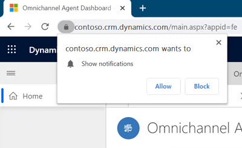
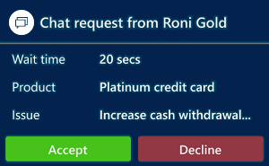
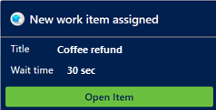
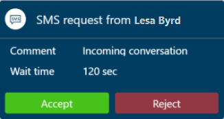

# View notifications

[!INCLUDE[cc-use-with-omnichannel](../includes/cc-use-with-omnichannel.md)]

A notification is a visual alert that appears each time you get a chat or SMS conversation request from a customer. When you get a notification, you see the details about the customer with whom you're going to interact. When you accept the request, a session is started, and you can view the contextual information of the customer and case on the Customer summary page.

Here are some scenarios where you might receive notifications:

- Case assignment if record routing is configured using unified routing

- Incoming chat conversation

- Incoming SMS conversation

- Conversation (work item) assignment

- Conversation transfer

- Conversation escalation

- Conversation escalation from a bot

## Receive notifications when the app is in the background

You'll receive desktop notifications when the Omnichannel for Customer Service app isn't in focus. The desktop notification helps ensure that you don't miss any conversation requests. Some scenarios where the app isn't in focus include:

- You've minimized the app.
- You're working in another browser window.
- You're working on another tab of the browser.

 > [!div class=mx-imgBorder]
 > 

You can accept or reject the conversation request by selecting a button on the desktop notification. When you accept the conversation request, the Omnichannel for Customer Service app is made active and displayed to you, and a session is started.

If you select the notification message body and not a button, the Omnichannel for Customer Service app is made active and the notification is displayed to you in the app. Then you can choose to accept or reject the conversation by selecting the appropriate button.

The wait time that's configured by your administrator applies to the desktop notification, but doesn't display the wait time on the desktop notification.

That is, your administrator has configured the wait time as 90 seconds and set the **Show Timeout** field to **No**. Now, when you get a notification, the wait time won't be displayed on the notification. However, you've 90 seconds to take action. More information: [Manage notification templates and settings](/dynamics365/app-profile-manager/notification-templates)

> [!Note]
> The desktop notification theme is based on the Windows operating system theme and settings.

### Allow your browser to show notifications

To get desktop notifications, you need to allow your browser (Microsoft Edge or Google Chrome) to show notifications. When you get a browser notification, you need to select **Allow**.

 > [!div class=mx-imgBorder]
 > 

## Types of notifications

There are two types of notifications:

- **Toast notifications:** A toast notification or floating notification is a notification message type where you receive information in a dialog, which disappears after a stipulated time. This type of notification appears for conversation (work item) assignments, conversation escalations, and conversation transfer scenarios.

- **Alert notifications:** An alert notification is a type of notification where a dialog appears with actionable buttons. When you select the **Accept** button, a screen pops up with the customer summary details. You need to take an action within the stipulated time and the notification disappears when the time is up.

## Incoming chat notifications

You receive a notification for an incoming chat request. When you accept the chat request, you'll see details about the customer in the Customer summary page. A simultaneous session starts, and a chat window expands so you can exchange messages with the customer.

 > [!div class=mx-imgBorder]
 >   

The details you'll see for a chat channel are as configured by your administrator.

## Case assignment notification

If record routing is configured using unified routing and notifications are enabled, then when a case is assigned to you, you'll receive a notification with the open item option. You can't reject the assignment, and irrespective of the notification timeout, the case will be assigned to you.

  > 

## Incoming SMS notification

When you receive a notification for an SMS conversation request and you accept the SMS request, a session starts, and the communication panel appears in which you can exchange messages with the customer.

A customer is identified based on the **Mobile Phone** field information stored in the Contact record in Dynamics 365 Customer Service. That is, if the incoming SMS conversation is from a phone number stored in the mobile phone field of a Contact record, the conversation automatically links to that contact record.

 > [!div class=mx-imgBorder]
 > 

The details you see for an SMS channel are as configured by your administrator.

## Missed notifications

> [!IMPORTANT]
> - The alert is displayed only when the missed notifications feature is enabled by your administrator.
> - Missed notification alerts are not supported in Omnichannel for Customer Service on Unified Service Desk.

When you don't respond to an incoming conversation notification, you'll see an alert at the top of your dashboard and your presence status will be set to inactive. You can respond to the alert or change your status. Your presence will be reset to the status that was last defined by the system. You won't be assigned new tasks until your presence is reset to a state in which you can be assigned tasks, which is based on the allowed presence set in the work stream. Your supervisor can also reset your presence.

 > [!div class=mx-imgBorder]
 > 

## Notification time-out and rerouting of conversations

When you don't respond to an incoming conversation notification, the conversation will time out based on the time-out settings configured by your administrator and be rerouted.

Sometimes, you might see that conversations have been assigned to you without notifications showing up. This can happen when the notifications are sent by the system, but they are not seen because you had either closed the browser, navigated away from the app page, or had lost network connectivity before the notifications could be displayed. In such a case, while the system might take a few seconds to mark you as unavailable, it ends up assigning conversations to you. The conversations are then rerouted after eight minutes.

## Agent reject notification alerts

> [!IMPORTANT]
>
> - This alert is displayed only when the agent reject feature is enabled by your administrator. 
> - Agent reject notification alerts aren't supported in Omnichannel for Customer Service on Unified Service Desk.

When you reject a work item notification, you'll see an alert at the top of your dashboard and your presence status will be set to **Do not disturb**. You can respond to the alert or change your status. Your presence will be reset to the status that was last defined by the system. You won't be assigned new tasks until your presence is reset to a state in which you can be assigned tasks, which is based on the allowed presence set in the workstream. Your supervisor can also reset your presence.

:::image type="content" source="media/agent-reject-notification-message.png" alt-text="Agent reject notification":::

### See also

[View customer summary and know everything about customers](oc-customer-summary.md)  
[View communication panel](oc-conversation-control.md)  
[Monitor real-time customer sentiment](oc-monitor-real-time-customer-sentiment-sessions.md)  
[Manage presence status](oc-manage-presence-status.md)  
[Search for and share knowledge articles](oc-search-knowledge-articles.md)  
[Take notes specific to conversation](oc-take-notes.md)  
[View customer summary for an incoming conversation request](oc-view-customer-summary-incoming-conversation-request.md)  
[Manage notification templates and settings](/dynamics365/customer-servi/app-profile-manager/notification-templates)  

[!INCLUDE[footer-include](../includes/footer-banner.md)]
