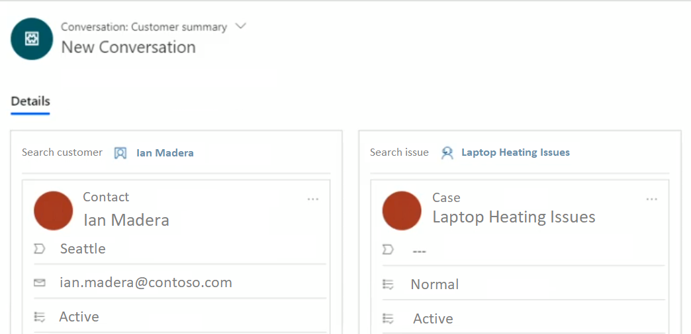
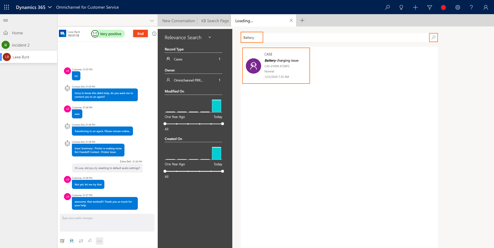
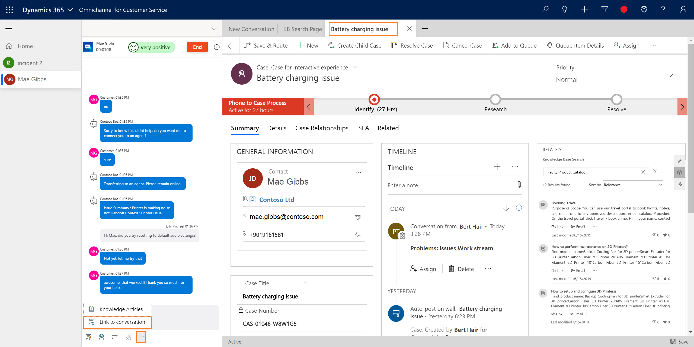

# Search, link, and unlink a record in Omnichannel for Customer Service

[!INCLUDE[cc-use-with-omnichannel](../includes/cc-use-with-omnichannel.md)]

The topic explains how to search for records, link a record to a conversation, and unlink the record from the conversation in Omnichannel for Microsoft Dynamics 365 Customer Service.

You can search for records in two ways:

- Inline search
- Relevance search

## Search for records by using the inline search option

When you accept an incoming conversation request and there's no customer record identified in Omnichannel for Customer Service, use the inline search option in the customer (**Contact** or **Account**) section and **Case** section to search for a contact or account and case, respectively. Inline search is based on the Lookup View and Quick Find View. You can search the fields (attributes) that are included in the Lookup View and Quick Find View fields.

For the customer (**Contact** or **Account**) section, you can search for a Contact or Account entity. By default, you can search by using the following fields.

|Entity|Fields|
|----------|----------|
|Account| <ul> <li>Account Name</li> <li>Account Number</li> <li>Email</li> <li>Main Phone</li> </ul>  |
|Contact| <ul> <li>Company Name </li> <li>Email</li> <li>First Name</li> <li>Last Name</li> <li>Middle Name</li> <li>Full Name</li> <li>Mobile Phone</li> </ul>|

For the **Case** section, you can search for a Case (Incident) entity. By default, you can search by using the following fields.

|Entity|Fields|
|--- |--- |
|Case| <ul> <li>Case Number</li> <li>Case Title</li> </ul>|

Only active views are displayed for the search results. You can customize the Quick Find View and Lookup View to change the searchable fields based on your business requirements. More information: [Understand views](/dynamics365/customer-engagement/customize/create-edit-views) and [Unified Interface Lookup view leverages Quick Find View](https://blogs.msdn.microsoft.com/crm/2018/11/02/unified-interface-lookup-now-leverages-quick-find-view/)

## Link a record to the conversation when doing an inline search

> [!div class=mx-imgBorder]
> 

During an inline search, the search results are displayed and you can select a record to link the conversation to the selected record. After you link the record, the **Customer summary** page is updated with the details.

> [!div class=mx-imgBorder]
> 

> [!NOTE]
> You can link only one contact or account in the customer (**Contact** or **Account**) section and one case in the **Case** section.

## Search for records by using relevance search

You can also search for records by using the relevance search option. When you select the search icon, the search page opens in the application tab. Specify the details for your search, and then select the search icon. The results appear in a list.

You can search for a case, account, contact, and associated fields as enabled by your administrator.

1. Select **Search** . The **Relevance Search** tab opens.  

2. In the search box, specify the entity or attribute details based on your search requirements, and then select **Search** .

## Link a record to the conversation when doing relevance search

After you search for a record by using relevance search, you can link the record to the conversation from the communication panel.

> [!Note]
> You can link only one record to a conversation.

1. Select the record from the list of search results. The record opens in the application tab.

2. Select **More options** (...) in the communication panel, and then select **Link to conversation**.

> [!div class=mx-imgBorder]
> 

Now, the **Customer summary** page is refreshed and updated with details from the record. Similarly, you can link other record types.

> [!NOTE]
> You can link only one contact or account in the customer (**Contact** or **Account**) section and one case in the **Case** section.

## Unlink a record from the conversation

You can unlink a record only when you are interacting with a customer by using the communication panel. That is, after you accept an incoming conversation request and view the **Customer summary** page, you can unlink the record from the conversation.

> [!div class=mx-imgBorder]
> 

To unlink a record, select **Close** next to the customer name in the customer (**Contact** or **Account**) section. After the record is removed, the customer (**Contact** or **Account**) section is blank.

> [!div class=mx-imgBorder]
> 

> [!Note]
> You can link and unlink only one contact or account in the customer (**Contact** or **Account**) section and one case in the **Case** section.

### See also

- [Understand conversation states](oc-conversation-state.md)
- [View a customer summary to get available information about a customer](oc-customer-summary.md)
- [View conversation and session activity types in the model-driven apps](oc-view-activity-types.md)
- [View customer summary for an incoming conversation request](oc-view-customer-summary-incoming-conversation-request.md)
- [Create a record](oc-create-record.md)

[!INCLUDE[footer-include](../includes/footer-banner.md)]
