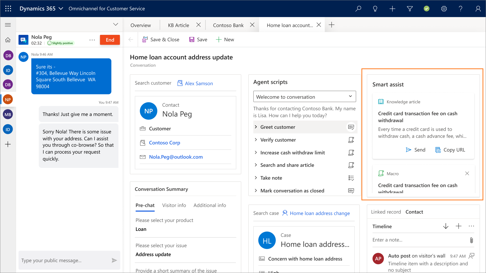

# View smart assist suggestions for agents configured using custom Azure bot

[!INCLUDE[cc-use-with-omnichannel](../includes/cc-use-with-omnichannel.md)]

## Introduction

Smart assist is an intelligent assistant that provides real-time recommendations to you (an agent), helping you to take actions during your interactions with customers. It shows relevant recommendations such as knowledge articles, similar cases, and next-best steps.

If your administrator has enabled the Productivity pane, then the productivity pane appears and on which the smart assist cards appear. By default, the productivity pane is enabled out of the box.

## Smart assist suggestions configured using custom Azure bot user

The smart assist bot interprets the conversation in the communication panel and provides real-time recommendations.

The recommendations appear in the user interface as cards. The most recent card (recommendation) appears at the top on the control. If you feel a recommendation doesn't meet the context of the conversation, you can choose to dismiss the card.

For a macro recommendation card, if the run is successful, a success message is displayed; otherwise, an error message is displayed in the user interface.

When a conversation is escalated from a bot, the agent needs to accept the request and start the conversation with the customer. Now, from this instance, the smart assist bot interprets the conversation in real-time and provides recommendations.

> [!div class=mx-imgBorder]
> 

## See also

[Smart assist for agents (admin)](smart-assist.md)  
[View smart assist suggestions using AI](oc-view-ai-suggested-cases-articles.md)  

[!INCLUDE[footer-include](../includes/footer-banner.md)]