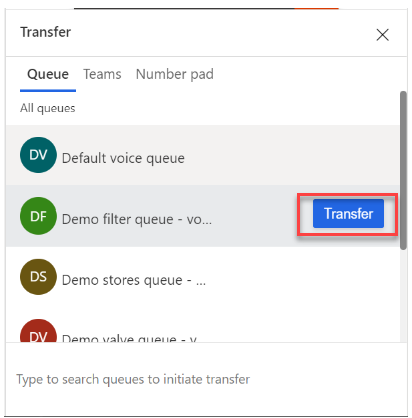

# Transfer calls and consult with users in the voice channel

You can use the **Transfer** or **Consult** option to contact another agent and consult with them on questions that you might have when you're on a call with a customer. 

To familiarize yourself with the call controls, see: [understand how to use the agent dashboard and call controls](voice-channel-agent-experience.md)

## Transfer scenarios

When you receive an incoming call, you can transfer the call to an agent, queue, a public switched telephone network(PSTN) Teams user, or an external PSTN number. Once you transfer the call, the following actions occur:

 - The customer is automatically put on hold. Hold music plays for the customer.
 - The agent who picks up the transferred call will become the primary agent and you will become the secondary agent, and will be removed from the call. 
 - The primary agent must manually remove the customer from hold.

**Transfer the call**

1. Select **Transfer** in the call window. 

    > [!div class="mx-imgBorder"]
    >  
2. The **Transfer** dialog box appears. The options, Queue, Teams, and Number pad are displayed.
  
    > [!div class="mx-imgBorder"]
    > 

3. The following section describes how you can transfer the call, based on your requirement.

    - **Transfer to a queue**: Select **Queue**, search for the queue you want to transfer the call to, and then select **Transfer**. 
         
        > [!div class="mx-imgBorder"]
        > 

    - **Transfer to an external PSTN number**:  Select **Number pad**. On the number pad that appears, enter the plus sign (+) followed by the customer's country code, phone number, and then select Call to make your call. 
        > [!div class="mx-imgBorder"]
        > 
    
    - **Transfer to Teams user via PSTN**: Select **Teams**, and use the search option to search for a Microsoft Teams user. The results are filtered based on the name and the live presence in Microsoft Teams. 

        > [!div class="mx-imgBorder"]
        >  

    The call recording and transcript of the conversation with the Teams user is saved in the application for reporting and compliance.

## Consult

You can collaborate with another agent, a supervisor, an external PSTN number, or a Teams PSTN number by using the Consult option.  When you initiate a consult, the following actions occur:

- You are the primary agent. 
- The customer is automatically put on hold. Hold music plays for the customer.
- When the invited collaborator joins the call, they have a consult role.
- The primary agent must manually remove the customer from hold. During a consult, the primary agent can choose to transfer the call to the new participant. 

> [!NOTE]
> If the primary agent ends the call, the call will end for everyone. 
> If the primary agent refreshes their browser, all the participants will be on hold until the primary agent returns to the call. 

**Consult with another user**

1. Select **Consult** in the call window. 

    > [!div class="mx-imgBorder"]
    >  
2. The **Consult** dialog box appears. The options Agent, Teams, and Number pad are displayed.
    > [!div class="mx-imgBorder"]
    >   

3. The following section describes how you can consult with other agents or supervisors, based on your requirement.
    - **Consult with an internal agent or supervisor** : Select **Agent**. You can either have a call or chat with an internal agent. 
      Select the conversation channel and then search for the agent you'd like to consult with. 
         > [!div class="mx-imgBorder"]
         > 
    - **Consult, then transfer**: The primary agent who initiated the consult can transfer the call to any participant involved in the consult. To transfer a conversation to the consulting agent in the conversation, perform the following steps:

       - If the consult is with an external participant (PSTN or Teams through PSTN), select **Transfer** next to the external phone number in the call window.
       - If the consult is with an internal agent or a supervisor, select  **Transfer** on the call controls. See: [Call controls](voice-channel-agent-experience.md#call-controls)

    Once the call is transferred, the primary agent becomes the consulting agent and can leave the call without ending the call. The consulting agent becomes the primary agent. If the primary agent leaves the call, the call will end for the customer. 

    - **Consult with external PSTN number**: Select the **Number Pad**. On the number pad that appears, enter the plus sign (+) followed by the customer's country code, phone number, and then select Call to make your call. 
    By default, the consultation is private, the customer is on hold while the primary agent speaks with the new participant. You can also have a public consultation, where the customer is actively involved in the conversation.  
    To make the consultation public, select **Hold** to put the call on hold. When the secondary agent has joined the conversation, remove the customer from hold to continue the consultation. 
        > [!div class="mx-imgBorder"]
        > 
    - **Consult with Teams user with PSTN**: Select **Teams** and use the search option to search for and select the Microsoft Teams user you'd like to consult with.  See: [Enable voice consult with Microsoft Teams users](voice-consult-microsoft-teams-user.md)
        > [!div class="mx-imgBorder"]
        > 

    The call recording and transcript of the conversation with the Teams user is saved in the application for reporting and compliance.

### See also

[Overview of the voice channel](voice-channel.md)  
[Enable voice consult with Microsoft Teams users](voice-consult-microsoft-teams-user.md)  
[Make and receive your first call](voice-channel-first-call.md)  
[Call a customer](voice-channel-call-customer.md)  

[!INCLUDE[footer-include](../includes/footer-banner.md)]
