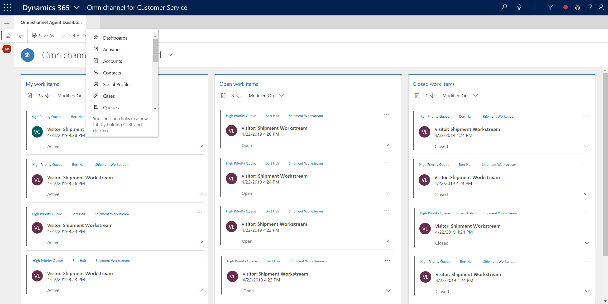
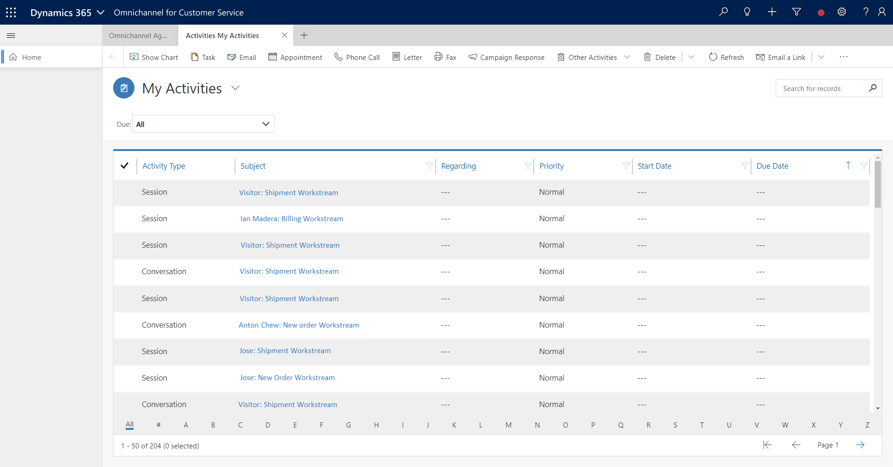
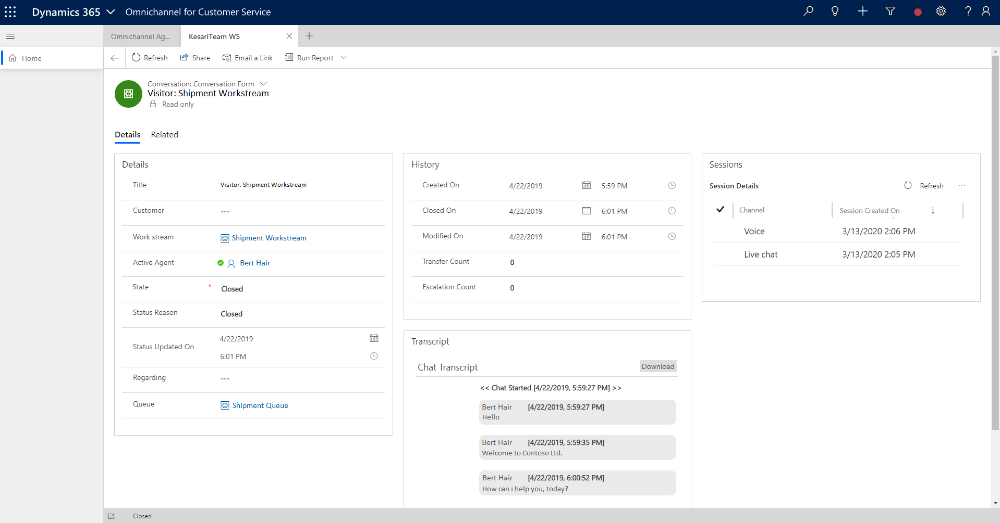
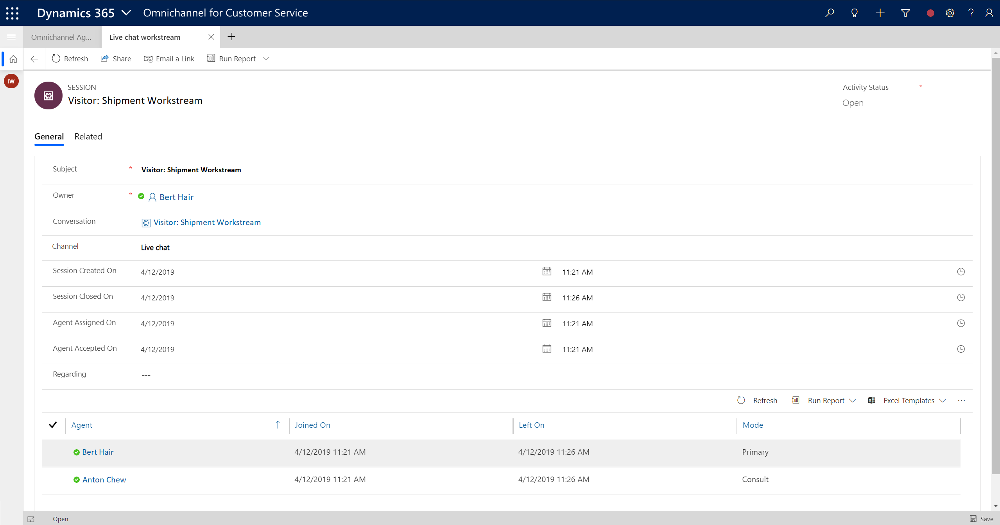

# View conversation and session forms

[!INCLUDE[cc-use-with-omnichannel](../includes/cc-use-with-omnichannel.md)]

Your organization might have a classification where certain agents work in the contact center, which uses Omnichannel for Customer Service on the web and certain agents work in another contact center, which uses model-driven app such as Customer Service Hub. In this case, if you are an agent who works on the model-driven app, and you need to analyze the conversation request from Omnichannel for Customer Service, you can find the information through **Activities** in the model-driven app.

Select the plus icon in the application tab to view the site map and select **Activities**.

> [!div class=mx-imgBorder]
> 

There'll be many activity types, and you need to look for **Conversation** and **Session** types.

> [!div class=mx-imgBorder]
> 

### Conversation activity type

The Conversation activity type displays information about a conversation request.

  

> [!Note]
> Only the fields listed in the following table are supported for the Conversation activity type.

| **Tab** | **Section**     | **Fields**        |
|---------|-----------------|-------------------|
| Details | Details         | <ul> <li>Title</li> <li>Customer</li> <li>Work stream </li> <li>Active agent</li> <li>Activity status</li> <li>Status reason</li> <li>Status updated on</li> <li>Regarding</li> <li>Queue</li> </ul>|
| Details | History         |<ul> <li>Created on</li> <li>Closed on</li> <li>Modified on</li> <li>Transfer count</li>  <li>Escalation count</li> <ul> |
| Details | Session Details |<ul> <li> Channel </li> <li>Date created</li> <li>Subject</li> <li>Date created</li> <ul>|
| Details | Chat Transcript |<ul> <li>Download</li> <ul>|

### Session activity type

The session activity type displays information about a individual session in a conversation request.

  

> [!Note]
> Only the fields listed in the following table are supported for the Session activity type.

| **Tab** | **Section**          | **Field**          |
|---------|----------------------|--------------------|
| General | Header               | <ul> <li>Activity Status</li> </ul>|
| General | General              | <ul> <li>Subject</li> <li>Owner</li> <li>Conversation</li> <li>Channel</li> <li>Session Created On</li> <li>Session Closed On</li> <li>Agent Assigned On</li> <li>Agent Accepted On</li> <li>Regarding</li> <li>Name</li> <li>Created on</li> </ul> |
| General | Session Participants | <ul> <li>Agents</li> <li>Joined On</li> <li>Left On</li> <li>Mode</li> </ul> |

The Session Participants section lets you add a participant related to the session or add a session participant that already exists for the record you are working with.

### See also

- [View customer summary for an incoming conversation request](oc-view-customer-summary-incoming-conversation-request.md)
- [View customer summary](oc-customer-summary.md)
- [Create a record](oc-create-record.md)
- [Search, link, and unlink a record](oc-search-link-unlink-record.md)

[!INCLUDE[footer-include](../includes/footer-banner.md)]
