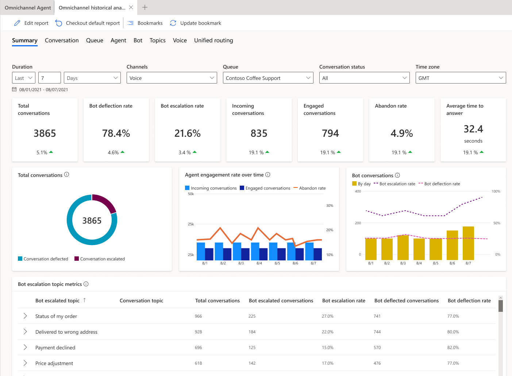

# Omnichannel for Customer Service dashboards

The insights dashboards in Omnichannel for Customer Service contain various charts and metrics to help you understand the factors that can improve customer service for your organization. Key performance indicators and visual breakdowns of your organization's support cases are coupled with AI-generated insights on cases, agents, and topics that contribute to overall trends.

The Omnichannel for Customer Service dashboards provide a view into the support operation across the various channels.

## Configure dashboards

To enable the dashboards, see [Configure Omnichannel historical analytics](oc-historical-analytics-reports.md).

## Omnichannel historical analytics reports

The following dashboard reports are available for Omnichannel historical analytics.

### Summary

The Summary dashboard gives you an integrated view of the Power Virtual Agents bot and Omnichannel metrics.

> [!div class="mx-imgBorder"]
> 

More information: [Conversation dashboard](omnichannel-summary-dashboard.md)

### Conversation

The Conversation dashboard gives you a broad overview of the assisted support customer service experience in your organization.

> [!div class="mx-imgBorder"]
> 

More information: [Conversation dashboard](oc-conversation-dashboard.md)

### Queue

The Queue dashboard gives you a broad overview of the customer service experience in your organization by providing insights into how specific queues are operating.

> [!div class="mx-imgBorder"]
> 

More information: [Queue dashboard](oc-queue-dashboard.md)

### Agent

The Agent dashboard shows charts and KPIs that you can use to guide agents and understand overall agent performance.

> [!div class="mx-imgBorder"]
> .

More information: [Agent dashboard](agent-dashboard.md#agent-dashboard)

### Bot

The Bot dashboard shows charts and KPIs that you can use to understand how bots are playing a role in a support organization. 

> [!div class="mx-imgBorder"]
> 

More information: [Bot dashboard](oc-bot-dashboard.md)

### Conversation Topics

The Topics dashboard shows a detailed breakdown of conversations and their assigned topics.

> [!div class="mx-imgBorder"]
> 

More information: [Topics dashboard](oc-conversation-topics-dashboard.md)

## Information that you need to know about analytics reports

### Refresh reports, retain data

The reports refresh shows the following information.

- **Data refresh:** Occurs every 24 hours. The reports are available during the refresh process. The **Last updated** timestamp in the report pages indicates when the latest data was included in the report, and the time reflects the time zone that's set in your user preferences. 
- **Custom refresh:** Isn't available.
- **Data refresh for inactive environments:** Data refresh is paused if the reports aren't used continuously for two weeks. When you access a report after a lengthy period of inactivity, the report will be refreshed in the next refresh cycle.
- **Data retention:** Data is stored for 24 months.

> [!NOTE]
> A report might be blank if you've customized any of the listed entities or are using out-of-the-box entities.

## Troubleshoot issues

To troubleshoot issues when you try to access or view the reports, see [Troubleshoot issues when accessing reports](customer-service-analytics-insights-csh.md#troubleshoot-issues-when-accessing-reports).

### See also

[Introduction to Customer Service insights](introduction-customer-service-analytics.md)  
[Manage report bookmarks](manage-bookmarks.md)  

[!INCLUDE[footer-include](../includes/footer-banner.md)]
