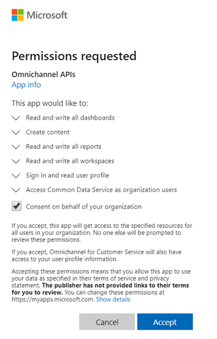
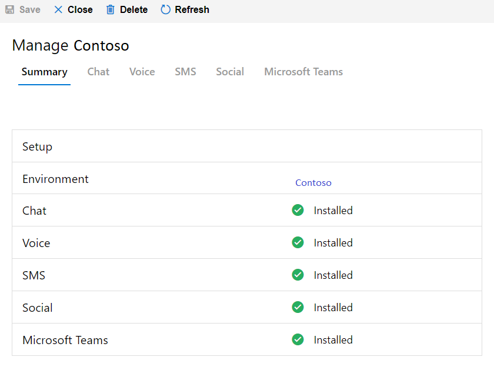
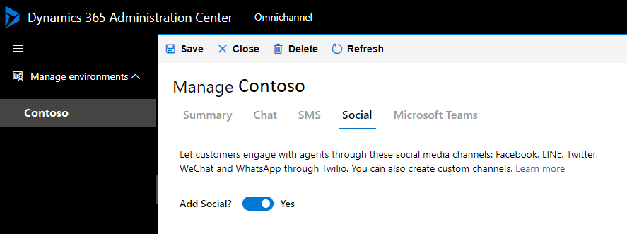
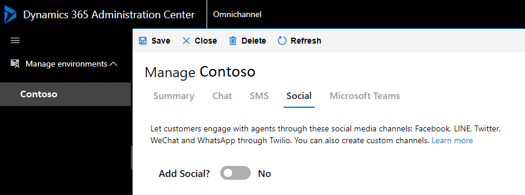

# Provision Omnichannel for Customer Service

[!INCLUDE[cc-use-with-omnichannel](../includes/cc-use-with-omnichannel.md)]

## Introduction

Omnichannel for Customer Service provides a modern, customizable, high-productivity app that lets agents help customers across different channels via a unified interface. It lets organizations choose the channel that suits their business needs. It also ensures that a high level of responsive, quality service is received across channels.

To find out if Omnichannel for Customer Service is available in your region, see [International availability](international-availability.md).

Looking for an upgrade? See [Upgrade Omnichannel for Customer Service](upgrade-omnichannel.md) for more information.

You can provision the following channels in Omnichannel for Customer Service:

- [Chat](set-up-chat-widget.md)
- [Voice](voice-channel.md)
- [SMS](configure-sms-channel.md)
- [Social](channels.md)
- [Microsoft Teams](configure-teams-chat.md)

> [!IMPORTANT]
> The channels that you want to provision might require a license. More information: [Dynamics 365 Licensing Guide](https://go.microsoft.com/fwlink/p/?LinkId=866544).

## Prerequisites

To provision the Omnichannel for Customer Service application, complete the following prerequisites:

- Obtain an active subscription of Chat for Dynamics 365 Customer Service or Dynamics 365 Digital Messaging.

- Obtain an active subscription of the voice channel.
  
   > [!NOTE]
   > More information: [Pricing](https://dynamics.microsoft.com/customer-service/pricing/), Dynamics 365 Licensing Guide, and [How to purchase through Volume Licensing](https://www.microsoft.com/en-us/licensing/how-to-buy/how-to-buy). You can also get a free 30-day trial if you have the required prerequisites. More information: [Try channels for Dynamics 365 Customer Service](try-channels.md).

- Set up the prerequisites mentioned in the system requirements. More information: [Prerequisites](system-requirements-omnichannel.md#prerequisites).

- Ensure that the provisioning user has the following permissions:
    - Microsoft 365 Global Admin role. More information: [Assign Admin roles to user in Microsoft Office 365](/microsoft-365/admin/add-users/assign-admin-roles)
    - Dynamics 365 System Administrator role on the root business unit for your organization. More information: [Assign security roles to a user in Power Platform](/power-platform/admin/assign-security-roles) and [Create or edit business units](/power-platform/admin/create-edit-business-units)
    - Read-Write access in the Client Access License Information (CAL). More information: [Create a Read-Write user account in Power Platform](/power-platform/admin/create-users#create-a-read-write-user-account)

## Provide data access consent

Use the following steps to allow Omnichannel for Customer Service to read and write data on behalf of users:

1. Go to [Data access consent URL](https://go.microsoft.com/fwlink/p/?linkid=2070932). For Government Community Cloud (GCC), use the [GCC data access consent URL](https://go.microsoft.com/fwlink/p/?linkid=2128838).
2. Sign in using **Global Tenant Admin** credentials.
3. Select the **Consent on behalf of your organization** checkbox.
4. Select **Accept** to grant data access consent.

    > [!div class=mx-imgBorder]
    > 

> For more information about app permissions, see [Azure app Power BI API permissions](/power-bi/developer/embedded/power-bi-permissions) and [Data access consent to provision Omnichannel for Customer Service](data-access-consent.md).

## Set up Omnichannel for Customer Service

1. In Power Platform admin center, on the **Environments** page, select the environment in which Omnichannel for Customer Service needs to be set up.
2. In the left pane, expand **Resources**, and select **Dynamics 365 apps**. 
   
   > [!NOTE]
   > Don't select **Environments** in the left pane and try to navigate to **Dynamics 365 apps** from there. There are similar-looking menu options, but the correct way to navigate to the **Dynamics 365 apps** management options is to expand **Resources** in the left pane and select **Dynamics 365 apps**.
  
3. On the **Dynamics 365 apps** page, select **More commands** beside **Omnichannel for Customer Service**, and then select **Manage**.

    > [!div class=mx-imgBorder]
    > 

4. On the **Manage Omnichannel for Customer Service** message, select **OK**. The **Dynamics 365 Administration Center | Omnichannel** page is displayed on a new tab.

5. On the **Manage Omnichannel Instances** page, select **Add Org** to add an organization. Omnichannel is set up on the organization environment that you add here.

    > [!div class=mx-imgBorder]
    > 

    > [!IMPORTANT]
    > As an admin, you can configure Omnichannel in multiple environments. You can view the status of all organization environments where the Omnichannel app has been configured in the **Manage environments** view.

6. Select the environment in the dropdown list, then perform the following steps.

    > [!div class=mx-imgBorder]
    > 

   1. Select **Next**, and in the **Chat** section, set the **Add chat** toggle to **Yes** to enable the Chat channel.

   2. In the **Voice** section, set the **Add voice** toggle to **Yes** to enable the voice channel. Ensure that you select the **Voice and SMS Terms** checkbox.

   3. In the **SMS** section, set the **Add SMS** toggle to **Yes** to enable SMS. Select the checkbox to confirm that you agree to the SMS terms.

        > [!IMPORTANT]
        > You must select the checkbox for **SMS Terms** to enable SMS and proceed with the setup.

   4. In the **Social channels** section, set the **Add social** toggle to **Yes** to enable social channels.

   5. In the **Microsoft Teams** section, set the **Add Microsoft Teams** toggle to **Yes** to enable Microsoft Teams.

7. On the **Confirmation** page, verify your selections, and then select **Finish** to provision Omnichannel for Customer Service in your organization.

    > [!div class=mx-imgBorder]
    > 

    The setup can take several minutes. You can close the window and check after some time, or refresh to check if it's complete. After the setup is complete, the selected channels are enabled in your environment.

    > [!div class=mx-imgBorder]
    > 

> [!IMPORTANT]
>
> - After you successfully provision Omnichannel for Customer Service, you might see the status as "Not configured" on the **Dynamics 365 apps** page. You can safely ignore the status.
> - If the provisioning of Omnichannel for Customer Service fails and you retry it, you might see an app profile named **Omnichannel Upgraded OOB Default app profile** on the **App profiles** page in Power Apps. You can safely delete this app profile that is created.

## Update Omnichannel for Customer Service application

After the Omnichannel for Customer Service application is successfully provisioned, you can update the environment by enabling or disabling the required channels.

1. In the **Power Platform Admin Center**, on the **Environments** page, select the environment where you want to set up Omnichannel for Customer Service.
2. In the left pane, expand **Resources**, and then select **Dynamics 365 Apps**.
3. On the **Dynamics 365 apps** page, select **More commands** beside **Omnichannel for Customer Service**, and then select **Manage**.
4. Select **OK** on the **Manage Omnichannel for Customer Service** message. The **Dynamics 365 Administration Center | Omnichannel** page is displayed on a new tab.

    > [!div class=mx-imgBorder]
    > 

5. Select the channel to be enabled. For example, in this procedure, we'll enable the Social channels.

6. On the **Social** tab, set the toggle to **Yes** to enable social channels in your environment.

    > [!div class=mx-imgBorder]
    > 

7. Select **Save**. After the update is complete, the status is displayed on the **Summary** tab.

    > [!div class=mx-imgBorder]
    > 

8. To disable a previously enabled channel, set the toggle to **No**. For example, in this procedure, we'll disable the Social channel.

   - On the **Social** tab, set the toggle to **No** to disable social channels in your environment. A confirmation message is displayed to remove the channel. Select **Remove**.

        > [!div class=mx-imgBorder]
        > 
    > [!NOTE]
    > If you disable all channels, Omnichannel for Customer Service will be removed from your organization.

### Troubleshoot provisioning

[Instance is not available to select on the provisioning application](troubleshoot-omnichannel-customer-service.md#provision)

### See also

[Upgrade Omnichannel for Customer Service](upgrade-omnichannel.md)  
[Create workstreams](create-workstreams.md)  
[Manage users](users-user-profiles.md)  

[!INCLUDE[footer-include](../includes/footer-banner.md)]
