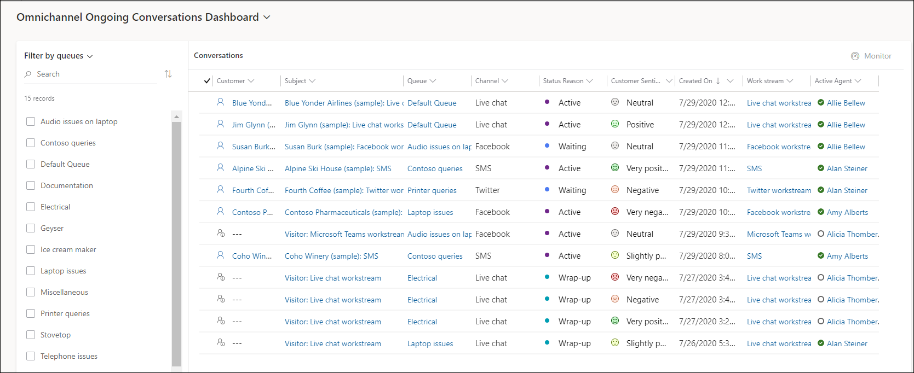
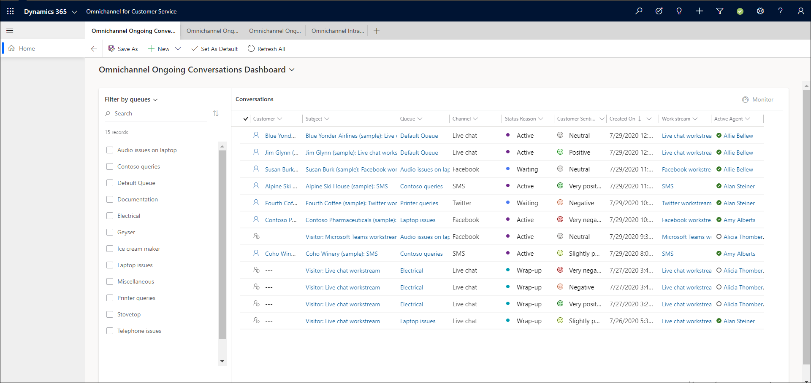

# View and understand Omnichannel Ongoing Conversations dashboard

[!INCLUDE[cc-use-with-omnichannel](../includes/cc-use-with-omnichannel.md)]

The **Omnichannel Ongoing Conversations** dashboard provides information on the conversations that are handled by agents and are in the active, open, wrap up, and waiting status in your organization. This dashboard provides a holistic view of the conversations with details, such as customer, agent assigned, subject, queue, and activity status. The data in the dashboard is auto refreshed in near real time.

Further, you can filter the conversations using the **Filter by queues** or **Filter by agents** option to create a personalized view of the queues or the group of agents you want to monitor or track. Select the queues or agents for which you want to view the conversations and then select **Apply**. The filter is applied, and conversations are displayed based on the selection. Select **Save** to set this filter as default and when you sign in to Omnichannel for Customer Service, you view conversations based on your saved filter.

> [!NOTE]
>
> - The **Ongoing Conversations dashboard** is view only and you can't perform any actions such as open, edit, or delete on this dashboard.
> - The status icon in the **Active Agent** column of the dashboard does not pertain to an agent's online presence in Omnichannel. The status is displayed based on your Microsoft Teams or Skype for Business integration settings with Microsoft Dynamics 365. The administrator can turn off the presence in the system settings for Dynamics 365.

## View Omnichannel Ongoing Conversations dashboard

The **Omnichannel Ongoing Conversations** dashboard is available in:

- [Unified Service Desk](#unified-service-desk)
- [Omnichannel for Customer Service](#omnichannel-for-customer-service)

### Unified Service Desk

1. Open the **Unified Service Desk** client application.

2. Sign in with your supervisor credentials.

    > [!NOTE]
    > To learn more, see [Sign in to Unified Service Desk – Omnichannel for Customer Service](../unified-service-desk/oc-usd/signin-unified-service-desk-omnichannel.md).

3. Select the **Conversations** tab.

    The **Omnichannel Ongoing Conversations** dashboard displays the list of conversations that you and agents are handling.

    > [!div class=mx-imgBorder]
    > 
  
### Omnichannel for Customer Service

1. Go to *https://**YourOrganization**.dynamics.com/apps* and select **Omnichannel for Customer Service**.

2. Select the **Omnichannel Ongoing Conversations Dashboard** tab.

    The Omnichannel Ongoing Conversations dashboard displays the list of conversations that you and agents are handling. 

    > [!div class=mx-imgBorder]
    > 

### See also

[Provide access to Ongoing Conversations dashboard](configure-ongoing-conversations-dashbaord.md)  
[Introduction to intraday insights dashboard](intro-intraday-insights-dashboard.md)  
[View and understand Omnichannel intraday insights dashboard](intraday-insights-dashboard.md)  

[!INCLUDE[footer-include](../includes/footer-banner.md)]
