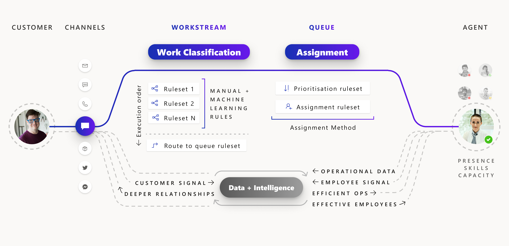

# Overview of unified routing

## Introduction

Unified routing is an intelligent, scalable, and enterprise-grade routing and assignment capability that can direct the incoming work item to the best-suited queue and agent by adhering to work item requirements and matching them with the agent’s capabilities.

The unified routing infrastructure can be used to route service requests on all channels. This creates a unified view of workforce utilization across multiple channels, and thus helps to optimize distribution of work across the workforce. It works in a truly omnichannel way by ensuring that work items on all the channels are routed in a consistent and similar manner. It takes the agent engagement on different channels into account before any new work is assigned to them.

Unified routing has two main stages: classification and assignment.

In the classification stage, rules and machine learning (ML) models can be used to add information on the work item, which can be used to find the best-suited agent.

During the assignment stage, the service requests are prioritized and then assigned to the agents based on the nature of the work, related entities, agent skills, and the current state of the agent workforce in terms of availability and workload.

For instance, an organization receiving an incoming chat will add information on the work item—such as skills required, urgency level, category of customer, and importance level—in the classification stage, based on certain conditions that are met as part of the configured rules. In the assignment stage, an organization might want to first prioritize the incoming chats based on highest urgency level and importance, and then assign them to the agents by matching the skills required, current workload status, and availability.

## How unified routing helps achieve business efficiency

Unified routing optimizes businesses in the following ways:

- Connecting end-customers with the best-suited agent to provide the right outcome upon first contact.

- Routing work items to the best queue by using attributes in a related entity, thereby saving an admin from creating a custom workflow.

- Using skills-based routing to automatically assign incoming work, matching to the best agent and decreasing resolution time.

- Adding more context to the incoming work item using conditions on work item attributes and related-entity attributes, and then further using that information to route to a particular queue and also while assigning to the right agent.

- Using machine-learning models to predict skills and assigning incoming work items to the best agent using skills to avoid writing manual declarative skill-identification rules.

- Prioritizing work items within a queue using work item attributes, added context, or related entity attributes so as to ensure the business is able to use the agent's time on the most important work items first as per the business need.

- Assigning work items within a queue by matching agent attributes against work item requirements dynamically, thereby assigning agents as per the business requirement.

## System requirements, supported geographical regions

Unified routing is supported in the same geographical regions as those supported by Omnichannel for Customer Service. More information: [International availability of Omnichannel for Customer Service](international-availability.md)

The requirements for unified routing are same as those that are applicable for Omnichannel for Customer Service. More information: [System requirements for Omnichannel for Customer Service](system-requirements-omnichannel.md)

For the languages that are supported in unified routing, see [Supported languages](international-availability.md#language-availability).

You can configure unified routing only through the Customer Service admin center (preview), Omnichannel admin center, or Customer Service Hub app. Agents must use the Customer Service workspace or Omnichannel for Customer Service app only to be assigned work through unified routing.

The intelligent skill finder depends upon the custom AI Builder category classification model. Therefore, AI Builder should be available in the geographical region where you want to use intelligent skill finder. The languages supported in the intelligent skill finder are determined by the languages that AI Builder supports. For more information, see the following:

- [Availability of AI Builder](/ai-builder/availability-region)
- [Supported languages](/ai-builder/before-you-build-text-classification-model#prerequisites)

> [!NOTE]
> Unified routing is not supported in Unified Service Desk.

### See also

[How routing and assignment works](set-up-routing-process.md)  
[Create workstreams for unified routing](create-workstreams.md)  
[Set up record routing](set-up-record-routing.md)  
[Configure work classification rulesets](configure-work-classification.md)  
[Historical analytics for Unified routing in Customer Service](cs-historical-analytics-unified-routing.md)  
[Historical analytics for unified routing in Omnichannel for Customer Service](oc-historical-analytics-unified-routing.md)  
[FAQs on unified routing](unified-routing-faqs.md)  
[Migrate workstreams created in Omnichannel Administration app](migrate-workstreams.md)  

[!INCLUDE[footer-include](../includes/footer-banner.md)]
