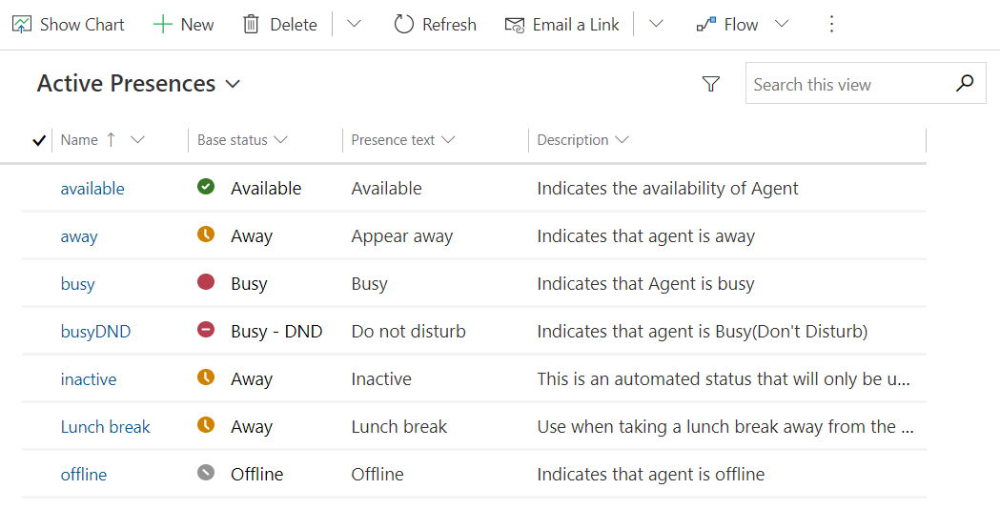

# Configure and manage custom presence

[!INCLUDE[cc-use-with-omnichannel](../includes/cc-use-with-omnichannel.md)]

## Introduction

The presence status indicates an agent's availability. A presence status consists of two elements:

- **Base status**: The base presence status that indicates an agent's status. The work distribution system distributes work items to agents according to the base statuses that you select as allowed presences at the time of creating a work stream. The base statuses are as follows:
  - Available
  - Busy
  - Busy-DND
  - Away
  - Offline

  Only the base statuses are available for selection in **Allowed Presences** while creating a [work stream](create-workstreams.md).

- **Presence text**: The text that is associated with a specific base status. This is the text that is visible to agents.

A default presence should be assigned to the agents that will be set when they sign in for work. If no default presence is assigned, the application will set "Available" as the default.

## Out-of-the-box presence statuses

Omnichannel for Customer Service provides the following presence statuses out of the box:

- Available
- Away
- Busy
- Busy - DND
- Inactive
- Offline

The inactive presence is not available for manual selection by the agents; if the missed notifications feature is enabled, the agent status will be changed to inactive when agents do not respond to the incoming conversation request notification.

> [!div class=mx-imgBorder]
> 

> [!NOTE]
> You cannot edit or delete these out-of-the-box base and presence statuses.

## Create custom presence status

In addition to the out-of-box presence statuses, admins can configure custom presence statuses for agents that must be mapped to a base presence. For example, if the agents on your team want to attend a training, you can create a custom **Away – In Training** presence status. When you map a custom presence to a base presence, make sure that the configurations are logically viable. For example, if you map an available custom presence to offline base status, the application will treat it as offline while the visual effect would be available.

**To create a presence record**

1. In Dynamics 365, go to one of the apps, and perform the following steps.

   ### [Customer Service admin center (preview)](#tab/customerserviceadmincenter)
     
    > [!IMPORTANT]
    > The Customer Service admin center app is in preview. [!INCLUDE[cc-preview-features-definition](../includes/cc-preview-features-definition.md)]

    - In the site map, in **Agent experience**, select **Productivity**.
   
   ### [Omnichannel admin center](#tab/omnichanneladmincenter) 

     - In the site map, in **Advanced settings**, select **Agent experience**.
    
1. Select **Manage** for **Custom Presence**.

1. On the command bar, select **New** to create a presence record.

1. On the **Summary** tab, provide the following information:

    1. **Name**: Enter a name for the custom presence status.
    2. **Presence Text**: Enter presence text that should be associated with the new custom entity.
    3. **Base Status**: Select the most applicable base status in the list.
    4. **Description**: Enter a brief description of the custom presence record.

1. Select **Save**.

> [!div class=mx-imgBorder]
> 

### See also

[Manage a user in Omnichannel for Customer Service](users-user-profiles.md#manage-a-user-in-omnichannel-for-customer-service)  
[Understand and create work streams](create-workstreams.md)  
[Overview of unified routing](overview-unified-routing.md)  

[!INCLUDE[footer-include](../includes/footer-banner.md)]
