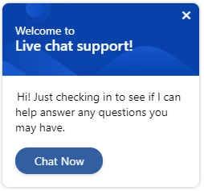
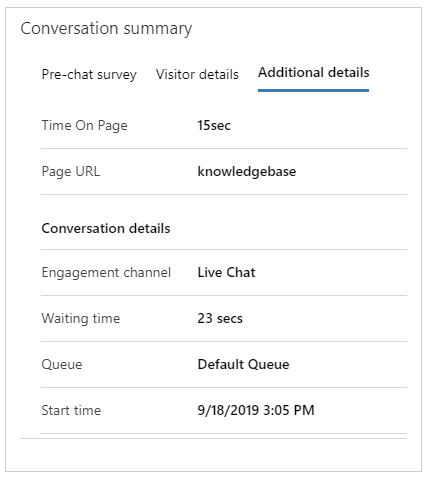

# Configure proactive chat

[!INCLUDE[cc-use-with-omnichannel](../includes/cc-use-with-omnichannel.md)]

A chat channel allows your customers to engage with customer service agents using the chat widget on a website. Proactive chat allows customer service agents to engage with customers by automatically inviting them to a chat conversation based on the configured rules. Proactively engaging with a customer at the time when they need help improves customer experience and satisfaction.

Information about the user journey, time spent on a web page, and more can be used to decide when to engage with a customer. You can control the proactive chat experience by using personalized trigger messages and configurable rules to define the target audience, time frame, and target location.

> [!NOTE]
> Proactive chat can be triggered only on pages where the chat widget is embedded.

## Enable proactive chat in new admin apps

In Customer Service admin center (preview) or Omnichannel admin center, go to the workstream of the chat widget in which you need to configure the settings, select edit for the required chat widget, and on the **Chat widget** tab of the **Chat channel settings** page, set the toggle for **Proactive chat** to **On**.

## Enable proactive chat in Omnichannel Administration

1.	Sign in to Omnichannel Administration.

2.	Open the chat widget for which you need to turn on proactive chat.

3.	Go to the **General settings** tab.

4.	Under **Proactive chat**, select **Yes** for **Enable Proactive Chat**. By default, it is set to **No**.

The conditions to trigger the proactive chat are defined in the web page code in which the chat widget is embedded. If the conditions are fulfilled, the proactive chat invitation is displayed with the help of an API.

For example scenarios and sample code, see [Start chat proactively](start-proactive-chat.md).

## Customer experience of proactive chat

When proactive chat is enabled, the chat invitation is displayed to customers based on the configured triggers.

> [!div class=mx-imgBorder]
> 

The customer can accept the chat invitation or close it. If the customer doesn't accept, the chat invitation is closed automatically after a minute. The one-minute timer for automatic closure can't be configured.

## Agent experience of proactive chat

When a customer accepts the proactive chat invitation, an agent receives the notification.

> [!div class=mx-imgBorder]
> 

The agent then accepts the chat request and starts conversing with the customer to provide the required help. The [customer summary](oc-customer-summary.md) is loaded and displayed if the customer’s details match the stored data. 

If your administrator or developer configures the **Additional details** tab and if there are additional context variables, such as time spent on a page and the page URL from where the chat is initiated, they are displayed on the **Additional details** tab. 

> [!div class=mx-imgBorder]
> 

To learn more, see [setContextProvider](developer/reference/methods/setContextProvider.md).

## Videos

[Proactive chat in Omnichannel for Customer Service](https://go.microsoft.com/fwlink/p/?linkid=2114614)

To view more videos on Omnichannel for Customer Service, see [Videos](videos.md).

[!INCLUDE[footer-include](../includes/footer-banner.md)]
