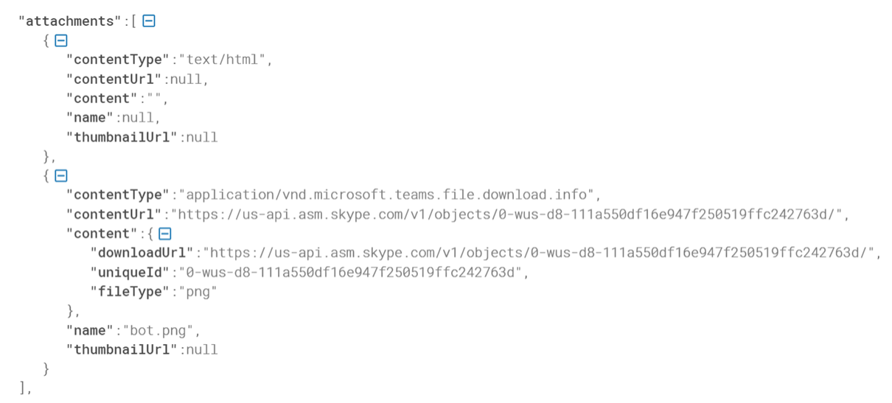
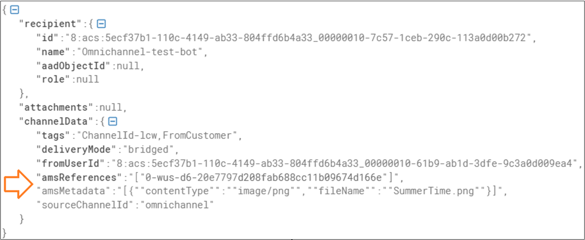

# Process file attachments during migration

[!INCLUDE[cc-use-with-omnichannel](../includes/cc-use-with-omnichannel.md)]

## Introduction

This topic describes how you must process file attachments received by your Azure bot when you migrate your omnichannel implementations from the Microsoft Teams channel to the new Azure Bot Service channel. 

Before you begin, let's quickly learn about the file attachment formats in the Teams channel and the Azure Bot Service channel.

## File attachment formats

When file attachments are sent from Omnichannel for Customer Service to an Azure bot on the Teams chat channel, the attachment format is passed in the `Activity.Attachments` property. The content type of that attachment is “application/vnd.microsoft.teams.file.download.info”.

  > [!div class="mx-imgBorder"]
  > 

However, when file attachments are sent from Omnichannel for Customer Service to the Azure bot on the Azure Bot Service channel, the information required to download the files is passed in the `amsReferences` and `amsMetadata` fields of the `Activity.ChannelData` property.
  > [!div class="mx-imgBorder"]
  > 

## How to process file attachments in your Azure bot code

In the new channel, the attachment information is not passed in the `Activity.Attachments` field, as is done on the Microsoft Teams chat channel. So, to ensure smooth migration between the two chat channels, the Teams channel-specific logic should be retained in the bot code together with the new Azure Bot Service channel-specific logic, as shown in the following sample code.

```csharp
// 1. Retrieve Attachment ID from ChannelData["amsReferences"]
if (turnContext.Activity.ChannelData != null &&
    turnContext.Activity.ChannelData is JObject incomingRequestChannelData &&
    incomingRequestChannelData.TryGetValue("amsReferences", out JToken amsReferencesArray))
{
    string attachmentId = JsonConvert.DeserializeObject<string[]>(amsReferencesArray.ToString()).FirstOrDefault();

    // 2. Build HTTP request for specified attachment Id.
    string requestUri = $"https://botapi.skype.com/amer/v3/attachments/{attachmentId}/views/original";
    var httpRequest = new HttpRequestMessage(HttpMethod.Get, requestUri);

    // 3. Acquire authentication token and add it to request headers
    var token = await new MicrosoftAppCredentials("botAppId", "botAppSecret").GetTokenAsync();
    var authorization = new AuthenticationHeaderValue("bearer", token);
                        httpRequest.Headers.Add("Authorization", authorization.ToString());

    // 4. Add ACS Bot Id to request header. This is required to achieve good download performance.
    httpRequest.Headers.Add("BotAcsId", turnContext.Activity.Recipient.Id);

    // 5. Use HttpClient to execute the request and download attachment
    var response = await client.SendAsync(httpRequest);
}
else if (turnContext.Activity.Attachments != null)
{
    // 1. Retrieve Teams attachment
    var teamsAttachment = turnContext.Activity.Attachments.FirstOrDefault(attachment => attachment.ContentType.Equals("application/vnd.microsoft.teams.file.download.info", StringComparison.OrdinalIgnoreCase));

    if (teamsAttachment != null)
    {
        // 1. Retrieve Teams Attachment ID from Content[“uniqueId”] field
        string attachmentId = (teamsAttachment.Content as JObject).GetValue("uniqueId").ToString();

        // 2. Build HTTP request for specified attachment Id.
        string requestUri = $"https://botapi.skype.com/amer/v3/attachments/{attachmentId}/views/original";
        var httpRequest = new HttpRequestMessage(HttpMethod.Get, requestUri);

        // 3. Acquire authentication token and add it to request headers
        var token = await new MicrosoftAppCredentials("botAppId", "botAppSecret").GetTokenAsync();
        var authorization = new AuthenticationHeaderValue("bearer", token);

        httpRequest.Headers.Add("Authorization", authorization.ToString());

        HttpClient client = new HttpClient();
        HttpResponseMessage response = await client.SendAsync(httpRequest);
    }
}
```

### See also

[Migration changes for new omnichannel messaging platform](migrate-acs.md)  
[Enable file attachments](enable-file-attachments.md)  
[Download file attachments from your Azure bot](download-attachments-bot.md)  

[!INCLUDE[footer-include](../includes/footer-banner.md)]
