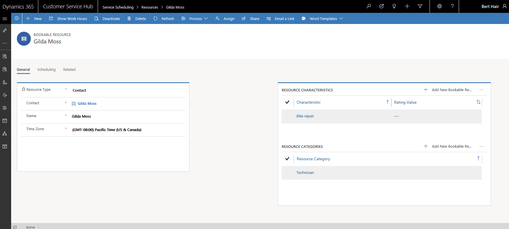

# Create and set up bookable resources

[!INCLUDE[cc-applies-to-update-9-0-0](../includes/cc_applies_to_update_9_0_0.md)]

A resource in Service Scheduling is anything that needs to be scheduled. You can set up Generic, Contact, User, Equipment, Account, Crew, Facility, or Pool as bookable resource.

## Create a new bookable resource

Make sure that you have the System Administrator or System Customizer security role or equivalent permissions.

1. In the Customer Service Hub sitemap, go to **Service Scheduling**.
2. From the list of entity records, select **Scheduling > Resources**.
   - The **Active Bookable Resources** view is displayed. You can switch between various system views using the drop-down menu.
   - Select any existing bookable resource to see additional options in the command bar.

3. On the command bar, select **New** to create a new bookable resource. 
4. In the **General** section:
   - Select a **Resource Type**. You can choose from the following options:

      - Generic
      - Contact
      - User
      - Equipment
      - Account
      - Crew
      - Facility
      - Pool
      
   - The field name is automatically populated. Look up for the record. You can also create a new record using the **Quick Create** dialog box. 

   - Select a **Time Zone**.

   - Select **Save**. A new resource is created and activated by default.

     **Resource Characteristics** and **Resource Categories**  sections are displayed.
    - In the **Resource Characteristics** section, select the ellipses  (**...**) and then select **Add New Bookable Resource Characteristics** to add characteristics.
   
      - Use the tooltips to help fill in your information and then select **Save**
      - Look up and assign **Rating Value**. You can also create a new rating value.
      - Assign the characteristic to a **Resource**

    - In the **Resource Categories** section, select the ellipses  (**...**) and then select **Add New Bookable Resource Category** to add a category.

5. In the **Scheduling** section:

    - Select the **Start Location** and the **End Location** to specify which location the resource will be at, when starting and ending work.
    - Select an **Organizational Unit** for the resource.
    - Select whether the resource should be displayed on the schedule board in the **Display On Schedule Board** box.
    - Select whether you want to enable the resource for availability search in the **Enable for Availability Search** box.

6. In the **Related** section, view and create all the common associations for the resource. You can create the following:

   - Bookable Resource Associations
   - Resource Bookings
   - Resource Booking Headers
   - Resource Characteristics
   - Resource Category Associations
   - Resource Territories
   - Actuals
   - Work Templates
   - Resource's Children
   - Resource's Parents

7. Once you are ready, select **Save**.

   

## Set work hours for the resources

You can set work hours for the bookable resources where you can define when the resources will be available to be booked for services. Select **Show Work Hours** from the command bar to define work hours.

[!INCLUDE[proc_more_information](../includes/proc-more-information.md)] [Set work hours for a resource](set-work-hours-resource.md#set-work-hours-for-a-resource)

### See also

[Service Scheduling overview](basics-service-service-scheduling.md)