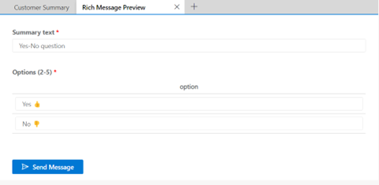

# Rich messages in the conversation control

When conversing in supported channels, the communication panel includes an additional feature for sending rich messages. These interactive messages can help you collect and share information with customers more easily. Rich messages are currently only supported in the Apple Messages for Business channel.

Start using rich messages in your conversation with one of the following options:

   - Select the Rich messages button to launch the rich message panel.
   - Use a keyboard command to see the list of rich messages. Type the forward slash (/) and the letters rm (/rm).
   
## Search for rich messages and tags

After launching the rich message panel by selecting the rich message icon or typing /rm, you can type any of the following options in the compose box to search for relevant rich messages:
   
   - Type /rm, followed by &lt;keyword&gt;, to list messages that match the keyword. 
   - Type /rm, followed by the number sign (#), to list all tags. All rich messages will have a tag containing their type. 
   - Type /rm, followed by &lt;tagname&gt;&lt;keyword&gt;, to list quick replies that match the tag and keyword.
   - Type /rm, followed by &lt;tagname&gt;, to list all rich messages that match the tag. Additionally, you can also add another tag after the &lt;tagname&gt;. For example, type /rm, followed by &lt;tagname&gt; &lt;tagname&gt;, to further refine the rich messages matching both the tags.

## View and send rich messages

When you find the rich message you want to send, you can click on the rich message to open it. This will open the **Rich Message Preview** application pane.

   > [!div class=mx-imgBorder]
   > 

Within the preview tab, you’ll be able to see the contents of the rich message you’ve selected, along with a Send Message button. When you’re ready to send a rich message, use **Send Message**.

If your administrator has enabled agent configuration, you can customize some types of rich messages before sending them. These customizations are single-use and aren’t saved for the next time you send the same rich message. 

  > [!Note] 
  > Agents should understand how customizable rich messages are constructed and appear on the customer’s device before attempting to edit them. 

## Customizable rich messages

Some types of rich messages may need their contents customized before they can be sent to customers. Others can be customized to add personalized touches or additional options that might change depending on context. 

The following rich messages support admin-enabled customization:

| Channel | Message type |
|---------|---------------|
| Apple Messages for Business | [List picker](create-rich-messages.md#list-picker)  [Suggested reply](create-rich-messages.md#suggested-reply)  [Time picker](create-rich-messages.md#time-picker)  [Video rich link](create-rich-messages.md#video-rich-link)  [Website rich link](create-rich-messages.md#website-rich-link)  |

### See also

[Configure Apple Messages for Business(apple-messages-for-business-channel.md)  
(Create rich messages](create-rich-messages.md)
[Understand and create workstreams](work-streams-introduction.md)  
[Create and manage routing rules](routing-rules.md)  
[Configure automated messages](configure-automated-message.md)  
[Configure a post-conversation survey](configure-post-conversation-survey.md)  
[Skill-based routing](overview-skill-work-distribution.md)  
[Create message templates](create-message-templates.md)  
[Templates](/dynamics365/app-profile-manager/templates-overview)  
[Delete a configured channel](delete-channel.md)  
[Support for live chat and asynchronous channels](card-support-in-channels.md)  

[!INCLUDE[footer-include](../includes/footer-banner.md)]
