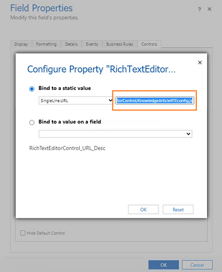

# Add a knowledge article rich text editor control to a form

By default, the rich text editor functionality is available for use with knowledge articles and emails. You can add the rich text editor control to other forms as well to leverage the benefits of the rich text editor functionality. More information: [Use the rich text editor toolbar](/power-apps/maker/model-driven-apps/rich-text-editor-control#use-the-rich-text-editor-toolbar)

## Add the rich text editor control to a form

Perform the following steps to add rich text editor control to a form.

1. In Power Apps, go to the form where you want to add the rich text editor control, and double-click a field where you can enter single or multiple lines of text to open **Field Properties**.

2. On the **Field Properties** dialog, select the **Controls** tab.

3. Under **Controls**, select **Rich Text Editor Control**.

    > [!div class=mx-imgBorder]
    > 

3. Under **Rich Text Editor Control** properties, select the pencil icon next to **RichTextEditorControl_URL**.
    
    > [!div class=mx-imgBorder]
    > 
    
    The properties configuration page is displayed.

4. In the **Bind to a static value** field, enter the following text: **webResources/msdyncrm_/RichTextEditorControl/KnowledgeArticleRTEconfig.js** 

    > [!div class=mx-imgBorder]
    > 

5. Select **OK** > **OK**, and then select **Save and Publish**.

For more information about rich text control properties, see [Rich text editor control configuration options](/powerapps/maker/model-driven-apps/rich-text-editor-control#rich-text-editor-control-configuration-options).