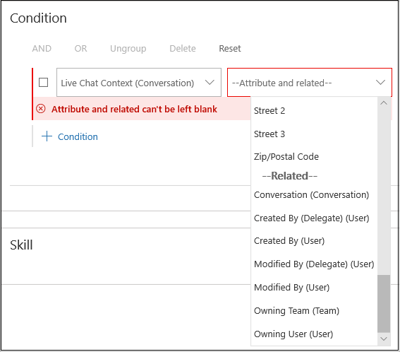

# Create and manage routing rules in Omnichannel Administration

[!INCLUDE[cc-use-with-omnichannel](../includes/cc-use-with-omnichannel.md)]

> [!IMPORTANT]
>
> - Support for the Omnichannel Administration app ended on April 30, 2022. We recommend that you use the Omnichannel admin center or Customer Service admin center app to configure the latest features, such as unified routing and voice channel. For more information about the deprecation announcement, see Omnichannel Administration app is deprecated.
> - Additionally, workstreams that you create in the Omnichannel Administration app can't be modified in the Omnichannel admin center app. You'll need to migrate the existing workstreams and then manage them in the Omnichannel admin center app. More information: [Migrate workstreams created in Omnichannel Administration](migrate-workstreams.md)

## Introduction

Routing rules define how conversations are routed to different queues. Each routing rule has a condition and a destination queue. If the rule condition is evaluated as **True**, then the conversation is routed to the destination queue.

 > [!Important]
 > Routing rules for entity records are defined at the entity record channel level. To learn more, see [Entity records routing](entity-channel.md).

A single work stream can have multiple routing rules that are evaluated in the order of definition. For example, if a work stream called **Chat** contains 5 routing rules, an incoming chat conversation will be evaluated against all the 5 routing rules in the defined order. While you can define as many rules as your business requires, the application processes only the first 100 rules.

> [!div class=mx-imgBorder] 
> 

Routing rules are evaluated from top to bottom. If a rule condition is evaluated as **True**, the chat gets routed to the destination queue and skips further evaluation. If a rule condition is evaluated as **False**, further rules are evaluated. 

Routing rule conditions could be based on channel context, pre-chat context, and contact, account, or case context. For example, you can define a routing rule so that chats from high priority customers who have specific queries about investments can be routed to a specific queue.

> [!IMPORTANT]
> If all the rule conditions are evaluated as False for a conversation, it goes to the **Default** queue. For more information, see [Queues in Omnichannel for Customer Service](queues-omnichannel.md).

## Create a routing rule

To create a routing rule, select a work stream by navigating to **Work Distribution Management** > **Work Streams**, and define a new rule in the **Routing Rule Items** tab.

1. Select **Add**. The **New Rule Item** page appears.  
   1. In the **General information** section of the **General** tab, provide the following information:  
      1. **Name**. Name of the rule item  
      2. **Work Stream** is auto populated  
      3. **Queue**. Look up a queue or select **New** to add a new queue. For more information, see [Create a queue in Omnichannel for Customer Service](queues-omnichannel.md)  
   2. **Description**. A brief description of the rule item.
   3. In the **Condition** section, provide the conditions for the rule. Based on the conditions defined, the conversations are routed to the correct queues. You can define the conditions based on the following:
    - Entity
    - Attribute or related entity
    - Attribute
    - Operator
    - Value

    For an entity, you can define rules based on related level 1 attributes.

    > [!div class=mx-imgBorder]
    > 
2. Select **Save**.

      > [!div class=mx-imgBorder]
      > 

### See also

[Understand and create workstreams](create-workstreams.md)

[Understand unified routing and work distribution](unified-routing-work-distribution.md)

[!INCLUDE[footer-include](../includes/footer-banner.md)]
